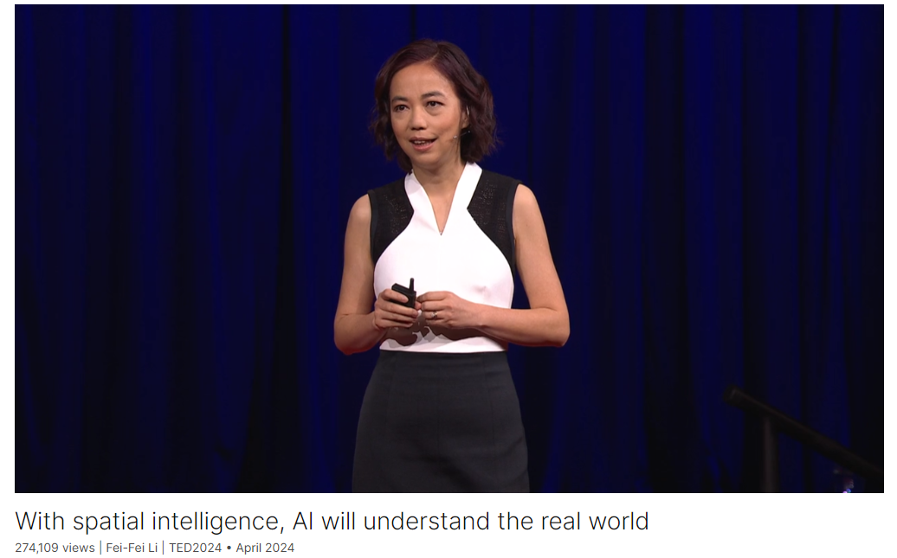

# With spatial intelligence, AI will understand the real world

Link: [https://www.ted.com/talks/fei_fei_li_with_spatial_intelligence_ai_will_understand_the_real_world?](https://www.ted.com/talks/fei_fei_li_with_spatial_intelligence_ai_will_understand_the_real_world?)

Speaker:  Fei-Fei Li 

Date: April 2024

@[toc]

## Introduction

In the beginning of the universe, all was darkness — until the first organisms developed sight, which ushered in an explosion of life, learning and progress. AI pioneer Fei-Fei Li says a similar moment is about to happen for computers and robots. She shows how machines are gaining "spatial intelligence" — the ability to process visual data, make predictions and act upon those predictions — and shares how this could enable AI to interact with humans in the real world.

## Vocabulary

hydrothermal: 美 [ˌhaɪdroʊˈθərməl]  热液的

vent：孔；口；通风孔；

seafloor：海底

brim：美 [brɪm] 充溢；充满；充盈

brimming with：充满

retina：美 [ˈrɛtnə]  视网膜

cornea：美 [ˈkɔrniə]  角膜

lens：美 [lenz]透镜 晶状体

lenses：美 [ˈlenzəz]晶状体；透镜。 复数形式

It wasn't dark due to a lack of light. It was dark because of a lack of sight. Although sunshine did filter 1,000 meters beneath the surface of ocean, a light permeated from hydrothermal vents to seafloor, brimming with life, there was not a single eye to be found in these ancient waters. No retinas, no corneas, no lenses. So all this light, all this life went unseen.  

并不是因为缺乏光线而黑暗，而是因为没有视力。尽管阳光确实渗透到了海洋表面下1000米的地方，来自热液喷口的光照亮了充满生命的海底，但在这些古代水域中没有一只眼睛。没有视网膜，没有角膜，没有晶状体。因此，所有这些光线，所有这些生命，都被看不见。

trilobite：美 [ˈtraɪləˌbaɪt]  三叶虫

So for reasons we're only beginning to understand, trilobites, the first organisms that could sense light, emerged. 因此，出于我们刚刚开始了解的原因，三叶虫，第一种能够感知光的生物出现了。

usher in：迎来；引领；开创；

Cambrian： 寒武纪的

The ability to see is thought to have ushered in Cambrian explosion, a period in which a huge variety of animal species entered fossil records. 人们认为，视觉能力带来了寒武纪大爆发，这是一个种类繁多的动物物种进入化石记录的时期。

gauge：美 [ɡeɪdʒ] 测量

The annual ImageNet challenge gauged the performance of this progress. 一年一度的ImageNet挑战赛衡量了这一进步的表现。

virtuous：美 [ˈvɜːrtʃuəs] 道德高尚的；有德性的；贞洁的

virtuous cycle：良性循环

innate:美 [ɪˈneɪt]  天生的；生来的；

The urge to act is innate to all beings with spatial intelligence, which links perception with action. 行动的冲动是所有具有空间智能的生物与生俱来的，空间智能将感知与行动联系起来。

budding:美 [ˈbʌdɪŋ] 萌芽的；初露头角的；

These are prototypes of the first budding signs of a future possibility. 这些是未来可能性的第一批萌芽迹象的原型。

One in which the human race can take our entire world and translate it into digital forms and model the richness and nuances. 在这个世界里，人类可以将我们的整个世界转化为数字形式，并模拟其丰富性和细微差别。

primordial: 美 [praɪˈmɔːrdiəl] 最早的；原始时代存在的；原始的；

In that primordial ocean, in our ancient times, the ability to see and perceive one's environment kicked off the Cambrian explosion of interactions with other life forms. 在原始海洋中，在我们的远古时代，看到和感知周围环境的能力开启了寒武纪与其他生命形式相互作用的爆发。

medical staff: 医务人员

my lab has been taking some of the first steps in applying AI to tackle challenges that impact patient outcome and medical staff burnout.我的实验室已经开始采取一些初步步骤，应用人工智能来解决影响患者治疗结果和医务人员倦怠的问题。

ambient：美 [ˈæmbiənt] 环境的；周围的

We consider these techniques a form of ambient intelligence 我们认为这些技术是环境智能的一种形式

surgeon：美 [ˈsɜːrdʒən] 外科医生

guiding surgeons to do safer, faster 指导外科医生更安全、更快速地

paralysis：美 [pəˈræləsɪs] 瘫痪；麻痹

imagine patients with severe paralysis controlling robots with their thoughts. 想象一下患有严重瘫痪的患者用他们的思想控制机器人。

sukiyaki：美 [ˌsukiˈjɑki] 寿喜烧

Japanese sukiyaki meal

## Summary

In her speech, Fei-Fei Li explores the transformative journey of visual intelligence, starting from the primordial times when the world was shrouded in darkness not due to the absence of light, but the absence of sight. She describes how the emergence of trilobites, the first organisms capable of sensing light, marked a significant evolutionary milestone, leading to the Cambrian explosion and the development of intelligence through the ability to see, understand, and act. This foundational process parallels the progress in computer vision and artificial intelligence, which began with neural networks, GPUs, and big data, culminating in the creation of algorithms capable of not only labeling images but also understanding dynamic relationships and generating new visual content.

Li then discusses the advancements in AI, emphasizing the need for spatial intelligence that combines seeing with doing. She illustrates the progress with examples such as algorithms translating 2D images into 3D spaces, and robotic arms performing tasks based on verbal instructions. These advancements highlight the importance of integrating perception with action, akin to human spatial intelligence. She underscores that this capability is essential for the next phase of AI development, which aims to create machines that can learn and act in the 3D world, similar to how biological intelligence evolved through interactions with the environment.

Finally, Li envisions a future where AI, endowed with spatial intelligence, becomes an indispensable partner in various fields, particularly in healthcare. She describes ongoing projects where AI helps monitor and assist medical staff, improving patient outcomes and reducing burnout. Looking ahead, she imagines autonomous robots and augmented reality enhancing medical procedures and aiding patients with severe paralysis. Li concludes with a call for responsible development of AI technologies, emphasizing the potential for these digital companions to enhance human productivity and well-being while maintaining dignity and collective prosperity.

## Transcript

Let me show you something.

To be precise,

I'm going to show you nothing.

This was the world 540 million years ago.

Pure, endless darkness.

It wasn't dark due to a lack of light.

It was dark because of a lack of sight.

Although sunshine did filter 1,000 meters

beneath the surface of ocean,

a light permeated from hydrothermal
vents to seafloor,

brimming with life,

there was not a single eye
to be found in these ancient waters.

No retinas, no corneas, no lenses.

So all this light,
all this life went unseen.

There was a time that the very idea
of seeing didn't exist.

It [had] simply never been done before.

Until it was.

So for reasons we're only
beginning to understand,

trilobites, the first organisms
that could sense light, emerged.

They're the first inhabitants
of this reality that we take for granted.

First to discover that there is
something other than oneself.

A world of many selves.

The ability to see is thought
to have ushered in Cambrian explosion,

a period in which a huge
variety of animal species

entered fossil records.

What began as a passive experience,

the simple act of letting light in,

soon became far more active.

The nervous system began to evolve.

Sight turning to insight.

Seeing became understanding.

Understanding led to actions.

And all these gave rise to intelligence.

Today, we're no longer satisfied with just
nature's gift of visual intelligence.

Curiosity urges us to create machines
to see just as intelligently as we can,

if not better.

Nine years ago, on this stage,

I delivered an early progress report
on computer vision,

a subfield of artificial intelligence.

Three powerful forces
converged for the first time.

A family of algorithms
called neural networks.

Fast, specialized hardware
called graphic processing units,

or GPUs.

And big data.

Like the 15 million images that my lab
spent years curating called ImageNet.

Together, they ushered in
the age of modern AI.

We've come a long way.

Back then, just putting labels on images
was a big breakthrough.

But the speed and accuracy
of these algorithms just improved rapidly.

The annual ImageNet
challenge, led by my lab,

gauged the performance of this progress.

And on this plot, you're seeing
the annual improvement

and milestone models.

We went a step further

and created algorithms
that can segment objects

or predict the dynamic
relationships among them

in these works done by my students
and collaborators.

And there's more.

Recall last time I showed you
the first computer-vision algorithm

that can describe a photo
in human natural language.

That was work done with my brilliant
former student, Andrej Karpathy.

At that time, I pushed my luck and said,

"Andrej, can we make computers
to do the reverse?"

And Andrej said,
"Ha ha, that's impossible."

Well, as you can see from this post,

recently the impossible
has become possible.

That's thanks to a family
of diffusion models

that powers today's
generative AI algorithm,

which can take human-prompted sentences

and turn them into photos and videos

of something that's entirely new.

Many of you have seen the recent
impressive results of Sora by OpenAI.

But even without the enormous
number of GPUs,

my student and our collaborators

have developed a generative
video model called Walt

months before Sora.

And you're seeing some of these results.

There is room for improvement.

I mean, look at that cat's eye

and the way it goes under the wave
without ever getting wet.

What a cat-astrophe.

(Laughter)

And if past is prologue,

we will learn from these mistakes
and create a future we imagine.

And in this future,

we want AI to do everything it can for us,

or to help us.

For years I have been saying

that taking a picture is not the same
as seeing and understanding.

Today, I would like to add to that.

Simply seeing is not enough.

Seeing is for doing and learning.

When we act upon this world
in 3D space and time,

we learn, and we learn
to see and do better.

Nature has created this virtuous cycle
of seeing and doing

powered by “spatial intelligence.”

To illustrate to you what your spatial
intelligence is doing constantly,

look at this picture.

Raise your hand if you feel
like you want to do something.

(Laughter)

In the last split of a second,

your brain looked
at the geometry of this glass,

its place in 3D space,

its relationship with the table, the cat

and everything else.

And you can predict
what's going to happen next.

The urge to act is innate to all beings
with spatial intelligence,

which links perception with action.

And if we want to advance AI
beyond its current capabilities,

we want more than AI
that can see and talk.

We want AI that can do.

Indeed, we're making exciting progress.

The recent milestones
in spatial intelligence

is teaching computers to see, learn, do

and learn to see and do better.

This is not easy.

It took nature millions of years
to evolve spatial intelligence,

which depends on the eye taking light,

project 2D images on the retina

and the brain to translate
these data into 3D information.

Only recently, a group
of researchers from Google

are able to develop an algorithm
to take a bunch of photos

and translate that into 3D space,

like the examples we're showing here.

My student and our collaborators
have taken a step further

and created an algorithm
that takes one input image

and turn that into 3D shape.

Here are more examples.

Recall, we talked about computer programs
that can take a human sentence

and turn it into videos.

A group of researchers
in University of Michigan

have figured out a way to translate
that line of sentence

into 3D room layout, like shown here.

And my colleagues at Stanford
and their students

have developed an algorithm
that takes one image

and generates infinitely plausible spaces

for viewers to explore.

These are prototypes of the first
budding signs of a future possibility.

One in which the human race
can take our entire world

and translate it into digital forms

and model the richness and nuances.

What nature did to us implicitly
in our individual minds,

spatial intelligence
technology can hope to do

for our collective consciousness.

As the progress of spatial
intelligence accelerates,

a new era in this virtuous cycle
is taking place in front of our eyes.

This back and forth
is catalyzing robotic learning,

a key component for any
embodied intelligence system

that needs to understand
and interact with the 3D world.

A decade ago,

ImageNet from my lab

enabled a database of millions
of high-quality photos

to help train computers to see.

Today, we're doing the same
with behaviors and actions

to train computers and robots
how to act in the 3D world.

But instead of collecting static images,

we develop simulation environments
powered by 3D spatial models

so that the computers can have
infinite varieties of possibilities

to learn to act.

And you're just seeing
a small number of examples

to teach our robots

in a project led by my lab
called Behavior.

We’re also making exciting progress
in robotic language intelligence.

Using large language model-based input,

my students and our collaborators
are among the first teams

that can show a robotic arm
performing a variety of tasks

based on verbal instructions,

like opening this drawer
or unplugging a charged phone.

Or making sandwiches,
using bread, lettuce, tomatoes

and even putting a napkin for the user.

Typically I would like
a little more for my sandwich,

but this is a good start.

(Laughter)

In that primordial ocean,
in our ancient times,

the ability to see and perceive
one's environment

kicked off the Cambrian explosion
of interactions with other life forms.

Today, that light
is reaching the digital minds.

Spatial intelligence is allowing machines

to interact not only with one another,

but with humans, and with 3D worlds,

real or virtual.

And as that future is taking shape,

it will have a profound
impact to many lives.

Let's take health care as an example.

For the past decade,

my lab has been taking
some of the first steps

in applying AI to tackle challenges
that impact patient outcome

and medical staff burnout.

Together with our collaborators
from Stanford School of Medicine

and partnering hospitals,

we're piloting smart sensors

that can detect clinicians
going into patient rooms

without properly washing their hands.

Or keep track of surgical instruments.

Or alert care teams when
a patient is at physical risk,

such as falling.

We consider these techniques
a form of ambient intelligence,

like extra pairs of eyes
that do make a difference.

But I would like more interactive help
for our patients, clinicians

and caretakers, who desperately
also need an extra pair of hands.

Imagine an autonomous robot
transporting medical supplies

while caretakers focus on our patients

or augmented reality,
guiding surgeons to do safer, faster

and less invasive operations.

Or imagine patients with severe paralysis
controlling robots with their thoughts.

That's right, brainwaves,
to perform everyday tasks

that you and I take for granted.

You're seeing a glimpse of that future
in this pilot study from my lab recently.

In this video, the robotic arm is cooking
a Japanese sukiyaki meal

controlled only by the brain
electrical signal,

non-invasively collected
through an EEG cap.

(Applause)

Thank you.

The emergence of vision
half a billion years ago

turned a world of darkness upside down.

It set off the most profound
evolutionary process:

the development of intelligence
in the animal world.

AI's breathtaking progress
in the last decade is just as astounding.

But I believe the full potential
of this digital Cambrian explosion

won't be fully realized until we power
our computers and robots

with spatial intelligence,

just like what nature did to all of us.

It’s an exciting time to teach
our digital companion

to learn to reason

and to interact with this beautiful
3D space we call home,

and also create many more new worlds
that we can all explore.

To realize this future won't be easy.

It requires all of us
to take thoughtful steps

and develop technologies
that always put humans in the center.

But if we do this right,

the computers and robots
powered by spatial intelligence

will not only be useful tools

but also trusted partners

to enhance and augment
our productivity and humanity

while respecting our individual dignity

and lifting our collective prosperity.

What excites me the most in the future

is a future in which that AI
grows more perceptive,

insightful and spatially aware,

and they join us on our quest

to always pursue a better way
to make a better world.

Thank you.

(Applause)

## Afterword

2024年5月17日于上海。

