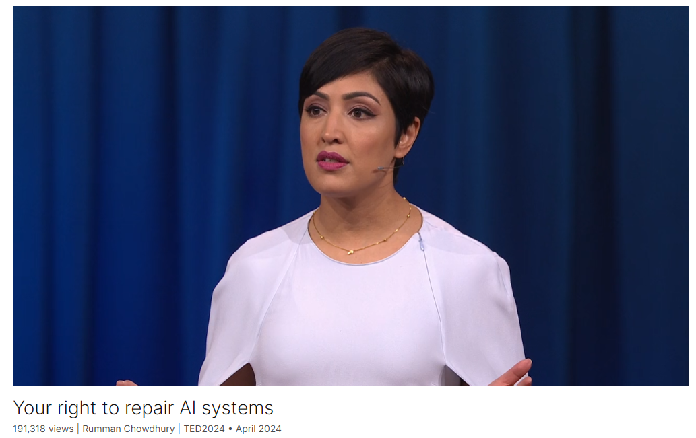

# Your right to repair AI systems

Link: [https://www.ted.com/talks/rumman_chowdhury_your_right_to_repair_ai_systems](https://www.ted.com/talks/rumman_chowdhury_your_right_to_repair_ai_systems)

Speaker:  Rumman Chowdhury

Date: April 2024

@[toc]

## Introduction

For AI to achieve its full potential, non-experts need to contribute to its development, says Rumman Chowdhury, CEO and cofounder of Humane Intelligence. She shares how the right-to-repair movement of consumer electronics provides a promising model for a path forward, with ways for everyone to report issues, patch updates or even retrain AI technologies.

人类智能公司（Humane Intelligence）首席执行官兼联合创始人鲁曼-乔杜里（Rumman Chowdhury）说，要想充分发挥人工智能的潜力，非专业人士必须为其发展做出贡献。她分享了消费电子产品的 "维修权 "运动如何为未来的道路提供了一个很有前景的模式，让每个人都有办法报告问题、更新补丁，甚至重新训练人工智能技术。

## Vocabulary

crop yields：农作物产量

farmers would have to wait for weeks while their crops rot and pests took over. 农民们将不得不等待数周，直到他们的庄稼腐烂，害虫接管。

ride-share drivers 拼车司机

measle：美 ['mizl]  麻疹

mump：美 [mʌmp] 腮腺炎

other diseases like measles, mumps and the flu 麻疹、腮腺炎和流感等其他疾病

resoundingly：响亮地

specs：规格

could they imagine a modern AI system that would be able to design the specs of a modern art museum? The answer, resoundingly, was no. “他们能想象出一个能够设计现代艺术博物馆规格的现代AI系统吗？答案是响亮的‘不’。”

Now architects are liable if something goes wrong with their buildings. They could lose their license, they could be fined, they could even go to prison. 现在，如果建筑师的建筑出了问题，他们就要承担责任。他们可能会被吊销执照，被罚款，甚至会进监狱。

evacuation：美 [ɪˌvækjuˈeɪʃ(ə)n] 撤离；疏散；撤退

exit doors that open the wrong way, leading to people being crushed in an evacuation crisis 出口门打开方式错误，导致人们在疏散危机中被挤压

shatter：粉碎；破坏；破掉

the wind blows too hard and shatters windows. 风吹得太猛，吹碎了窗户。

agentic AI：代理式AI

tipping point：临界点；引爆点；爆发点；忍受极限

The next wave of artificial intelligence systems, called agentic AI, is a true tipping point between whether or not we retain human agency, or whether or not AI systems make our decisions for us. “下一波人工智能系统，被称为代理型AI，是一个真正的临界点，决定了我们是否保留人类自主权，还是让AI系统为我们做决定。”

medication：药物

a medical agent might determine whether or not your family needs doctor's appointments, it might refill prescription medications, or in case of an emergency, send medical records to the hospital. 医疗代理可能会决定您的家人是否需要预约医生，可能会重新配药，或者在紧急情况下将医疗记录发送到医院。

What professional would trust an AI system with job decisions, unless you could retrain it the way you might a junior employee? “哪个专业人士会信任一个AI系统来做工作决策，除非你能够像培训一名初级员工那样对它进行再培训？”

这个句子might后面省略了动词，解释如下：

>在这个句子里，“the way you might a junior employee” 确实省略了动词，但这是英语中一种常见的简略表达，称为“ellipsis”（省略）。完整的表达应该是：
>
>“the way you might train a junior employee.”
>
>省略动词“train”是为了避免重复，因为上下文已经很清楚地表明了动词的含义。这种省略让句子更加简洁，而不影响理解。
>
>再举一个例子：
>
>“If you treat the project the way you would a major client, it will succeed.”
>（如果你像对待重要客户那样对待这个项目，它就会成功。）
>
>完整的句子应该是：
>“If you treat the project the way you would treat a major client, it will succeed.”
>
>同样，第二个“treat”动词被省略了，因为上下文已经清楚地说明了动词的含义。

intrepid：美 [ɪnˈtrɛpəd] 勇敢的；无畏的；

Or you could be like these intrepid farmers and learn to program and fine-tune your own systems 或者你可以像这些勇敢的农民一样学习编程和微调自己的系统

## Summary

Rumman Chowdhury, CEO and cofounder of Humane Intelligence, begins her talk by highlighting the intersection of artificial intelligence (AI) and farming technology. She discusses the advancements such as computer vision predicting crop yields and AI identifying pests. However, she notes the challenges faced by farmers, exemplified by the controversy over John Deere's smart tractors which restricted farmers' ability to repair their own equipment. This led to a movement called "right to repair," advocating for the ability to repair one's own technology, whether it's tractors or household devices. Chowdhury emphasizes that this right should extend to AI systems to ensure that people can fix and trust the technologies they use.

Chowdhury then addresses the declining public confidence in AI, citing polls that show widespread concern about the technology's impact. She explains that people feel alienated because their data is used without consent to create systems that affect their lives, and they lack a voice in how these systems are built. To bridge this gap, she proposes the concept of red teaming, a practice from cybersecurity where external experts test and find flaws in systems. She highlights successful examples of red-teaming exercises with scientists and architects, which led to improvements in AI models and demonstrated the need for AI systems that interact with and are trusted by users.

In her concluding remarks, Chowdhury emphasizes the importance of involving people in the AI development process to build trust and ensure the technology benefits everyone. She introduces the idea of a "right to repair" for AI, suggesting tools like diagnostics boards and collaborations with ethical hackers to allow users to understand and improve AI systems. Chowdhury stresses that the potential of AI can only be realized if developers and users work together. She calls for a shift in focus from merely building trustworthy AI to creating tools that empower people to make AI work for them, asserting that technologists alone cannot achieve this goal without public involvement.

Humane Intelligence的首席执行官兼联合创始人Rumman Chowdhury在她的演讲中首先强调了人工智能（AI）和农业技术的交叉点。她讨论了计算机视觉预测作物产量和AI识别害虫等进步。然而，她也指出农民面临的挑战，例如John Deere的智能拖拉机争议，该公司限制农民自行修理设备的能力。这导致了一个名为“维修权”的运动，倡导能够修理自己的技术设备，无论是拖拉机还是家用设备。Chowdhury强调，这种权利应扩展到AI系统，以确保人们能够修理和信任他们所使用的技术。

Chowdhury接着谈到了公众对AI信任度的下降，引用了一些调查显示广泛存在的对技术影响的担忧。她解释说，人们感到被疏远，因为他们的数据在未经同意的情况下被用来创建影响他们生活的系统，而且他们在这些系统的构建过程中没有发言权。为了弥合这一差距，她提出了“红队”（red teaming）的概念，这是一种来自网络安全领域的实践，外部专家会测试和找出系统中的漏洞。她强调了一些成功的红队演练案例，如与科学家和建筑师的合作，这些演练改善了AI模型并展示了需要与用户互动并受其信任的AI系统。

在她的总结发言中，Chowdhury强调了让人们参与AI开发过程的重要性，以建立信任并确保技术惠及所有人。她提出了AI的“维修权”概念，建议使用诊断板和与道德黑客的合作，让用户理解和改进AI系统。Chowdhury强调，只有在开发者和用户共同努力的情况下，AI的潜力才能得以实现。她呼吁从仅仅构建可信的AI转向创建能让人们使AI为他们服务的工具，坚称仅靠技术人员无法实现这一目标，必须有公众的参与。

## Transcript

I want to tell you a story

about artificial intelligence and farmers.

Now, what a strange combination, right?

Two topics could not sound
more different from each other.

But did you know that modern farming
actually involves a lot of technology?

So computer vision is used
to predict crop yields.

And artificial intelligence
is used to find,

identify and get rid of insects.

Predictive analytics helps figure out
extreme weather conditions

like drought or hurricanes.

But this technology
is also alienating to farmers.

And this all came to a head in 2017

with the tractor company John Deere
when they introduced smart tractors.

So before then,
if a farmer's tractor broke,

they could just repair it themselves
or take it to a mechanic.

Well, the company actually made it illegal

for farmers to fix their own equipment.

You had to use a licensed technician

and farmers would have to wait for weeks

while their crops rot and pests took over.

So they took matters into their own hands.

Some of them learned to program,

and they worked with hackers to create
patches to repair their own systems.

In 2022,

at one of the largest hacker
conferences in the world, DEFCON,

a hacker named Sick Codes and his team

showed everybody how to break
into a John Deere tractor,

showing that, first of all,
the technology was vulnerable,

but also that you can and should
own your own equipment.

To be clear, this is illegal,

but there are people
trying to change that.

Now that movement is called
the “right to repair.”

The right to repair
goes something like this.

If you own a piece of technology,

it could be a tractor, a smart toothbrush,

a washing machine,

you should have the right
to repair it if it breaks.

So why am I telling you this story?

The right to repair needs to extend
to artificial intelligence.

Now it seems like every week

there is a new and mind-blowing
innovation in AI.

But did you know that public confidence
is actually declining?

A recent Pew poll showed
that more Americans are concerned

than they are excited
about the technology.

This is echoed throughout the world.

The World Risk Poll shows

that respondents from Central
and South America and Africa

all said that they felt AI would lead
to more harm than good for their people.

As a social scientist and an AI developer,

this frustrates me.

I'm a tech optimist

because I truly believe
this technology can lead to good.

So what's the disconnect?

Well, I've talked to hundreds
of people over the last few years.

Architects and scientists,
journalists and photographers,

ride-share drivers and doctors,

and they all say the same thing.

People feel like an afterthought.

They all know that their data is harvested
often without their permission

to create these sophisticated systems.

They know that these systems
are determining their life opportunities.

They also know that nobody
ever bothered to ask them

how the system should be built,

and they certainly have no idea
where to go if something goes wrong.

We may not own AI systems,

but they are slowly dominating our lives.

We need a better feedback loop

between the people
who are making these systems,

and the people who are best
determined to tell us

how these AI systems
should interact in their world.

One step towards this
is a process called red teaming.

Now, red teaming is a practice
that was started in the military,

and it's used in cybersecurity.

In a traditional red-teaming exercise,

external experts are brought in
to break into a system,

sort of like what Sick Codes did
with tractors, but legal.

So red teaming acts as a way
of testing your defenses

and when you can figure out
where something will go wrong,

you can figure out how to fix it.

But when AI systems go rogue,

it's more than just a hacker breaking in.

The model could malfunction
or misrepresent reality.

So, for example, not too long ago,

we saw an AI system attempting diversity

by showing historically inaccurate photos.

Anybody with a basic
understanding of Western history

could have told you
that neither the Founding Fathers

nor Nazi-era soldiers
would have been Black.

In that case, who qualifies as an expert?

You.

I'm working with thousands of people
all around the world

on large and small red-teaming exercises,

and through them we found
and fixed mistakes in AI models.

We also work with some of the biggest
tech companies in the world:

OpenAI, Meta, Anthropic, Google.

And through this, we've made models
work better for more people.

Here's a bit of what we've learned.

We partnered with the Royal Society
in London to do a scientific,

mis- and disinformation event
with disease scientists.

What these scientists found

is that AI models actually had
a lot of protections

against COVID misinformation.

But for other diseases like measles,
mumps and the flu,

the same protections didn't apply.

We reported these changes,

they’re fixed and now
we are all better protected

against scientific mis-
and disinformation.

We did a really similar exercise
with architects at Autodesk University,

and we asked them a simple question:

Will AI put them out of a job?

Or more specifically,

could they imagine a modern AI system

that would be able to design the specs
of a modern art museum?

The answer, resoundingly, was no.

Here's why, architects do more
than just draw buildings.

They have to understand physics
and material science.

They have to know building codes,

and they have to do that

while making something
that evokes emotion.

What the architects wanted
was an AI system

that interacted with them,
that would give them feedback,

maybe proactively offer
design recommendations.

And today's AI systems,
not quite there yet.

But those are technical problems.

People building AI are incredibly smart,

and maybe they could solve
all that in a few years.

But that wasn't their biggest concern.

Their biggest concern was trust.

Now architects are liable if something
goes wrong with their buildings.

They could lose their license,

they could be fined,
they could even go to prison.

And failures can happen
in a million different ways.

For example, exit doors
that open the wrong way,

leading to people being crushed
in an evacuation crisis,

or broken glass raining down
onto pedestrians in the street

because the wind blows too hard
and shatters windows.

So why would an architect trust
an AI system with their job,

with their literal freedom,

if they couldn't go in
and fix a mistake if they found it?

So we need to figure out these problems
today, and I'll tell you why.

The next wave of artificial intelligence
systems, called agentic AI,

is a true tipping point

between whether or not
we retain human agency,

or whether or not AI systems
make our decisions for us.

Imagine an AI agent as kind of
like a personal assistant.

So, for example,
a medical agent might determine

whether or not your family needs
doctor's appointments,

it might refill prescription medications,
or in case of an emergency,

send medical records to the hospital.

But AI agents can't and won't exist

unless we have a true right to repair.

What parent would trust
their child's health to an AI system

unless you could run
some basic diagnostics?

What professional would trust
an AI system with job decisions,

unless you could retrain it
the way you might a junior employee?

Now, a right to repair
might look something like this.

You could have a diagnostics board

where you run basic tests that you design,

and if something's wrong,
you could report it to the company

and hear back when it's fixed.

Or you could work with third parties
like ethical hackers

who make patches for systems
like we do today.

You can download them and use them
to improve your system

the way you want it to be improved.

Or you could be like these intrepid
farmers and learn to program

and fine-tune your own systems.

We won't achieve the promised benefits
of artificial intelligence

unless we figure out how to bring people
into the development process.

I've dedicated my career
to responsible AI,

and in that field we ask the question,

what can companies build
to ensure that people trust AI?

Now, through these red-teaming exercises,
and by talking to you,

I've come to realize that we've been
asking the wrong question all along.

What we should have been asking
is what tools can we build

so people can make AI beneficial for them?

Technologists can't do it alone.

We can only do it with you.

Thank you.

(Applause)

## Afterword

2024年6月6日18点01分于上海。