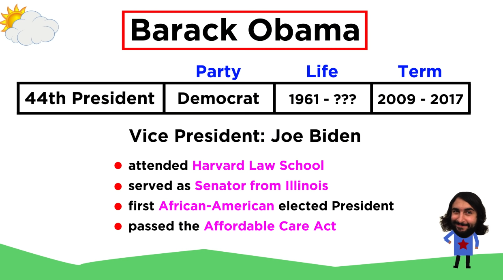

# Barack Obama: First African-American President (2009 – 2017)

Link: [https://www.youtube.com/watch?v=wHCBI3yypmE&list=PLybg94GvOJ9E-ZM1U6PAjgPUmz-V4-Yja&index=44](https://www.youtube.com/watch?v=wHCBI3yypmE&list=PLybg94GvOJ9E-ZM1U6PAjgPUmz-V4-Yja&index=44)

## Introduction

Barack Obama made history as the first African-American elected to the presidency. Given America's history of racism and slavery, this was a monumental occurrence in and of itself. Obama also happened to have been elected just at the onset of the worst economic recession since the Great Depression. High hopes were placed upon him to fix a lot of problems, so how did he do? What were his successes and failures? Let's take a look now.

## Summary

Barack Obama made history as the first African-American President of the United States, elected during a time of significant political and social division. Born to a white mother from Kansas and a black father from Kenya, he grew up in Hawaii and Indonesia before attending Harvard Law School, where he became the first African-American president of the Law Review. Obama gained national attention with a unifying speech at the 2004 Democratic Convention and was elected President in 2008 during the Great Recession. His major legislative achievements included the Recovery Act and the Affordable Care Act, but his presidency faced staunch opposition from the GOP, which vowed to block his legislative efforts from the onset.

Despite his accomplishments, Obama's presidency was marked by intense polarization. The GOP's obstructionist tactics led to a legislative gridlock, undermining Obama's ability to enact significant changes. His foreign policy, including the handling of the Syrian Civil War and the drone strikes against ISIS, drew criticism from both the left and the right. Domestically, his efforts to address economic disparity and immigration issues faced substantial challenges. The rise of dissatisfaction among the left and the continuing economic struggles of the middle class highlighted the limits of his centrist policies and the deepening political divide in the country.

Obama's tenure underscored the profound challenges of addressing systemic issues within American society. The entrenched corruption in political, social, and economic spheres contributed to a growing disillusionment with the political system. Despite his oratory skills and efforts to foster unity, the deep-seated ideological divides and corporate influence in politics hindered his potential to be a transformational president. The enduring struggle between the nation's founding ideals and its historical realities remains a critical point of reflection, suggesting that the path to meaningful change requires persistent vigilance and an unwavering commitment to justice and equality.

巴拉克·奥巴马作为美国历史上第一位非裔总统，在政治和社会分裂严重的时期当选，这本身就是一个重要的历史事件。他出生于一位来自堪萨斯州的白人母亲和一位肯尼亚的黑人父亲，小时候在夏威夷和印度尼西亚度过，随后进入哈佛法学院学习，成为第一位担任《哈佛法律评论》主席的非裔美国人。奥巴马因在2004年民主党全国大会上的演讲而引起全国关注，强调美国人民的团结。2008年，他在大萧条以来最严重的经济危机期间当选总统，其主要立法成就包括《复苏法案》和《平价医疗法案》（又称“奥巴马医保”），但从一开始就面临共和党的强烈反对。

尽管取得了一些成就，奥巴马的总统任期却因强烈的两极分化而著称。共和党的阻挠战术导致立法僵局，削弱了奥巴马实施重大变革的能力。

奥巴马的任期突显了解决美国社会系统性问题的深刻挑战。政治、社会和经济领域的根深蒂固的腐败加剧了人们对政治体系的幻灭感。尽管他拥有出色的演讲能力并努力促进团结，但深层次的企业对政治的影响限制了他成为变革性总统的潜力。国家的建国理想与历史现实之间的持续斗争仍然是一个重要的反思点，表明实现有意义变革的道路需要持续的警觉和对正义和平等的坚定承诺。

## Vocabulary

staunch：美 [stɔːntʃ]  坚定的；可靠的；坚固的；稳固的；坚定不移的

make history: 创造历史；做名垂青史的事；成为历史性的事件；成为历史性的成就

momentous: 美 [moʊˈmentəs] 重大的；重要的；关键的；

contentious: 美 [kənˈtenʃəs] 好争论的；好辩的；

primary battle: 初选竞争

His victory over Senator John McCain, following a contentious  primary battle with former first lady Hillary Clinton在与前第一夫人希拉里·克林顿激烈的初选竞争后，他战胜了参议员约翰·麦凯恩

maternal：美 [məˈtɜːrnl] 母亲的；母性的；母系的；

maternal grandparents：外祖父母

burst onto：突然出现在…（指突然成功）

stirring：美 [ˈstɜːrɪŋ] 激动人心的；移动轻快的；活跃的

unity：美 [ˈjuːnəti] 团结；

Obama burst onto the national scene with a stirring speech at the 2004 Democratic Convention that stressed the unity of the American people. 奥巴马在2004年民主党大会上发表了一篇激动人心的演讲，强调了美国人民的团结，从而登上了全国舞台。

astute：美 [əˈstuːt] 精明的；敏锐的

bailout：财政援助

His handling of the Great Recession was astute,  if perhaps too cautious, and built upon the Bush bailout 他对大衰退的处理是精明的，尽管可能过于谨慎，并且是建立在布什救市的基础上的

buoyed：使浮起；支持；（buoy的过去式和过去分词）

crumbling：坍塌；（crumble的现在分词）；破碎的；

Buoyed by the Democratic majorities in the House and Senate, he was able to pass such legislation as the Recovery Act, which was designed to rebuild the nation’s crumbling infrastructure and put Americans back to work.  在众议院和参议院民主党多数派的支持下，他得以通过《复苏法案》等立法，旨在重建国家摇摇欲坠的基础设施，让美国人重返工作岗位。

His signature accomplishment was the Affordable Care Act, also known as “Obamacare.”  他的标志性成就是患者保护与平价医疗法案，也被称为“奥巴马医改”

>奥巴马医保法案（Affordable Care Act，简称“Obamacare”）是美国前总统巴拉克·奥巴马任内的重要政策之一，于2010年3月23日签署成为法律。该法案的主要目的是提高美国公民的医疗保险覆盖率，降低医疗成本，并改善医疗服务的质量。
>
>奥巴马医保法案的主要内容包括：
>
>1. **扩大医疗保险覆盖范围**：通过扩大Medicaid（美国的低收入医疗保障计划）的覆盖范围，使更多低收入家庭能够享受医疗保险。
>
>2. **建立健康保险交易所**：各州建立健康保险交易所，个人和小企业可以通过这些平台购买医疗保险，享受政府补贴。
>
>3. **禁止拒绝承保和取消保单**：保险公司不能因为投保人的既往病史拒绝承保或取消保单，从而保护有健康问题的个人能够获得保险。
>
>4. **强制购买医疗保险**：要求大多数美国公民和合法居民必须购买医疗保险，否则将面临罚款。这一措施旨在扩大保险池，分摊风险和成本。
>
>5. **鼓励预防性医疗服务**：鼓励并覆盖预防性医疗服务，如疫苗接种、筛查检查等，以期降低长期的医疗成本。
>
>奥巴马医保法案旨在通过上述措施，让更多的美国人能够获得负担得起的医疗保险，同时推动整个医疗系统的改革与改进。然而，该法案在实施过程中也面临着许多挑战和争议，包括对政府财政负担的担忧、政策执行的复杂性等问题。
>
>The Affordable Care Act (ACA), also known as "Obamacare," is one of the signature accomplishments of former U.S. President Barack Obama. Signed into law on March 23, 2010, the ACA aimed to increase health insurance coverage for Americans, reduce healthcare costs, and improve the quality of care.
>
>Key components of the Affordable Care Act include:
>
>1. **Expanding Medicaid**: The ACA expanded Medicaid eligibility to cover more low-income individuals and families, allowing a larger portion of the population to receive health insurance.
>
>2. **Establishing Health Insurance Marketplaces**: The law created health insurance marketplaces (or exchanges) where individuals and small businesses can shop for and purchase insurance plans, often with government subsidies to make them more affordable.
>
>3. **Prohibiting Denial of Coverage and Policy Cancellations**: Insurance companies are prohibited from denying coverage or canceling policies due to pre-existing conditions, ensuring that individuals with health issues can still obtain insurance.
>
>4. **Mandating Health Insurance Coverage**: The ACA initially required most Americans to have health insurance or face a penalty, known as the individual mandate. This was intended to broaden the insurance pool and spread risk and costs more evenly.
>
>5. **Encouraging Preventive Care**: The law promoted preventive health services, such as vaccinations and screenings, which are covered without additional cost to the insured, aiming to reduce long-term healthcare expenses by catching diseases early.
>
>The Affordable Care Act was designed to make healthcare more accessible and affordable while reforming the overall healthcare system. However, it has faced numerous challenges and controversies, including concerns about government spending, the complexity of implementation, and political opposition. Despite these issues, the ACA significantly increased the number of insured Americans and brought about substantial changes to the U.S. healthcare landscape.

obstructionism: 美 [əbˈstrəkʃəˌnɪzəm] 蓄意阻挠

nihilistic: 美 [ˌnaɪɪ'lɪstɪk] 虚无主义的；无政府主义的

spurious: 英 [ˈspjʊərɪəs]  假的；伪造的；

charges: 指控

This obstructionism became a nihilistic war against Obama,  who was attacked as being an inauthentic American, a Muslim, and other spurious charges.  这种阻挠变成了对奥巴马的虚无主义战争，他被攻击为不真实的美国人、穆斯林和其他虚假的指控。

scorched earth policy： 焦土政策

paralysis：美 [pəˈræləsɪs] 瘫痪；麻痹；无力；功能丧失；**注意发音**

Nevertheless, the scorched earth policy of the GOP produced a paralysis.然而，共和党的焦土政策造成了瘫痪。

assail ：美 [əˈseɪl] 攻击；袭击；突然猛烈地袭向；强烈地批评

Hispanics：美 [hisˈpæniks]西班牙裔；（Hispanic的复数）

## Transcript

Barack Hussein Obama II made history as the 
first African-American elected to the Presidency.  

Given the fact that five of the first 
seven presidents had owned slaves,  

this in itself was a momentous event. His victory 
over Senator John McCain, following a contentious  

primary battle with former first lady Hillary 
Clinton, had given many the hopes that he would  

be able to heal the racial and political divisions 
that had arisen over the previous half century.  

Sadly, this was not to be, for the 
political climate in the country  

had become so polarized, so toxic, that no 
chance of social healing remained possible. 

Born to a white mother from Kansas and a black 
father from Kenya, young Obama grew up in Hawaii  

as well as Indonesia, where his mother had gone 
to study after her divorce from Obama’s father.  

She remarried an Indonesian man whom she later 
divorced, and Obama returned to Hawaii to live  

with his maternal grandparents. 
He attended Harvard Law School,  

became the first African-American president 
of the Law Review, and then moved to Chicago,  

where he became a community organizer, eventually 
entering politics as a State Legislator.

Obama burst onto the national scene with 
a stirring speech at the 2004 Democratic  

Convention that stressed the unity of the 
American people. When 2008 came around,  

he ran successful primary and presidential 
campaigns, and was elected president during the  

worst financial crisis since the Great Depression. 
His handling of the Great Recession was astute,  

if perhaps too cautious, and built upon the Bush 
bailout. Buoyed by the Democratic majorities in  

the House and Senate, he was able to pass 
such legislation as the Recovery Act, which  

was designed to rebuild the nation’s crumbling 
infrastructure and put Americans back to work.  

His signature accomplishment was the Affordable 
Care Act, also known as “Obamacare.” While not  

the single payer healthcare system of Canada or 
other industrialized nations, it was a substantial  

achievement that no other president has been 
able to accomplish in nearly a century of effort.

Unfortunately for Obama, on Obama’s Inauguration 
Day, top GOP Congressional leaders assembled  

and decided to oppose every piece of Obama’s 
legislation and make him a one-term president.  

This obstructionism became a 
nihilistic war against Obama,  

who was attacked as being an inauthentic 
American, a Muslim, and other spurious charges.  

Despite his achievements, such as saving the 
Detroit auto industry, negotiating a successful  

breakthrough with Iran regarding their nuclear 
program, advancing the cause of gay rights in  

America, and his attempts at controlling the 
disastrous effects of climate change, Obama was  

unable to become the transformational president 
America needed. This was in part due to the  

ideological prejudice he encountered from the GOP, 
but also likely a symptom of a bigger problem,  

whereby corporate overreach in the political 
system has gone past the point of no return.  

Nevertheless, the scorched earth policy 
of the GOP produced a paralysis. It was  

a remarkably successful tactic that the GOP 
had perfected, whereby Democrats were blocked  

from enacting change and then criticized 
for being unable to make any changes.

Soon, a dissatisfaction with 
Obama’s centrist policies  

took place among the left as his attempts at 
finding common ground with the GOP failed,  

and he was criticized for not doing 
more to prevent another financial crisis  

by reinstating Glass-Steagall. He responded 
by saying that the Dodd-Frank Act was enough,  

which did not persuade many. Though he kept 
his campaign promise to disengage from Iraq,  

he continued the controversial American presence 
in Afghanistan, trying to rebuild the battered  

nation after thirty years of civil war and 
occupation by the fundamentalist Taliban,  

which continued to battle the remaining American 
forces. The left also heavily criticized him for  

his air war against a new Islamic threat, 
the Islamic State of Iraq and Syria,  

better known as ISIS, which had sprung up in Iraq 
after the American invasion. ISIS was comprised  

of remnants of the disbanded Baʼath Party and 
Revolutionary Guards. Knowing the American public  

wouldn’t support American troops returning to the 
region, Obama launched a vigorous drone policy,  

killing al-Qaeda militants in Yemen and Iraq 
and attacking ISIS troops that were waging  

a genocidal war of ethnic cleansing against the 
Kurds, as well as beheading Western journalists.

Republicans meanwhile accused 
Obama of feckless ambivalence  

as he refused to intervene in the Syrian Civil War 
on the side of the brutal Baʼathist Assad regime.  

Assad initiated the war in 2011, when peaceful 
protests against corrupt authoritarian governments  

across the Arab world arrived in Syria. These 
protests failed to achieve democratic reforms,  

and were brutally crushed. The protests soon 
escalated into open warfare against the regime.  

Complicating the issue was the infiltration of 
the rebels by al-Qaeda and ISIS operatives such as  

the al-Nusra Front. When rumors of Assad’s use of 
chemical weapons against his own people surfaced,  

Obama warned Assad that using them would 
be “crossing a red line.” Yet when evidence  

surfaced that Assad had ignored Obama’s warning, 
Obama took no action and was heavily criticized  

by both leftists who supported the rebels and the 
GOP, who claimed he looked weak and indecisive.  

The left continued to assail Obama 
for his ongoing drone policy,  

pointing to the drone assassination 
of Anwar al-Awlaki in Yemen in 2011,  

an American citizen who had joined al-Qaeda. 
Two weeks later, al-Awlaki's 16-year-old son,  

an American citizen, was also killed by a CIA-led 
drone strike in Yemen. The Justice Department  

justified these strikes as lawful acts of war. 
Some civil liberties advocates have described  

the incident as “an extrajudicial execution” 
that breached al-Awlaki’s right to due process.

Despite his great gifts as an orator, Obama failed 
to communicate his accomplishments to the country,  

and he lacked certain political skills that might 
have prevented some disastrous losses in Congress.  

Obama’s perceived failures early in his term 
resulted in a 2010 GOP sweep of both Houses  

in Congress, and in state capitols, where some of 
the most sophisticated gerrymandering in American  

history then took place, creating artificial 
GOP districts that were in actuality, heavily  

Democratic. Obama failed to significantly reverse 
the economic disparity that had begun under the  

Reagan-Bush-Clinton eras, though not for lack of 
trying. His 2013 state of the union address called  

for a raise in the minimum wage, and although 
he could not get this passed, many states took  

up his call, and 18 states did increase their 
minimum wages. However, the increased outsourcing  

of American jobs continued during his tenure, 
as did the disappearance of the middle class.  

Though Obama continued deporting large 
numbers of unauthorized immigrants,  

many displaced workers perceived him 
as being too soft on the issue, and the  

influx of Hispanics entering the country without 
papers was perceived to be driving down wages,  

driving up housing prices, and breaking unions, 
while the low level of immigrant assimilation  

had created an enormous resentment among the white 
working class. Republicans would exploit this  

resentment. It was during this time that unions 
began losing their clout; the free-market became  

the god that was to be worshipped above all while 
the American government itself became an evil,  

a sentiment not without a firm basis, but 
certainly an oversimplified version of reality.

As this series has demonstrated, there has always 
been a tremendous gulf between the glorious ideals  

of the United States: self-government by 
enlightened patriots with the nation’s  

best interests at heart and a commitment to the 
stirring words of the Declaration of Independence  

that “all men are created equal”, and 
the brutal realities of American history:  

racism, slavery, genocide, and imperialism; a 
history of economic warfare between the upper  

classes and the working people. But as the 
Founding Fathers knew, “the price of freedom  

is eternal vigilance.” And those liberties they 
fought for must never be taken for granted.  

The corruption in America’s political, social, 
and economic spheres has taken a deep hold in  

virtually every fabric of American life, and 
will be extremely difficult to root out. This  

has led to the disillusion in the political system 
that is so often expressed, and a growing sense  

that disunion may be the only alternative, that 
self-destructive act that has haunted presidents  

ever since Washington. We live in historic 
times, and whether America can survive these  

challenges remains to be seen, but perhaps we 
can find our answers in the study of history,  

for what’s past is prologue. As the old proverb 
says, as long as there is life, there is hope.

## Afterword

2024年6月29日17点34分于上海。

