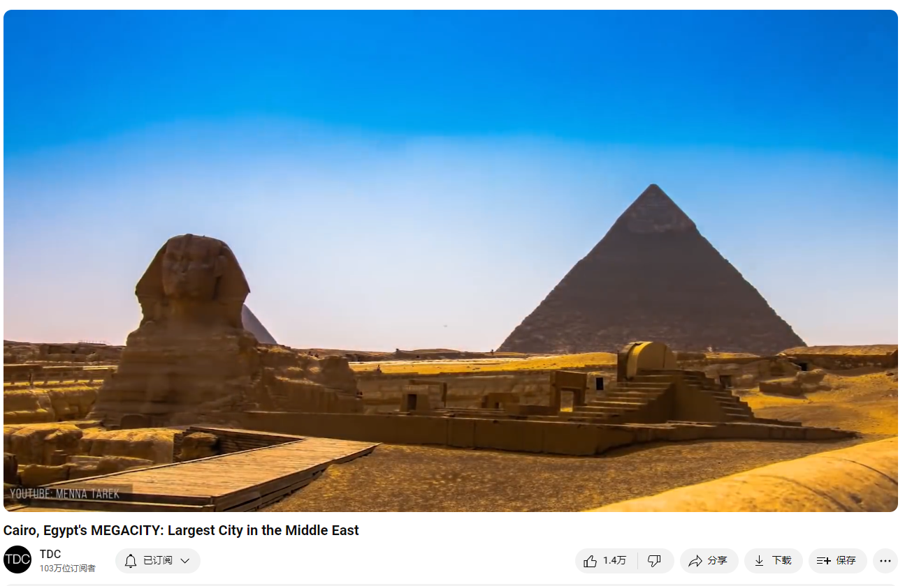

# Cairo, Egypt's MEGACITY: Largest City in the Middle East

Link: [https://www.youtube.com/watch?v=0tKphKvodLQ&list=PLmSQiOQJmbZ7TU39cyx7gizM9i8nOuZXy&index=23](https://www.youtube.com/watch?v=0tKphKvodLQ&list=PLmSQiOQJmbZ7TU39cyx7gizM9i8nOuZXy&index=23)

## Summary

Summary of the Mini-Documentary on Cairo

#### Historical and Cultural Significance
Cairo, the capital of Egypt, is a city with a rich history that dates back 5,000 years to the time of the first Egyptian pharaohs and the iconic pyramids of Memphis. Established on the east bank of the Nile, it grew from the Arab general Amr ibn al-’As’s founding of Al-Fustat in 641. By the 14th century, Cairo had become a major cultural and intellectual hub, with significant contributions to higher learning and trade. However, plagues and the shift of trade routes due to Vasco da Gama's discovery of a sea route to India led to its decline. During the Ottoman Empire, Cairo was reduced to a provincial capital. The city's modern growth began in the 1830s, influenced by European urban designs, and accelerated in the 1950s under Col. Nasser's regime.

#### Modern Challenges and Developments
Today, Cairo is a sprawling megacity with a population of 20 million. It faces significant challenges, including overcrowding, inadequate infrastructure, and unregulated building practices. The city is home to large informal settlements, such as the City of the Dead and Garbage City, where residents live in extreme conditions. Despite these hardships, innovative solutions like the efficient sanitation system in Garbage City highlight the resilience and resourcefulness of its people. The government has attempted to address overcrowding by constructing new satellite cities, but these have largely failed due to poor transportation links and high costs.

#### Future Prospects and Climate Change
Cairo's future is further complicated by climate change, with rising sea levels threatening the Nile Delta and the coastal city of Alexandria, potentially displacing more people to Cairo. The government's plan to build a new capital aims to alleviate congestion, but it faces criticism for not addressing the immediate needs of the population. Environmental consultant Mounir Neamatalla suggests that megacities like Cairo hold potential for positive global impact if managed wisely. Effective use of resources and smart urban planning can help Cairo thrive, contributing to global peace and environmental sustainability.

Mini纪录片《开罗》的总结

#### 历史和文化意义

开罗，埃及的首都，是一个有着5000年悠久历史的城市，起源可以追溯到第一批埃及法老和孟菲斯的标志性金字塔。它建在尼罗河东岸，由阿拉伯将军阿姆尔·伊本·阿尔·阿斯于公元641年创建的阿尔-福斯塔特镇逐渐发展而成。到14世纪，开罗已经成为一个主要的文化和智力中心，对高等教育和贸易有着重要贡献。然而，由于瘟疫的爆发和由于瓦斯科·达·伽马发现了通往印度的海上航线导致贸易路线的转移，开罗经历了衰退。在奥斯曼帝国时期，开罗被降级为一个省会城市。现代开罗的发展始于19世纪30年代，受欧洲城市设计的影响，并在20世纪50年代纳赛尔上校的统治下加速发展。

#### 现代挑战与发展
今天，开罗是一个拥有2000万人口的庞大城市，面临着严重的拥挤、基础设施不足和建筑规范不健全的问题。城市中有大量的非正规定居点，如“死者之城”和“垃圾城”，居民生活在极端的条件下。尽管面临这些困难，垃圾城高效的卫生系统等创新解决方案展示了开罗人民的韧性和足智多谋。政府试图通过建设新的卫星城市来解决过度拥挤的问题，但由于交通连接不便和成本高昂，这些努力大多未能成功。

#### 未来前景和气候变化
气候变化进一步复杂了开罗的未来，海平面上升威胁着尼罗河三角洲和沿海城市亚历山大，可能会使更多人流向开罗。政府计划建设一座新首都以缓解拥挤，但因未能解决人口的直接需求而受到批评。环境顾问穆尼尔·内玛塔拉建议，如果管理得当，像开罗这样的特大城市可以对全球产生积极影响。有效利用资源和智慧的城市规划可以帮助开罗蓬勃发展，为全球和平和环境可持续性做出贡献。

## Vocabulary

minaret:英 [ˈmɪnərɛt] 尖塔

megalopolis：美 [ˌmɛɡəˈlɑpələs]特大城市；特大都市

Middle East：中东

Nile：美 [naɪl]  尼罗河

pharaoh：美 [ˈfɛroʊ] 古埃及国王；法老

pyramids： 美 [ˈpɪrəmɪdz]金字塔；（pyramid的复数）

iconic pyramids：标志性的金字塔

Born on the east bank of the Nile 5,000 years ago, Cairo dates back to the time of the first Egyptian pharaohs and iconic pyramids of the ancient city of Memphis. 开罗诞生于5000年前的尼罗河东岸，其历史可以追溯到第一任埃及法老的时代，以及孟菲斯古城标志性的金字塔。

lucrative：美 [ˈluːkrətɪv] 生利的；赚钱的

spice：美 [spaɪs]香料；调味料；调味品

With almost half a million people, it was a key link in the lucrative spice trade, allowing it to thrive culturally and intellectually. 这里有近50万人口，是利润丰厚的香料贸易的关键环节，使其在文化和智力上得以繁荣。

pinnacle：美 [ˈpɪnəkl] 顶峰；巅峰；高峰；极点；

The middle of the 14th century saw Cairo reach the pinnacle of its importance. 14世纪中叶，开罗达到了其重要性的顶峰。

monopoly：美 [məˈnɑːpəli] 垄断；独家控制； **注意发音**

Portugal：英 [ˈpɔːtʃəgəl]  葡萄牙（欧洲西南部国家）

sea route：海上航线

Then, its spice trade monopoly was broken when Vasco da Gama sailed from Portugal to India, establishing an alternative sea route, undermining Cairo’s economic importance. 然后，瓦斯科·达·伽马从葡萄牙航行到印度，建立了另一条海上航线，打破了埃及的香料贸易垄断，削弱了埃及的经济重要性。

sprawling：美 [ˈsprɔːlɪŋ] 手脚摊开地坐；大面积铺开；（sprawl的现在分词）

northward：朝北的

fertile：美 [ˈfɜːrtl]  肥沃的；多产的；富饶的；

valuable：美 [ˈvæljuəbl]  贵重的；宝贵的；珍贵的；

That’s when the city began sprawling northward into the fertile nile river delta, consuming valuable farmland. 从那时起，这座城市开始向北扩展到肥沃的尼罗河三角洲，消耗了宝贵的农田。

sanitation：美 [ˌsænɪˈteɪʃn] 环境卫生；

ramshackle：美 [ˈræmˌʃæk(ə)l] 严重失修的；摇摇欲坠的；东歪西倒的

Looking around Cairo from above also reveals that nearly all the rooftops are occupied by squatters who’ve made ramshackle homes on the only open space they could find. 从空中俯瞰开罗，几乎所有的屋顶都被擅自占地者占据，他们在唯一能找到的空地上搭建了摇摇欲坠的房屋。

prestige：美 [preˈstiːʒ] 声望；威望；威信；

 they’re driven by profit and prestige 他们受利润和声望的驱使

## Transcript

The Sahara is home to the world’s largest
desert city.

For centuries this place has thrived alongside
the world’s largest river.

This city of a thousand minarets is the capital
of the Arab world, a megalopolis with a population

of 20 million people.

This is Cairo, Egypt, the Megacity of the
Middle East.

Born on the east bank of the Nile 5,000 years
ago, Cairo dates back to the time of the first

Egyptian pharaohs and iconic pyramids of the
ancient city of Memphis.

Much later, in 641, the Arab general Amr ibn
al-’As founded the town of Al-Fustat, the

seed from which contemporary Cairo has grown.

In 970, a walled city was established to protect
its inhabitants from conquering armies.

Over the next 400 years it would grow to become
the largest city in all of Africa, Europe,

and Asia Minor.

With almost half a million people, it was
a key link in the lucrative spice trade, allowing

it to thrive culturally and intellectually.

Some of the earliest institutions of higher
learning were established here at this time.

The middle of the 14th century saw Cairo reach
the pinnacle of its importance.

Soon after, decline set in as plagues like
the black death began killing large portions

of its population.

Then, its spice trade monopoly was broken
when Vasco da Gama sailed from Portugal to

India, establishing an alternative sea route,
undermining Cairo’s economic importance.

And, while under Turkish control, Cairo was
relegated to just another provincial capital

within the massive Ottoman Empire.

Fast-forward to the 1830's, when the urban
growth that defines modern Cairo began.

Influenced by the renovation of Paris, a European-style
city was built to the west of the medieval

core.

Cairo entered its most rapid period of expansion
in the 1950's, triggered by Col. Nasser’s

revolution that ended 2,000 years of imperial
rule in Egypt.

That’s when the city began sprawling northward
into the fertile nile river delta, consuming

valuable farmland.

This growth was fueled by improvements in
transportation and industrialization.

Things like flood control allowed the riverfront
to be developed, and bridges allowed people

to settle on the area's islands and west bank.

Just like we've seen with the other cities
in this series, Cairo's development eventually

reached a point of critical mass--where it
suddenly became an attractive enough destination

that people began arriving faster and faster,
and in larger and larger numbers.

But unfortunately for Cairo, it was unprepared
for this influx and couldn’t grow fast enough

to support them.

Many of these newcomers had to make desperate
choices about where to live.

Today, half a million people live in the City
of the Dead, among row after row of tombs.

More of Cairo’s poor live in a place called
Garbage City.

Here 70,000 Cairenes sort and recycle the
15,000 tons of trash that’s created every

day in the rest of the city.

They actually provide a vital service and
were even recognized as one of the most efficient

sanitation operations in the world.

An urban artist named eL Seed recently undertook
a beautification project there and shared

what he learned in a Ted talk.

“The Zaraeeb community was the ideal context
to raise the topic of perception.

We need to question our level of misconception
and judgment we can have as a society upon

communities based on their differences…The
people of Cairo call them ‘the Zabaleen,’

which means ‘the people of the garbage.’

But ironically, the people of Manshiyat Naser
call the people of Cairo the Zabaleen.

They say they are the ones who produce the
garbage, not them.”

Even if you’ve got a home in Cairo, it’s
often built on shaky ground.

Developers frequently ignore, or bribe their
way past, rules that limit buildings to six-stories

because of the oversaturated nile river delta
land that serves as city’s foundation.

This had tragic consequences in 1992 when
an earthquake struck that collapsed numerous

residential towers killed more than 600 people.

Looking around Cairo from above also reveals
that nearly all the rooftops are occupied

by squatters who’ve made ramshackle homes
on the only open space they could find.

One of the ways the government dealt with
overcrowding was to build a large subway system

modelled after the Paris metro.

It now has over 1 billion riders a year and
has somewhat eased the brutal traffic congestion,

but it brought the unintended consequence
of encouraging even more people to move to

the city.

In response, the Egyptian government has tried
to relocate people to gleaming new cities

they are continually building on the outskirts
of Cairo.

But with bad transportation options to and
from there, these cities become too expensive

to move to, and fall flat every time.

Twenty two of these “new towns” already
exist.

Designed for millions and millions of residents,
they collectively hold a little over 1 million.

It seems the excitement and connectivity of
urban Cairo will always be more attractive

than a life lived in overpriced suburbs further
out in the desert.

But wealthy developers haven’t gotten the
message: they’re driven by profit and prestige

rather than doing what’s best for Cairo.

And Egyptian housing minister Mostafa Madbouli
seems to be listening to them.

He recently unveiled a $40 billion mega plan
to build an entirely new capital.

He argues the project is needed to ease congestion
and overcrowding in Cairo.

It attempts to follow in the footsteps of
purpose-built capitals like Islamabad, Brasilia,

and Canberra.

At 700 sq km, it will be as big as Singapore
and will aim to house at least five million

residents.

The project was originally led by the Emirati
businessman behind the Burj Khalifa, although

disagreements forced the Egyptians to turn
to Chinese companies instead.

This ambitious, risky project has many Egyptians
wondering if it’s the right way forward.

[Cairo resident] “What new capital are they
talking about?

They should pay attention to the poor and
needy instead.

Millions of Egyptians are unemployed, and
the government wants to spend billions of

dollars on a new capital.”

[Cairo resident] “The new capital city is
a late decision.

Here in Egypt, I don’t know.

But those in charge only start thinking after
the problem has already happened.”

Perhaps one of the reasons President el-Sisi
is initiating the project has to do with the

turmoil Cairo has just lived through.

In 2011, the world was captivated by the Egyptian
revolution when millions took to the street

demanding change.

First, the 29 year rule of Hosni Mubarak ended.

Then, the misguided and brief presidency of
Muhammad Morsi was toppled by a coup led by

the current President, el-Sisi.

With a firm grip on power, it makes sense
for el-Sisi to want to build himself a new

capital, safely removed from the masses in
Cairo—a city that is now home to nearly

1 in 4 Egyptians and is one of the fastest
growing places in the world.

In the next 30 years, its population is on
pace to hit 40 million.

One of the factors that will bring so many
more people, is climate change.

While Cairo is removed from the coast, the
Egyptian city of Alexandria isn’t—and

it’s already feeling the effects of rising
seas.

NPR’s Jane Arraf recently travelled there
to tell the story.

“Egypt is one of the countries most vulnerable
to climate change.

Eventually entire neighborhoods could be underwater.

The nile delta is crucial to Egypt.

More than half of its crops are grown in that
triangle where it spreads out and drains into

the sea.

In farmland along the Nile diesel pumps spring
up water from the river for irrigation.

Increasingly, seawater is creeping in.”

A coastline that is continually creeping inland
will force more and more people to move to

Cairo.

This will amplify the pressure Cairo’s leaders
already feel.

But solutions exist to manage its growth,
as long as smart ideas prevail and Egypt’s

precious resources, be they water or money,
are used in the most efficient way.

In a documentary that’s several decades
ago, visionary environmental consultant Mounir

Neamatalla, made the case that — despite
its size — Cairo can thrive.

“Megacities are an opportunity, they’re
not a burden.

We have to look at megacities as a place where
human beings are going to efficiently contribute

something to mankind.

The world now is not separated by national
boundaries, and cannot be separated by national

boundaries—thank goodness.

And that is very much because of megacities.

Megacities are playing a very, very, very
important role in promoting peaceful coexistence,

and in making sure that the very important
issues that concern our planet, such as environment,

are indeed exchanged, attended to, and acted
upon.”

Thanks for watching.

If you enjoyed this latest video in our Megacities
series, give it a like and a share so others

can discover it to.

For TDC, I’m Bryce Plank.

## Afterword

2024年6月28日16点33分于上海。

