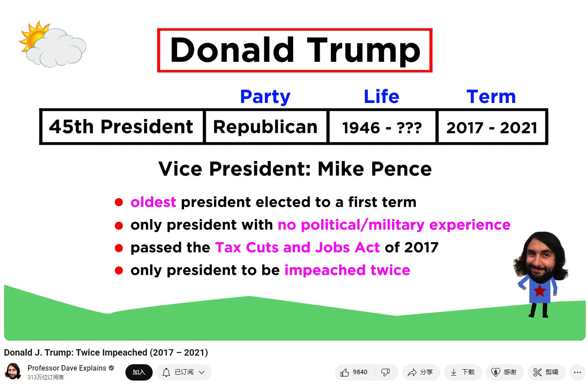

# Donald J. Trump: Twice Impeached (2017 – 2021)

Link: [https://www.youtube.com/watch?v=J7RC2DKf6rs&list=PLybg94GvOJ9E-ZM1U6PAjgPUmz-V4-Yja&index=45](https://www.youtube.com/watch?v=J7RC2DKf6rs&list=PLybg94GvOJ9E-ZM1U6PAjgPUmz-V4-Yja&index=45)

## Summary

Summary of Donald Trump's Rise and Presidency

Donald John Trump, originally from Queens, New York, inherited a real estate empire from his father, Fred Trump, and expanded it into a global brand. With a background in the New York Military Academy and the Wharton School, Trump took over the Trump Organization in his mid-20s, diversifying into hotels, resorts, and casinos. Known for his media-savvy and charismatic personality, he became a public figure in the 1980s and 1990s, promoting his image through ventures in sports, beauty pageants, and the bestselling book "The Art of the Deal." Despite numerous financial setbacks, he maintained a public persona as a successful businessman.

Trump's foray into politics began with a brief presidential run in 2000, but he gained significant traction with his 2015 campaign for the Republican nomination. Running on a populist platform, he leveraged social media, especially Twitter, to communicate directly with supporters. His campaign focused on issues like immigration, trade protectionism, and reducing special interest influence in Washington. Despite controversies and a crowded field of experienced opponents, Trump secured the Republican nomination and won the 2016 presidential election against Hillary Clinton, largely by appealing to voters disillusioned with the political establishment.

As president, Trump's tenure was marked by significant deregulation, tax cuts, and attempts to undo many of President Barack Obama's policies. His administration faced numerous scandals, high staff turnover, and two impeachments—the first related to alleged pressure on Ukraine to investigate Joe Biden, and the second for incitement of insurrection following the January 6th Capitol riot. Trump's handling of the COVID-19 pandemic, characterized by misinformation and delayed responses, led to widespread criticism. Ultimately, Trump lost the 2020 presidential election to Joe Biden but continued to assert unproven claims of electoral fraud, culminating in the Capitol riot. His presidency underscored deep national divisions and a shift toward populism in American politics.

唐纳德·特朗普的崛起和总统任期总结

唐纳德·约翰·特朗普（Donald John Trump）出生于纽约市皇后区，继承了他父亲弗雷德·特朗普（Fred Trump）的房地产帝国，并将其扩展为一个全球品牌。他在纽约军事学院和宾夕法尼亚大学沃顿商学院学习后，在二十多岁时接管了特朗普集团，投资于酒店、度假村和赌场。以其媒体敏锐和富有魅力的个性而闻名，他在20世纪80年代和90年代成为公众人物，通过在体育、美容选美和畅销书《交易的艺术》中的冒险活动推广自己的形象。尽管面临许多财务挫折，他依然保持着成功商人的公众形象。

特朗普的政治生涯始于2000年的一次短暂总统竞选，但在2015年竞选共和党提名时，他获得了显著的关注。以民粹主义为竞选平台，他利用社交媒体，尤其是推特，直接与支持者沟通。他的竞选重点包括移民、贸易保护主义和减少华盛顿特区的特殊利益影响。尽管面临许多争议和一群经验丰富的对手，特朗普赢得了共和党提名，并在2016年总统大选中击败希拉里·克林顿。

作为总统，特朗普的任期以显著的放松管制、减税和试图推翻前总统巴拉克·奥巴马的许多政策为特征。

## Vocabulary

rise to fame：成名；发迹；一举成名

adept at：擅长；善于；熟练于…          

Adept at marketing：擅长营销

household name：家喻户晓的人

turn his last name into a household name. 让他的姓氏家喻户晓。

borough：美 [ˈbəroʊ]  行政区；自治市镇；自治镇；自治区**注意发音**

the borough of Queens：皇后区

look up to：敬仰；尊敬；仰慕；

workaholic：美 [ˌwɜːrkəˈhɑːlɪk] 工作狂；工作迷；事业迷；

ruthless：美 [ˈruːθləs]无情的；残忍的；冷酷的；冷血的；

businessman：商人

cut corners：走捷径

Born in the borough of Queens in New York City, Trump looked up to his workaholic father, in many ways a ruthless businessman, who cut corners and avoided paying taxes whenever possible.特朗普出生于纽约市皇后区，崇拜他的工作狂父亲，在许多方面，他都是一个无情的商人，尽可能地偷工减料和逃税。

deferment：美 [dɪˈfɚmənt]延期；迁延；

Similar to 42nd president Bill Clinton, he received several draft deferments in college to avoid serving in the Vietnam War. 与第42任总统比尔·克林顿相似，他在大学期间也曾数次延期服兵役，以避免参加越南战争。

graduate college：从大学毕业

oversee：监督；管理；

By 1973, the Trump Organization oversaw 14,000 apartments across New York. 到1973年，特朗普集团在纽约管理了14000套公寓。

residential buildings：住宅楼

resorts：美 [rɪˈzɔːrts] 度假村；旅游胜地；度假胜地；（resort的复数）

golf courses：高尔夫球场

In addition to residential buildings, under Donald’s leadership it invested heavily in hotels, resorts, casinos, golf courses, and other types of large-scale commercial buildings all around the world. 除了住宅建筑，在唐纳德的领导下，该公司还在世界各地投资了大量酒店、度假村、赌场、高尔夫球场和其他类型的大型商业建筑。

associates：美 [əˈsoʊsieɪts] 同事；伙伴；合伙人；（associate的复数）

charisma：美 [kəˈrɪzmə]  魅力；感召力；超凡的个人魅力；吸引力；

charismatic：美 [ˌkærɪzˈmætɪk] 有迷人魅力的；

In these early years, associates of Trump described him as charismatic and very easy to work with.早些年，特朗普的同事形容他很有魅力，很容易共事。

seize any opportunity: 抓住机会

seize:美 [siːz] 抓住；咬住； **注意发音**

make media appearances： 在媒体上露面      

He also loved attention, seizing any opportunity he could to make media appearances and turning every opening of a new hotel into a huge media event. 他也喜欢被关注，抓住一切机会在媒体上露面，把每一个新酒店的开业都变成一个巨大的媒体事件。

Czech：美 [tʃɛk] 捷克人；捷克裔；捷克语

tabloid：美 [ˈtæblɔɪd] 通俗小报；耸人听闻的；引起轰动的

the couple soon became tabloid figures in New York society. 这对夫妇很快成为纽约社会的轰动人物。

managerial：美 [ˌmænəˈdʒɪriəl] 管理上的；经营性的；**注意发音**

hold managerial positions: 担任管理职位

Ivana became active in the Trump Organization, holding important managerial positions. Ivana在Trump组织中非常活跃，担任重要的管理职务。

pageant: 美 [ˈpædʒənt]  露天舞台场景；活动舞台场景；选美比赛

beauty pageants.选美比赛

many of the details in the book were fabricated.很多都是编造的

nationally syndicated：全国性；全国联合

syndicate：辛迪加；企业联合组织；

cameo：美 [ˈkæmiˌoʊ] 精彩片段；客串角色

wrestling：美 [ˈreslɪŋ] 摔跤运动；角力；格斗；**注意发音**

He went on to be a regular guest on the nationally syndicated Howard Stern show, made several cameo appearances in films and TV shows, and even got involved with professional wrestling. 他继续成为全国性的霍华德·斯特恩秀的常客，在电影和电视节目中客串了几次，甚至涉足职业摔跤。

deficit：美 [ˈdefɪsɪt] 赤字；财政赤字 **注意发音**

starring：领衔主演；主演；

reality TV：真人秀

apprentice：美 [əˈprentɪs] 学徒；徒弟 **注意发音**

In 2003, Trump became much more famous after co-producing and starring in the successful reality TV show The Apprentice. 2003年，特朗普在联合制作并主演了成功的真人秀节目《学徒》后变得更加出名。

pundits：美 [ˈpʌndɪts] 专家；评论员；（pundit的复数）

populist：美 [ˈpɑpjələst] 平民主义者；平民论者

 lobbyists：美 [ˈlɑːbiɪsts] 说客；（lobbyist的复数）

campaign trail：竞选过程；竞选途径；

unpolished：美 [ˌənˈpɑlɪʃt]未磨光的；未擦亮的；未经润饰的；

On the campaign trail, Trump was unpolished and controversial. 在竞选过程中，特朗普表现得不完美，充满争议。

entice：美 [ɪnˈtaɪs]引诱；勾引；诱惑；诱导；吸引

inaugurated：美 [iˈnɔ:ɡjureitid] 开创；举行就职典礼；开始；（inaugurate的过去分词）

Once inaugurated, Trump had many friends and family members join him as advisors, including his daughter Ivanka and son-in-law Jared Kushner. 特朗普一就职，就有许多朋友和家庭成员作为顾问加入他的行列，包括他的女儿伊万卡和女婿贾里德·库什纳。

tone down：使（言辞）温和；使（调子）缓和；收敛          

rhetoric：美 [ˈretərɪk] 修辞；修辞学；花言巧语；虚夸；言论 **注意发音**

ramp up：加大马力，加强

Although many assumed he would tone down his rhetoric on Twitter, instead he ramped it up. 尽管许多人认为他会在推特上缓和他的言辞，但他反而加强了。

repeal：美 [rɪˈpiːl] 撤销；废止

These were not successful in repealing the law. 这些在废除法律方面没有成功。

retaliatory：美 [rɪˈtæliətɔːri] 报复的；报复性的

zeitgeist： [ˈtsaɪtˌɡaɪst]  时代精神；时代思潮 **注意发音**

## Transcript

Donald John Trump rose to fame by knowing how to use the media to get people to like

him.

Adept at marketing, he inherited a real estate empire from his father, Fred Trump, and used

the wealth from that empire to turn his last name into a household name.

Born in the borough of Queens in New York City, Trump looked up to his workaholic father,

in many ways a ruthless businessman, who cut corners and avoided paying taxes whenever

possible.

As a kid, he went to the New York Military Academy and later graduated from the Wharton

School of Finance and Commerce at the University of Pennsylvania.

Similar to 42nd president Bill Clinton, he received several draft deferments in college

to avoid serving in the Vietnam War.

By the time he graduated college, he was already working for his dad’s firm and receiving

the equivalent of $1 million a year in gifts.

He then invested $70,000 in a Broadway comedy called Paris Is Out!

While he didn’t make any money off the venture, Trump spent much of the rest of his career

fascinated by show business.

By the time he was 25, Donald had already taken over his father’s real estate firm,

renaming it the Trump Organization.

By 1973, the Trump Organization oversaw 14,000 apartments across New York.

In addition to residential buildings, under Donald’s leadership it invested heavily

in hotels, resorts, casinos, golf courses, and other types of large-scale commercial

buildings all around the world.

In these early years, associates of Trump described him as charismatic and very easy

to work with.

He also loved attention, seizing any opportunity he could to make media appearances and turning

every opening of a new hotel into a huge media event.

In 1977, Trump married a Czech model named Ivana Zelníčková, and the couple soon became

tabloid figures in New York society.

Ivana became active in the Trump Organization, holding important managerial positions.

By the end of the 1980s, Donald Trump was a billionaire, and, at least on paper, one

of the richest people in the world.

With the money he earned in real estate, he continued to invest in other ventures, including

a professional football league, a professional cycling race, boxing matches, and beauty pageants.

However, the New York Times later reported that Trump rarely actually made money in any

given year.

In 1990 and 1991 alone, he lost more than $250 million each year.

However, the majority of the American public had no idea.

Trump continued to portray himself as a billionaire and financial wizard even while most of his

core businesses were failing.

Much of this was due to how Trump promoted himself.

In fact, whenever he was selling himself as a brand, he did make money.

The Art of the Deal, a self-help book that also hyped up Trump’s life, sold more than

a million copies.

The author of the book, Tony Schwartz, later admitted that many of the details in the book

were fabricated.

By then, it was too late.

The myth that Trump was a genius businessman had been created.

Throughout the 1990s, Trump continued to demand attention wherever he went, and always stood

out with his unique hairstyle.

He went on to be a regular guest on the nationally syndicated Howard Stern show, made several

cameo appearances in films and TV shows, and even got involved with professional wrestling.

Meanwhile, he was regularly outspoken on political matters, taking out full-page advertisements

in major newspapers for things like advocating peace in Central America and the reduction

of the federal deficit.

In 2000, Trump briefly ran for President, seeking the Reform Party’s nomination, running

on issues such as fair trade and implementing universal healthcare.

However, after polling poorly against opponents George W. Bush and Al Gore, Trump decided

to drop out of the race.

In 2003, Trump became much more famous after co-producing and starring in the successful

reality TV show The Apprentice.

In it, contestants competed for a year of employment at the Trump Organization, completing

business-related tasks for the prize of a $250,000 contract to promote one of Trump’s

properties.

After the show’s success, Trump continued to invest in more side ventures, including

founding a university and licensing his name for various products.

In 2015, Trump decided to make another run for President, this time with the Republican

Party.

He had been one of Barack Obama’s most vocal critics during Obama’s Presidency, even

going so far as to widely promote the debunked conspiracy theory that Obama was not born

in the United States.

Trump’s platform of choice was Twitter, and he naturally excelled at getting attention

on the platform, as well as other social media outlets.

Initially, many political pundits did not take Trump’s presidential campaign seriously,

dismissing his ideas of closing down the borders to immigrants as too radical.

However, news outlets spent much more time covering his campaign than other candidates,

as he often helped their ratings go up, and soon Trump was the frontrunner in a crowded

field for the Republican nomination.

Running under the slogan “America First,” Trump ran as a populist, calling for tighter

border security, more protectionism, and less influence of special interests and lobbyists

in Washington, D.C.

On the campaign trail, Trump was unpolished and controversial.

He often spoke off the cuff, never apologizing for harshly making fun of his opponents.

He was the opposite of “politically correct,” and this proved very popular with his supporters.

These were people who were tired of elitist DC politicians which, to them, had seemed

to forget about Americans in rural areas and those who didn’t live along the coasts.

Despite a Never Trump coalition within the Republican Party, Trump won the nomination,

beating out over a dozen more experienced and polished rivals.

Trump’s main opponent in the 2016 presidential election was Hillary Clinton, the former U.S.

Secretary of State and U.S. Senator, as well as wife to former President Bill Clinton.

To many American voters, Clinton, despite being the first woman to be nominated for

President by a major political party, was just another establishment, status-quo type

candidate, and Trump, despite being a billionaire, was the underdog, an outsider who could challenge

what they viewed as an inherently corrupt system.

Even though the majority of the country feared a Trump Presidency, Trump enticed enough new

voters to the polls to win the presidency, despite getting nearly three million fewer

votes than Clinton.

His victory was considered a political upset, as many forecasters predicted a Clinton victory.

In addition to being the oldest person to ever be elected to a first presidential term,

Trump was also the first president who had not held any government office nor served

in the military prior to taking office.

Once inaugurated, Trump had many friends and family members join him as advisors, including

his daughter Ivanka and son-in-law Jared Kushner.

While he promised to reduce lobbyist influence in DC, his cabinet ended up appointing four

times as many lobbyists as Obama did.

Although many assumed he would tone down his rhetoric on Twitter, instead he ramped it

up.

To Trump, this was the absolute best way to communicate directly to the American people,

especially his supporters.

While many Republicans grew weary of his provocative tweets, fearing that some could even lead

to national security concerns, his advocates seemed to support him even more passionately

through the platform.

As President, Trump spent much of his time trying to undo most of what Obama had accomplished

in the previous eight years.

He signed executive orders attempting to repeal parts of the Affordable Care Act, also known

as “Obamacare.”

These were not successful in repealing the law.

He withdrew the United States from the Trans-Pacific Partnership negotiations and the Paris Agreement,

a global treaty which sought to mitigate the damaging effects of climate change.

He also formally withdrew the United States from the Iran nuclear deal framework.

Even though he wanted to be known as the “anti-Obama” President, he kept Obama’s foreign policy

in place, maintaining and even extending the so-called War on Terrorism.

Ultimately, the four biggest priorities for the Trump administration were border security,

keeping production domestic, deregulation, and lowering taxes.

Regarding border security, he demanded more funding from Congress for the extension of

a border wall along the United States-Mexico border.

Due to Congress not wanting to cover the costs, Trump was only able to redirect sufficient

funds to get about 80 miles of new barriers built where there were none before.

He also implemented a controversial family separation policy for migrants illegally crossing

the United States-Mexico border.

As for keeping production domestic, Trump mainly sought additional tariffs on imports

as part of his “America First” economic policy to reduce the trade deficit.

This angered trading partners like China, who implemented retaliatory tariffs on U.S.

goods.

The trade war with China harmed diplomatic relations between the two countries.

Most of the Trump administration’s deregulation involved environmental protections, and many

were challenged by environmental groups in courts and ultimately struck down.

One of Trump’s most significant actions was signing into law the Tax Cuts and Jobs

Act of 2017, which was the biggest overhaul of the tax code since the Reagan administration.

While the law lowered taxes for all Americans, most of the benefits went to the wealthy,

the banks, and other corporations, due to significant tax cuts to corporate profits,

investment income, and estates.

Most economists today argue that there is little evidence that Trump’s tariffs, deregulation,

and lowering of taxes substantially helped the American economy.

Nevertheless, during the Trump years, the economy continued to grow.

In fact, it was the height of the longest economic expansion in American history going

all the way back to the Great Recession.

More importantly, wages finally began to increase slightly.

Other priorities for Trump included making as many federal judicial appointments as possible,

reducing the cost of prescription drugs, improving healthcare for veterans, and criminal justice

reform.

Of all his priorities, Trump was most successful in these four areas.

His biggest criminal justice reform accomplishment was the signing of the First Step Act, which

meant to decrease the federal inmate population and reduce harsh sentencing laws for nonviolent

drug offenders.

Accomplishments aside, the Trump presidency was consistently marked by scandal and controversy.

He was the most unpopular American President of the modern era.

Despite the consistent and loud support from his diehard fans, his approval rating rarely

got over 42%.

Often, he seemed uninterested in the job, and instead of reading daily briefings, he

preferred to watch Fox News for hours each day.

According to multiple media outlets, Trump made more false and misleading statements

than any President before him.

Due to news outlets consistently calling him out when he lied, Trump grew to distrust the

media which he once so loved, turning on that which was largely responsible for his success

as a celebrity and politician, referring to any unfavorable coverage as “fake news”.

The Trump administration also had a higher turnover rate in its first two and a half

years than the five previous presidents did over their entire terms.

After an investigation concluded that Russia helped get Trump elected in 2016, there was

no evidence that the Trump campaign conspired or coordinated with the Russian government.

However, Trump later allegedly attempted to pressure Ukraine to announce investigations

into his political rival Joe Biden, which led to him being only the third President

ever to be impeached, the others being Bill Clinton in 1998 and Andrew Johnson in 1868.

The House of Representatives adopted two articles of impeachment: abuse of power and obstruction

of Congress.

However, the Senate acquitted Trump of these charges.

In his last year in office, Trump reacted slowly to the COVID-19 pandemic, the most

devastating pandemic since the Spanish flu from a century prior.

He often ignored or downplayed recommendations from top health experts and even actively

promoted misinformation.

As hundreds of thousands of Americans died from the virus, many people directed their

anger toward him.

In addition, the country found itself in its worst economic crisis since the Great Depression.

All of this culminated with the presidential election of 2020.

This time Trump’s main opponent was Joe Biden, the senator from Delaware and former

Vice President to Barack Obama.

The two went on national television to debate, and it was chaotic, with both yelling over

each other and barely getting their points across.

At one point, Biden called Trump “the worst president America has ever had.”

It was a clear cut sign of how divided the nation still was, despite a pandemic that

should have brough unification.

In fact, COVID-19 had become a political issue during the campaign.

There wouldn’t be a second debate as Trump had contracted the coronavirus himself, apparently

nearly dying from it.

Despite the conditions, it was the highest turnout for a presidential election since

that of 1900.

Although results were slow to manifest due to the counting of millions of mail-in ballots,

Biden won the election, demonstrating that the majority of Americans felt they’d had

enough of Trumpism, especially with a struggling economy and a worsening pandemic.

Despite clear evidence that the 2020 election was the most secure election in American history,

Trump refused to admit that he lost, falsely claiming electoral fraud.

He pressured government officials and attempted to overturn the results.

On January 6th, 2021, Trump led a rally in Washington, D.C., in which he urged his supporters

to march to the U.S. Capitol building, where the electoral votes were being certified that

day.

A mob of hundreds of Trump supporters stormed the Capitol, interrupting the vote count and

threatening the lives of members of Congress and even the Vice President, Mike Pence, who

led the ceremony to certify the election results.

Tragically, 5 people died, including 1 police officer, and many dozens were injured.

The rioters occupied, vandalized, and looted the Capitol for hours before the National

Guard finally came in to eject them and make arrests.

Many criticized Trump for inciting the violence and not doing anything to protect the Capitol.

The House of Representatives impeached him for incitement of insurrection on January

13th, 2021, making him the only president in American history to be impeached twice.

The Republican majority Senate, however, acquitted him for a second time on February 13th.

But in retribution for the Capitol attack, Trump lost nearly all of his social media

accounts, including his beloved Twitter.

It was then much more difficult for him to control the zeitgeist as he was no longer

part of the Twittersphere.

While Donald Trump rose to fame by knowing how to use the media to gain favor, his actions

at the height of his influence cost him his access to those very same tools.

The Trump presidency marked a time when the country was as divided as it ever had been

since the Civil War.

Though it is still too early to fully analyze the legacy of Trump and Trumpism in general,

his presidency undoubtedly marked a shift toward populism amongst American citizens.

It also, unfortunately, only further divided

the country.

## Afterword

2024年6月28日13点04分于上海。