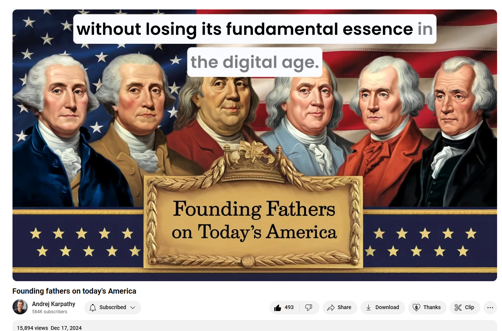

# Founding fathers on today's America: Chapter 7

Link: [https://www.youtube.com/watch?v=1qTa9cJ7cjk&t=4407s](https://www.youtube.com/watch?v=1qTa9cJ7cjk&t=4407s)

本文用于学习英语，仅供个人使用。如有侵权，请联系删除。

treatise: 美 [ˈtriːtɪs]   专著；论文；学术论文；专题论文

>A treatise on the topic written by o1-pro and prompted iteratively by Andrej, as an exploration of the LLM capabilities. First I prompted for a chapter outline, then for each chapter in turn, and finally for the summary chapter 10 by putting all previous chapters in the context window.  
>
>Also available as text on my blog: [https://karpathy.ai/blog/foundingfathers.html](https://karpathy.ai/blog/foundingfathers.html)
>
>More context on why this video exists: [https://x.com/karpathy/status/1868903...](https://www.youtube.com/redirect?event=video_description&redir_token=QUFFLUhqbjdjOE11a1RFZVp3VVkydVZJQW9BNW1CVmt3Z3xBQ3Jtc0trLU5FTWxPQkVjUXJKLXNZRVFkNnpkQTU1NEphb3dfeXNvWkhuVjBIX3MwamNETl9WdHAwbGxNNnlId01meERPdmx2VFZyUDFqbHdCMTNKWGRBYk1HYTctZ2RNLXZES0N6eFp0NkdzbHhxUnhFX2dLQQ&q=https%3A%2F%2Fx.com%2Fkarpathy%2Fstatus%2F1868903650451767322&v=1qTa9cJ7cjk) 
>
>Chapters (bleh if anyone can help in comments would be helpful): 
>
>- Chapter 1: The Constitutional Framework Under Modern Strain 
>
>- Chapter 2: Liberty and Surveillance in the Digital Age 
>
>- Chapter 3: Political Parties and the Founders’ Intentions 
>
>- Chapter 4: Economic Power and Corporate Influence 
>
>- Chapter 5: Equality and Civil Rights Beyond the Eighteenth Century 
>
>- Chapter 6: Education, Citizenship, and Civic Virtue 
>
>- Chapter 7: Religion, Secularism, and the Public Sphere 
>
>- Chapter 8: Military, Foreign Policy, and America’s Global Role 
>
>- Chapter 9: Technological Advancement and Democratic Discourse 
>
>- Chapter 10: Renewing the American Experiment 
>
>
>
>AI credits:
>
>- o1-pro for writing ($200/mo atm on ChatGPT), the most bleeding edge LLM from OpenAI as of Dec 2024.
>- ElevenLabs for audio
>- Ideogram for thumbnail
>- VEED for video

## Chapter 7: Religion, Secularism, and the Public Sphere 

In the early Republic, religion held both an essential and a precarious place. The Founders, having emerged from a colonial period marked by both sectarian strife and official religious establishments, understood well the power of faith communities to shape civic life. Yet in crafting the Constitution and the Bill of Rights, these statesmen took pains to ensure that no single religious tradition would dominate the fledgling nation’s public institutions. Their overarching goal—reflected in the First Amendment’s religion clauses—was to foster a pluralistic environment where personal belief, or nonbelief, could freely unfold without fear of state coercion. In an era when religious tests for office had often been the norm, the Founders’ approach was revolutionary. By declining to establish a national church or to privilege one tradition over others, they sought to secure a government in which conscience could be expressed independently of political authority.

If the Founders were to witness contemporary America, they would encounter a vastly more varied religious landscape than they had ever imagined. Their eighteenth-century world was largely Protestant and shaped by a limited number of denominations, with Catholic and Jewish communities existing as relative minorities. Today, religion takes innumerable forms and includes communities bound by global traditions, new and evolving spiritual movements, and secular perspectives. The presence of millions of Americans who identify as religiously unaffiliated and secular, alongside a multiplicity of faiths—Islam, Buddhism, Hinduism, Sikhism, and more—would demonstrate that the principle of free exercise, over time, has led to a religious pluralism that would seem both exhilarating and daunting.

The Founders would likely find themselves impressed by how well the principle of religious liberty has been preserved as a constitutional ideal. In the main, Americans remain free to worship as they choose, form congregations, establish religious schools, and live in accordance with their spiritual values. At the same time, however, the Founders would also grapple with the increasingly complex interplay between religion and public policy. While they had hoped for a system in which government remained neutral and detached from sectarian concerns, modern debates over matters such as reproductive rights, marriage equality, public funding of religious institutions, and religious objections to generally applicable laws reveal just how challenging it can be to maintain a healthy balance. Religious liberty cases reaching the nation’s highest court would raise for them new and perplexing questions: How far should a religious exemption extend? When does neutrality turn into neglect of spiritual commitments? How should a diverse democracy ensure that no one faith tradition imposes its moral code on everyone else?

The rise of secularism as a visible force in public life would be another layer the Founders might not have anticipated. They were not unfamiliar with freethinkers and deists—indeed, many of them held unorthodox beliefs themselves—but the prospect of a substantial part of the populace identifying as nonreligious or finding meaning outside organized faith communities would prompt reflection. For them, the question might become: If religion no longer holds the same unifying moral and cultural role it once did, what does that mean for sustaining a shared civic identity? They would see that, over time, the public sphere has become a space where claims are often evaluated according to secular reasoning and empirical evidence. While this might align well with Enlightenment-influenced habits of thought, it could also raise the concern that spiritual perspectives might be marginalized or misunderstood, losing their capacity to contribute moral insights.

In the shifting, globalized religious environment, the Founders might also observe how faith intersects with national debates on immigration, social welfare, international relations, and cultural integration. Houses of worship often serve as social anchors, community centers, and sources of charitable support. Americans still look to religious traditions to guide them through ethical dilemmas and community challenges. Yet they might note how religious tensions can emerge when certain faith communities feel threatened or when political rhetoric characterizes entire religious groups as suspect. Such divisions, fueled by media narratives and partisan politics, could undermine the very religious coexistence the Founders aimed to protect.

The Founders would also consider how public spaces and government ceremonies reflect religious traditions today. Debates over public religious symbols—whether a nativity scene can appear on a courthouse lawn or whether the phrase “under God” is appropriate in the Pledge of Allegiance—would reveal a nation still testing the boundaries of free exercise and nonestablishment. They might conclude that while their original design still stands as a firm foundation, the nation’s religious tapestry has grown so elaborate that its application demands constant calibration and dialogue.

Ultimately, the Founders would recognize that the American experiment in religious freedom remains in flux, pushed and pulled by cultural transformations, demographic shifts, legal contests, and the ongoing tension between devotion and doubt. Their original hope—that religion, liberated from state favoritism and interference, would serve as a wellspring of moral insight and a check on arbitrary power—remains an inspiring principle. They would likely advise modern Americans that the health of a republic is measured by how well it protects the conscience of each individual and fosters an atmosphere of genuine respect. The Founders, never static, would accept that new faiths, secular voices, and ever-changing beliefs are integral to the nation’s evolutionary journey. They might counsel that, as America grows more pluralistic, its people must reinforce their commitment to the freedom of conscience, remembering that the ideal they set forth—to ensure neither God nor government would dictate belief—is indispensable to the nation’s democratic vitality.