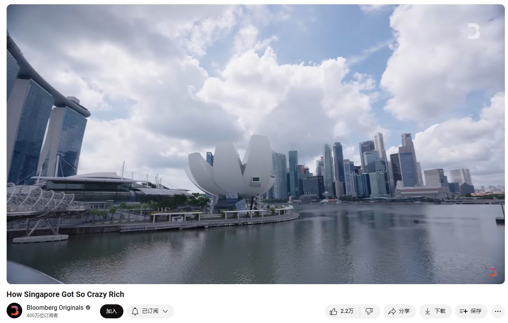

# How Singapore Got So Crazy Rich

Link: [https://www.youtube.com/watch?v=YSMWN8VpY6A](https://www.youtube.com/watch?v=YSMWN8VpY6A)

## Summary

Singapore, a small island nation, has become Asia's wealthiest country and one of the richest in the world. With a GDP per capita surpassing countries like the UK, the US, and France, Singapore transformed from a colonial trading port into a global financial hub over six decades. The country's success is attributed to strategic planning by its ruling party since independence in 1965. Lee Kuan Yew, Singapore's first Prime Minister, overcame the lack of natural resources by focusing on building a robust manufacturing industry, leveraging Singapore's strategic location as a shipping hub. Over time, Singapore developed a solid financial and legal system, a stable government, efficient public transport, and world-class healthcare. By the 1980s, Singapore pivoted towards finance, liberalizing the industry to attract multinational companies with low taxes and a business-friendly environment.

In the subsequent decades, Singapore continued to innovate under leaders like Goh Chok Tong and Lee Hsien Loong. The country emphasized a knowledge-based economy, attracting businesses and entrepreneurs while transforming the city into a vibrant, livable destination. Massive land reclamation projects led to the development of office spaces, apartments, and entertainment hubs, enhancing Singapore's appeal. The introduction of attractions like the F1 night race and integrated resorts (casinos) coincided with booming Chinese and Indian economies, drawing wealthy individuals to the city. Consequently, Singapore's asset management industry grew significantly, with assets under management increasing from \$420 billion to $3.6 trillion between 2004 and 2022.

Despite its economic achievements, Singapore's leadership faces criticism for restricting civil liberties and maintaining tight control over the media. The climate of fear established under Lee Kuan Yew persists, with protests still largely illegal. As Lawrence Wong takes over as the new prime minister, he inherits a nation grappling with issues like rising housing costs, the high cost of living, and concerns over foreign labor. Singapore's population is becoming more diverse and vocal, and the country must remain competitive while addressing the challenges of an aging population and climate change. Wong's leadership will be crucial in sustaining Singapore's success and guiding its continued evolution as a tech hub.

新加坡是一个小岛国，但它是亚洲最富有的国家之一，全球最富有的国家之一。其人均GDP已经超过了英国、美国、法国等发达国家。在过去的六十年里，新加坡从一个殖民贸易港口转变为一个全球金融中心。这一成就归功于自1965年独立以来执政党的战略规划。新加坡的第一任总理李光耀克服了自然资源匮乏的挑战，通过建立强大的制造业，利用新加坡作为航运枢纽的战略位置，实现了经济发展。随着时间的推移，新加坡建立了稳固的金融和法律体系，稳定的政府，完善的公共交通系统和一流的医疗保健。到1980年代，新加坡转向金融业，通过放松监管吸引跨国公司，以低税率和亲商环境为基础。

在接下来的几十年里，新加坡在吴作栋和李显龙等领导人的带领下继续创新。国家强调知识型经济，吸引企业和企业家，同时将城市转变为一个充满活力、适宜居住的地方。大规模的土地填海项目导致办公空间、公寓和娱乐中心的发展，提升了新加坡的吸引力。F1夜间赛车和综合度假村的引入与中国和印度经济的繁荣同步，吸引了富裕的个人来到新加坡。因此，新加坡的资产管理行业显著增长，从2004年的4200亿美元增加到2022年的3.6万亿美元。

尽管经济成就显著，新加坡的领导层因限制公民自由和严格控制媒体而受到批评。在李光耀的治理下形成的恐惧气氛仍然存在，抗议活动大多仍然是非法的。随着黄循财接任新总理，他继承了一个面临住房价格上涨、生活成本高昂和外来劳动力问题的国家。新加坡的人口变得更加多样化和直言不讳，国家在保持竞争力的同时还必须应对人口老龄化和气候变化的挑战。黄循财的领导将对保持新加坡的成功和引导其继续发展成为科技中心至关重要。

## Vocabulary

tiny island nation：很小的岛国

wealthiest = richest: 最富有的

trading port：贸易港口

buzzing：嗡嗡响的；使嗡嗡叫；发出嗡嗡声；

envied：美 [ˈenvid] 被人妒忌的；被人羡慕的

a buzzing financial center that's envied the world over.令全世界羡慕的繁忙的金融中心。

robust：强健的；强劲的；结实的；

seeking to grow a robust, high-tech economy. 寻求发展强劲的高科技经济。

formula for success：成功的公式

the Strait of Malacca：马六甲海峡

makes it a pivotal shipping hub：使它成为一个重要的航运中心

intend as：打算把xxx作为

stepping stone：垫脚石

But Lee only ever intended manufacturing as a stepping stone to a more developed economy. 但是，李只打算把制造业作为通向更发达经济的垫脚石。

lay：铺设

groundwork：基础工作；基本准备；准备工作；

Lee started laying the groundwork for what is now Singapore's biggest source of wealth, finance. 李开始为如今新加坡最大的财富来源——金融——奠定基础。

liberalized：美 [ˈlibərəlaizd] 宽大；使自由化；（liberalize的过去式）

he liberalized the financial services industry with lighter touch regulation. 他放宽了金融服务业的监管。

>“Touch regulation” 这里指的是对金融服务行业实施的监管方式。具体来说，"lighter touch regulation" 是一种较为宽松、灵活的监管模式。这种方式与严格的监管相对，旨在减少政府对金融市场的干预，允许更多的市场自由和创新，同时依赖市场自身的自律和透明度来维持秩序。

continued to lean into attracting big business. 继续倾向于吸引大企业。

embark on: 着手；开始

reclamation：美 [ˌrɛkləˈmeʃən] 开垦；改造；

It had embarked on an ambitious land reclamation project in the 1970s. 它在20世纪70年代开始了一项雄心勃勃的土地开垦项目。

politicking：美 [ˈpɑlətɪkɪŋ] 政治活动；竞选活动

Housing prices have increased. The cost of living has gone up.

## Transcript

This tiny island nation is smaller
than New York City,

but it's the wealthiest country in Asia

and one of the richest in the world.

Its GDP per capita itself has surpassed
the likes of the UK,

the US, France and other
developed countries.

Over six decades,

Singapore has transformed itself
from a colonial trading port

to a buzzing financial center
that's envied the world over.

And it's held up as an
example for any country

seeking to grow a robust,
high-tech economy.

Its wealth is the product of
decades of planning

by a party that's been in power
since independence.

So what's Singapore's
formula for success?

And as its leadership changes
for the first time in 20 years,

can it continue to prosper?

When Singapore became
independent in 1965,

the first prime minister, Lee Kuan Yew,
and other founding leaders

recognized it had an economic problem:

It had no natural resources.

So if they wanted to develop an export-led economy

and attract foreign capital,

they would need to build up the
country's manufacturing industry.

Its location gave it an edge.

It has access to the Strait of Malacca,
to the Indian Ocean,

to the South China Sea,
which makes it a pivotal shipping hub.

So it did this initially by transforming
Singapore into a manufacturing base

with a focus on labor-intensive industry at first

to wipe out the high unemployment.

But Lee only ever intended manufacturing

as a stepping stone
to a more developed economy.

He laid the fundamentals,
which is a solid financial

and legal system, stable
and largely clean government,

making sure that the public transport
system is efficient, 

has world-class health care infrastructure.

In the 1980s,

Lee started laying the groundwork
for what is now

Singapore's biggest source of wealth, finance.

Following the lead of places
like the US and UK,

he liberalized the financial services
industry with lighter touch regulation.

The legacy of that approach is evident today.

4200 multinational companies
have regional headquarters here.

Low taxes are a big reason for that.

Singapore's corporate tax rate is just 17%

and can hit 13.5% or
lower for some activities.

That's also because Lee's successor,
Goh Chok Tong,

continued to lean
into attracting big business.

Singapore shifted emphasis
to a knowledge-based economy

that relies more on creativity
and growing Singapore's entrepreneurs.

In 2004, Lee Hsien Loong, 
Lee Kuan Yew's eldest son,

 took over the premiership.

And he realized to retain the flow of businesses and wealth,

it needed to be an even more attractive place to live in.

With its prime location,

Singapore had to become a destination in itself.

That's been key to Singapore success.

It had embarked on an ambitious land
reclamation project in the 1970s.

Over the years,

that space was filled with not just
offices and apartment buildings,

but entertainment hubs, changing
the city skyline in the process.

One example was bringing in the F1 night race.

The government also welcomed casinos or

integrated resorts,
as they're called in Singapore.

And the timing was impeccable

because the Chinese and Indian
economies were booming.

Singapore was ideally situated
to attract the region's

ultra-wealthy, who could then
enjoy the casinos and nightlife,

but also park their money.

The results - the total value of assets
under management in Singapore

jumped from $420 billion at the
 start of Lee Hsien Loong’s tenure

to 3.6 trillion in 2022.

While Singapore has been
an economic success,

its leadership is criticized by some

for the restrictions on civil liberties and the media.

Freedom of the press,

freedom of the news
media must be subordinated

to the overriding needs
of the integrity of Singapore.

Under Lee Kuan Yew's governance,

one of the chief criticisms is that

 there was this climate of fear in Singapore.

People were afraid to criticize
the government.

Subsequent governments also faced
criticism for maintaining a tight grip.

Protests are still largely illegal.

The government is definitely cognizant
that its population is changing.

It is much more diverse.

It is much more vocal.

At the same time,
Singapore needs to stay competitive

as other countries
learn from its model of growth.

And climate change is becoming 
a threat to national security.

This is the Singapore that Lawrence Wong

is inheriting as the country's
new prime minister.

Wong, who grew up in public housing,

earned praise for his leadership

in the country's COVID-19 response.

He is seen as having more of a common man's touch.

We should build on what we have today.

We should affirm and reinforce
what works well for Singapore.

While the People's Action Party
still forms the ruling government,

its popularity is declining.

There will be that politicking

that will happen much more intensely

in the years to come than
there was ever before.

The build-up of wealth
has brought problems of its own.

Housing prices have increased.

The cost of living has gone up.

Part of Singapore's growth
model has been to attract foreign labor.

But too much foreign worker
inflow raises concerns

by the citizens that the foreigners
are taking too many of the good jobs.

If you just look at the numbers,
inequality has been reduced,

but that's not how some residents feel.

The country's rapidly
aging population is also going

to add pressure to workforce
growth and government spending.

So whether it's managing discontent

or guiding Singapore's continued
evolution into a tech hub,

Wong's job is to sustain
the city-state's hard-earned success.

## Afterword

2024年6月24日14点33分于上海。