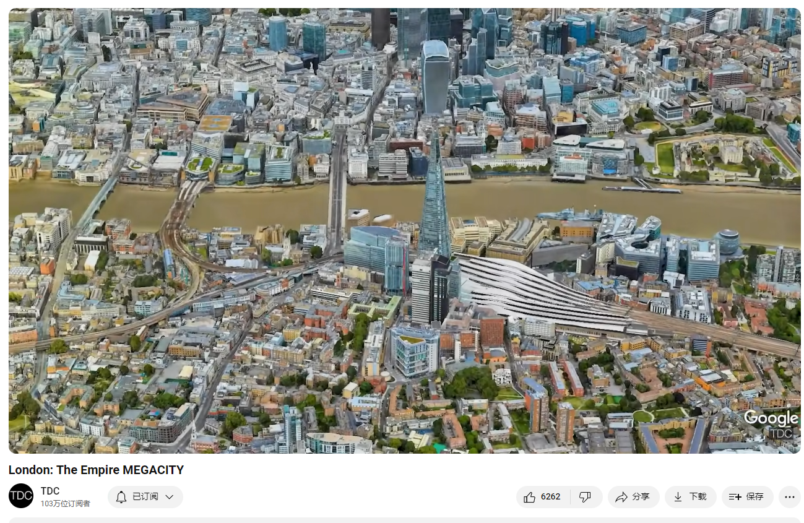

# London: The Empire MEGACITY

Link: [https://www.youtube.com/watch?v=ZM7TBKD3a5U](https://www.youtube.com/watch?v=ZM7TBKD3a5U)

London is the capital of the United Kingdom and was the world’s largest city until 1925. Once the center of the massive British Empire, it is now a mature, well-planned metropolis with a population of 13.7 million.

## Summary

**Summary of the History and Cultural Significance of London**

London, the Empire city, is a mature, well-planned metropolis with a population of 13.7 million. It is a highly admired place, consistently ranked as a top three most-visited destination globally. As the largest urban economy in Europe, with the greatest concentration of top-class universities, London has hosted the Summer Olympics three times. The city offers diverse attractions, including luxury, nature, sports, and entertainment, making it an appealing destination for many. London's history dates back to its founding as Londinium in 43 A.D. by the Romans along the River Thames. Over the centuries, it evolved into a significant cultural and economic hub, marked by landmarks such as Westminster Abbey, the Palace of Westminster, and the Tower of London. Despite experiencing devastating events like the Great Plague and the Great Fire in 1666, London's resilience and dynamic culture enabled it to recover and thrive.

**Economic and Social Development**

London's growth continued through the Industrial Revolution, becoming the world's largest city by 1831. The city's economy benefited from innovations like the electric motor and the development of a modern sewer system and the Underground railway. The quality of transportation allowed for the expansion of suburbs, foreshadowing the sprawl seen in other major cities. The green belt around London helped preserve nature and restrict development, but it also contributed to rising land costs and a severe housing shortage. Post-war immigration from Commonwealth countries further diversified London's population, making it the fourth largest immigrant community in the world. This influx, coupled with rising real estate prices, led to taller buildings and a changing skyline. Despite challenges, London remains a picturesque city with layers of historic architecture and a thriving economy.

**Contemporary Issues and Future Outlook**

Today, London faces significant challenges, including the assimilation of millions of foreigners and adapting to the rising cost of living. These issues contributed to the decision to leave the European Union in 2016, which continues to impact the country's political landscape. Additionally, London grapples with climate change, experiencing record heatwaves and facing flood risks from the rising sea levels. The city has invested in infrastructure like the Thames Barrier to mitigate these risks. Despite these challenges, London is well-positioned to remain a top global city, thanks to its advantageous location on a temperate island with no active volcanoes. Looking ahead, London is expected to continue its legacy as a leading metropolis well into the 2100s, maintaining its cultural and economic significance on the global stage.

**伦敦的历史与文化意义概述**

伦敦，被称为帝国之城，是一个成熟且规划良好的大都市，拥有1370万人口。它是一个备受赞赏的地方，常年位居全球三大最受欢迎的旅游目的地之一。作为欧洲最大的城市经济体，拥有最密集的顶级大学，伦敦曾三次举办夏季奥运会。这个城市提供了各种各样的吸引力，包括奢华、自然、体育和娱乐，使其成为许多人的理想目的地。伦敦的历史可以追溯到公元43年，罗马人在泰晤士河沿岸建立了伦蒂尼姆。几个世纪以来，伦敦发展成为一个重要的文化和经济中心，其标志性建筑包括威斯敏斯特教堂、威斯敏斯特宫和伦敦塔。尽管经历了如大瘟疫和1666年大火等毁灭性事件，伦敦凭借其复原力和动态的文化得以恢复和繁荣。

**经济与社会发展**

伦敦的增长在工业革命期间继续发展，到1831年成为世界上最大的城市。城市经济得益于诸如电动机的发明、现代化下水道系统和地铁的开发等创新。优质的交通使郊区得以扩展，预示了其他主要城市所见的蔓延。伦敦周围的绿带帮助保护了自然环境并限制了开发，但也导致了土地成本的上涨和严重的住房短缺。战后来自英联邦国家的移民进一步多样化了伦敦的人口，使其成为世界第四大移民社区。这种涌入，加上房地产价格的上涨，促使高层建筑的出现，改变了城市的天际线。尽管面临挑战，伦敦仍然是一个风景如画的城市，拥有多层次的历史建筑和繁荣的经济。

**当代问题与未来展望**

今天，伦敦面临重大挑战，包括数百万外国人的融合和适应不断上升的生活成本。这些问题促成了2016年脱欧的决定，继续影响国家的政治格局。此外，伦敦也在应对气候变化，经历创纪录的热浪，并面临海平面上升带来的洪水风险。城市投资了诸如泰晤士河屏障等基础设施，以减轻这些风险。尽管面临挑战，伦敦凭借其位于温带岛屿且没有活火山的有利位置，处于继续作为顶级全球城市的有利地位。展望未来，预计伦敦将继续其作为领先大都市的遗产，直至21世纪，保持其在全球舞台上的文化和经济重要性。

英国（United Kingdom）由四个部分组成，分别是：

1. **英格兰（England）**：
   - 英格兰是英国最大的组成部分，首都是伦敦，也是英国的政治、经济和文化中心。

2. **苏格兰（Scotland）**：
   - 苏格兰位于英格兰的北部，首都是爱丁堡（Edinburgh）。苏格兰拥有自己的法律体系和教育体系，并且在一定程度上享有自治权。

3. **威尔士（Wales）**：
   - 威尔士位于英格兰的西部，首都是加的夫（Cardiff）。威尔士有自己的语言（威尔士语）和独特的文化。

4. **北爱尔兰（Northern Ireland）**：
   - 北爱尔兰位于爱尔兰岛的东北部，首都是贝尔法斯特（Belfast）。北爱尔兰与爱尔兰共和国接壤，具有复杂的历史和政治背景。

这四个部分共同组成了大不列颠及北爱尔兰联合王国（The United Kingdom of Great Britain and Northern Ireland），简称英国。

The United Kingdom (UK) is composed of four parts:

1. **England**:
   - England is the largest part of the UK, with London as its capital. It is the political, economic, and cultural center of the country.

2. **Scotland**:
   - Scotland is located to the north of England, with Edinburgh as its capital. Scotland has its own legal and educational systems and enjoys a degree of autonomy.

3. **Wales**:
   - Wales is situated to the west of England, with Cardiff as its capital. Wales has its own language (Welsh) and distinctive culture.

4. **Northern Ireland**:
   - Northern Ireland is located in the northeast of the island of Ireland, with Belfast as its capital. It shares a border with the Republic of Ireland and has a complex historical and political background.

These four parts together form the United Kingdom of Great Britain and Northern Ireland, commonly known as the United Kingdom (UK).

## Vocabulary

Commonwealth countries 英联邦国家

the greatest concentration of top-class universities 顶尖大学最集中的地方

Thames：美 [temz] 泰晤士河 **注意发音**

abbey：美 [ˈæbi] 修道院；大修道院；修道院教堂

coronation：美 [ˌkɔːrəˈneɪʃn]加冕；加冕礼；加冕典礼；

monarchs：英 [ˈmɒnəks] 君主；帝王；（monarch的复数）

The construction of Westminster Abbey in the 11th century ensured its place as the heart of the country. Since then, the Abbey has hosted all coronations of English and British monarchs. 威斯敏斯特教堂在11世纪的建造确保了它作为国家中心的地位。从那以后，该修道院主持了所有英格兰和英国君主的加冕仪式。

The Royal Exchange was the center of London commerce 皇家交易所是伦敦的商业中心

memorial：美 [məˈmɔːriəl]  纪念的；悼念的; 纪念碑；纪念像；纪念物 **注意发音**

column：柱子

memorial column：纪念柱

commemorate：美 [kəˈmeməreɪt] 纪念；庆祝；祝贺

high seas：公海

cement：巩固

The memorial column at Trafalgar square commemorates the victory that cemented Britain's superiority on the high seas. 特拉法尔加广场的纪念柱是为了纪念这场巩固了英国在公海霸权优势的胜利。

open sewer：开放的下水道

stink：发出难闻的气味；散发恶臭；

cholera：美 [ˈkɑːlərə]  霍乱

The Thames was an open sewer capturing the waste of three million people. The stink and cholera it produced was unbearable. 泰晤士河是一条敞开的下水道，收集了300万人的粪便。它产生的臭味和霍乱让人无法忍受。

subterranean：美 [ˌsəbtəˈreɪniən] 存在于地面下的；地底下发生的；在地下进行的

stagecoach：美 [ˈsteɪdʒkoʊtʃ]  公共马车

middle-class：中产阶级

modest garden：不太大的花园

sprawling：美 [ˈsprɔːlɪŋ] 蔓延的

tracts：大片土地；

outskirts：郊区

With the population passing 6 million in the 1800s, middle-class workers were looking for homes with a modest garden, so developers built sprawling tracts in the outskirts, including the Becontree Estate in Dagenham. 随着19世纪人口突破600万，中产阶级工人正在寻找带有一个不大的花园的房子，因此开发商在郊区建造了大片土地，包括达格南的Becontree庄园。

semi-detached：半独立式的；半独立式房屋          

dwellings：住处；（dwelling的复数）          

With more than 25,000 semi-detached dwellings it was the largest housing development in the world. 它拥有25，000多套半独立式住宅，是世界上最大的住宅开发项目。

crunch：危机；经济紧缩；资源短缺；短缺；

housing crunch：住房危机

But drawing so many new arrivals has contributed to London’s housing crunch, and the megacity now has the highest real estate prices in Europe. 但是吸引如此多的新移民导致了伦敦的住房危机，这个大城市现在拥有欧洲最高的房地产价格。

low-slung：美 [loʊ sləŋ]较低的；

low-slung skyline.低矮的地平线。

picturesque：美 [ˌpɪktʃəˈresk] 风景如画的；优美的；生动的；

riverine：美 [ˈrɪvəˌraɪn] 河流的；河上的；河边的；

riverine city：河边的城市

greenscapes：绿色风景

As a picturesque, riverine city with layers of historic architecture, gorgeous greenscapes, an economy that hums along as the capital of one of the world’s most stable democracies, it's no wonder why people and their money are drawn to London. 作为一个风景如画的河边城市，这里有多层历史建筑，美丽的绿色景观，作为世界上最稳定的民主国家之一的首都，经济蓬勃发展，难怪人们和他们的钱会被吸引到伦敦来。

churn：市场或组织）经历大量变动          

occupants：居住者；占有者；（occupant的复数）          

a decision that continues to challenge the churn of occupants at 10 Downing Street, the Prime Minister’s residence. 这一决定继续挑战首相官邸唐宁街10号的住户变动。

hydrologist：美 [haɪ'drɑlədʒɪst] 水文学者

## Transcript

The world’s largest city until 1925 is now
a mature, well-planned metropolis with a population

of 13.7 million.

It’s a highly admired place and is consistently
ranked as a top three most-visited destination

on the planet, making its airspace the busiest
on Earth.

As the largest urban economy in Europe, with
the greatest concentration of top-class universities,

it has hosted the Summer Olympics a record
three times.

It has something for everyone, whether you're after luxury (the world’s most 5-star

hotels), nature (the world’s largest urban
forest in a city with more than 40% greenspace),

sports (the world’s highest total stadium
capacity), or entertainment (the world’s

biggest theater audience).

But while the high life continues for many,
this city has seen its share of tough times.

This is London, the Empire city.

Londinium was founded in 43 A.D.

along the river Thames as a gateway for goods
and people entering Britannia from every corner

of the Roman Empire.

A walled city covering roughly 1.5 square
km, Romon London reached a population of 60,000

in the second century, but the empire soon
came under severe crisis and by the fourth

century, Londonium was completely abandoned.

After 700 years, London had recovered to become
the largest town in England.

The construction of Westminster Abbey in the
11th century ensured its place as the heart

of the country.

Since then, the Abbey has hosted all coronations
of English and British monarchs.

Its most recent royal wedding was Prince William
to Catherine Middleton, and last month the

state funeral of Elizabeth II took place there.

Sitting alongside is the Palace of Westminster,
home of the government of the United Kingdom

with its two houses of parliament.

Westminster lies just southwest of the city
of London, a ceremonial district that covers

a bit more than a square mile.

It constituted most of settled London through
to the Middle Ages and is today one of the

world’s most important financial centers.

The Royal Exchange was the center of London
commerce, seen here with work being done to

its facade.

Originally opened by Queen Elizabeth I, royal
heralds still shout the news of historic events

from its steps, like the dissolution of parliament
and the start of a new monarch’s reign.

Just outside The City’s borders is the Tower
of London.

Originally a castle built by King William
the Conqueror, it has served as a grand royal

palace, a prison, a treasury, a menagerie,
the Royal Mint, a public record office, and

the home of the Crown Jewels of England.

In the 1660s it was an armory during the most
destructive event in London’s history.

Still reeling from the Great Plague that year
that had killed 100,000 people - nearly a

quarter of its population - Londoners awoke
on the morning of September 2, 1666 to high

winds and smoke.

Over four days, most of the medieval city
was destroyed by a raging fire.

The Tower of London garrison used gunpowder
to create effective firebreaks that stopped

the fire’s spread to the east.

Still, several thousand were likely killed
and thousands of buildings were reduced to

ash–including over 13,000 homes, 90 churches,
and St Paul’s Cathedral.

In the aftermath, many architects submitted
plans reimagining grand boulevards along a

grid system that would become popular in urban
America.

But the businessmen of the City were eager
to rebuild and mostly stuck to the old street

plan, although they widened some streets and
built with brick and stone rather than flammable

wood.

Even without an extensive redesign, the rebuild
forced the City of London Corporation into

default and forced thousands of its newly
homeless residents to resettle in the countryside–with

a little push from King Charles II who feared
they might revolt.

So how did London survive a devastating plague
and fire in the same year?

The simplest explanation is that the culture
of the city at this time was historically

dynamic, cultivating ingenuity in every aspect
of society.

London’s population had recently exploded
by 900% in the century leading up to the Great

Plague and Fire, growing from 50,000 to 500,000.

As the main port in the North Sea, its ships
were taking full advantage of new trading

opportunities in the Americas and Asia.

And one new commodity they brought back gave
Londoners a huge jolt–coffee.

The foreign brew was served in houses that
became meeting places to catch up on and debate

the news of the day.

Soon houses catered to particular trades like
craftsmen, writers, and explorers, and the

exchange of ideas they encouraged gave rise
to the UK’s national academy of sciences,

whose members included the coffee house-addicted
Robert Hooke, the great Isaac Newton, chemist

Robert Boyle, philosopher John Locke, and
prolific architect Christopher Wren.

Coffee house culture also fueled the world’s
first great capitalist economy.

Edward Lloyd’s house specialized in obtaining
the most reliable shipping news and a waiter

would read out the latest bulletins, then
pin them to a wall.

This attracted long-distance traders eager
to make deals on site.

Today, Lloyds has evolved into the world’s
main insurance market, an unseen but vital

engine in the globalized economy, where brokers
and underwriters can meet face-to-face to

form the trust necessary to close deals that
are too risky or unique for any other market.

This culture also established - in 1694 - the
Bank of England, creating a publicly financed

national debt–an innovation that positioned
Britain as a global superpower, and its capital

as the world’s most important city of the
1700s.

London’s wealth allowed it to finance the
most powerful navy the world had ever seen.

The memorial column at Trafalgar square commemorates
the victory that cemented Britain's superiority

on the high seas.

The battle saw an outnumbered Admiral Horatio
Nelson bravely sacrifice his life while leading

his warships into the heart of the combined
Spanish and French fleets, decimating them

without losing a single British vessel.

The victory ended any hope European conquerors
like Napoleon had for invading Britain by

sea, and set the stage for a peacetime boom.

Propelled by inventions like the electric
motor by London’s Michael Faraday, the industrial

revolution brought rapid urbanization and
growth, and by 1831 London was the largest

city in the world.

It was also filthy.

The Thames was an open sewer capturing the
waste of three million people.

The stink and cholera it produced was unbearable.

Chief civil engineer Joseph Bazalgette was
put in charge of creating a modern sewer system–an

innovative megaproject involving hundreds
of miles of brick and cement tunnels combined

with several pumping stations to move the
sewage a few miles to release it downriver,

safely away from London.

Another engineering marvel was the Underground.

Through trial and error over 20 grueling years,
project mastermind John Fowler’s team perfected

the technique of “cut and cover”, completing
the Metropolitan line in 1863.

It was both the world’s first subterranean
and rapid railway system in the world.

Today it is the third longest metro system
on Earth, and is still growing.

The £19b Elizabeth Line was inaugurated this
May, completing a phase that was the biggest

construction project in all of Europe.

The quality of transportation available to
Londoners - including their roads and stagecoach

service - allowed them to settle and commute
farther from the city center.

With the population passing 6 million in the
1800s, middle-class workers were looking for

homes with a modest garden, so developers
built sprawling tracts in the outskirts, including

the Becontree Estate in Dagenham.

With more than 25,000 semi-detached dwellings
it was the largest housing development in

the world.

It seems suburbia began in Britain, foreshadowing
the sprawl that was to come to places like

Los Angeles.

As London swallowed up more and more of the
surrounding countryside, authorities contained

it by reserving wide swaths of land for a
green belt 7 to 10 miles deep around its built

up area.

This so-called girdle could only be left wild,
turned into parks, or used for agriculture–an

idea sold to Londoners as guaranteeing their
access to recreation.

The citizens of Britain’s other industrial
cities wanted access to clean air and nature

too, and soon adopted green belts of their
own.

In 1941, after Hitler’s airforce bombed
London for 8 months - killing more than 30,000

many buildings were destroyed.

However, with the green belt restricting development,
the cost of the land available to build on

rose–a trend that continues to today, when
70% of the cost of a new building is the purchase

of the land (compared to just 25% in the 1950s).

This has contributed to a severe shortage
of affordable housing, and sparked a much-needed

conversation about how to more wisely use
London’s precious public lands in ways that

actually benefit the general public.

Another post-war development was an increase
in immigration to London from the British

Commonwealth countries of India, Jamaica,
and Pakistan.

Today, more than 4 million Londoners are foreign-born,
the fourth largest immigrant community in

the world after New York, Los Angeles, and
Paris.

But drawing so many new arrivals has contributed
to London’s housing crunch, and the megacity

now has the highest real estate prices in
Europe.

So developers try to stack more square footage
on each plot of land, making buildings taller

and changing London’s notoriously low-slung
skyline.

The financial districts are home to most of
the 103 buildings taller than 100 meters,

the second-most skyscrapers in Europe, behind
Moscow.

As a picturesque, riverine city with layers
of historic architecture, gorgeous greenscapes,

an economy that hums along as the capital
of one of the world’s most stable democracies,

it's no wonder why people and their money
are drawn to London.

However, things can feel a bit different in
people’s day-to-day lives, especially for

those living outside the capital.

The twin challenges of assimilating millions
of foreigners and adapting to the rising cost-of-living

helped sway a majority of British voters to
leave the European Union in the summer of

2016–a decision that continues to challenge
the churn of occupants at 10 Downing Street,

the Prime Minister’s residence.

Just across from St. James Park is Buckingham
Palace, official residence of the head of

state of the United Kingdom, the newly crowned
King Charles III.

While both Brexit and the role of a monarch
in a modern society pose internal political

challenges for the entire country, London
is also grappling with the wicked problem

facing the entire world: climate change.

During the record heatwave this July that
saw temperatures reach 40.2 celsius, or 104.4

fahrenheit at Heathrow airport, parts of London
were again ablaze.

The steadily rising sea presents an enormous
flood risk to an estimated £200bn worth of

property along the Thames, a tidal river.

To protect the city, an impressive 520-meter
retractable barrier was built in 1984, a structure

the Environmental Agency believes should last

with slight modifications - until 2070–a

testament to the foresight of its design and
engineering team.

Water also presents another challenge.

While London is sometimes perceived as consistently
socked in by fog and gray skies, it actually

receives half the rainfall of New York City
despite a significantly more northern latitude.

It even gets less rain than the fairly dry
cities of Rome, Lisbon, and Sydney.

The problem is that the western half of southern
England catches most of the rain systems from

the Atlantic, receiving about four times the
precipitation as the eastern half.

As things get dryer and more unpredictable,
hydrologists warn that London - on the eastern,

dry side - may begin having water supply problems
by 2050.

A debate is ongoing about submerging a swath
of Oxfordshire on the Thames to create a reservoir

to store water for the megacity.

But though London faces a few challenges from
forces beyond its control, solving them seems

relatively straight-forward.

Looking ahead, London’s position well away
from the coast on a temperate island with

no active volcanoes is one of the most advantageous
locations for any major city in history, which

should allow it to continue as a top global
city well into the 2100s.

If you enjoyed this episode, check out my
look at Jakarta, Indonesia’s megacity, whose

citizens face a far less certain future.

And next up is Tehran, the capital of Iran.

## Afterword

2024年6月26日13点01分于上海。