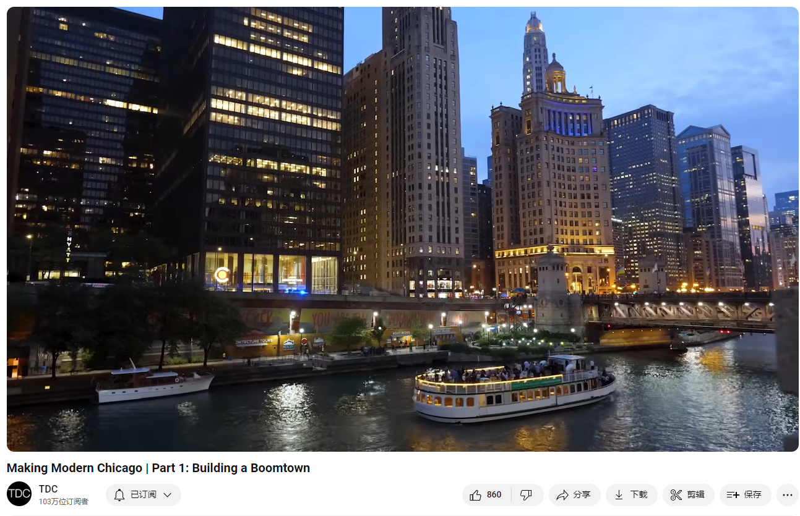

# Making Modern Chicago | Part 1: Building a Boomtown

Link: [https://www.youtube.com/watch?v=pNdX0Dm-J8Y&list=PLmSQiOQJmbZ7TU39cyx7gizM9i8nOuZXy&index=4](https://www.youtube.com/watch?v=pNdX0Dm-J8Y&list=PLmSQiOQJmbZ7TU39cyx7gizM9i8nOuZXy&index=4)

## Summary

Summary of Chicago's History and Development

#### Urban Planning and Growth

Chicago, often referred to as the crossroads of America, is a city that has flourished due to its strategic location and innovative urban planning. It serves as the nation's railroad hub and a key node in the extensive system of navigable freshwater ways. This advantageous positioning has facilitated the development of one of the planet's most productive regions for agriculture and raw material extraction. The city's flat terrain allowed planners to lay out an extremely orderly grid, leading to the most uniform and extensive network of straight streets and blocks in the world. This meticulous planning helped accommodate the rapid influx of people during the late 1800s, a period when Chicago experienced the highest population growth rate on Earth.

#### Economic Development and Industrial Revolution
Chicago's economic foundation was laid by a diverse array of industries, propelled by its role as a major transportation hub. The arrival of the first locomotive in 1848 marked a pivotal moment, transforming the city into a center for the burgeoning railroad industry. This network facilitated the transport of agricultural products, livestock, lumber, and ores into the city, where they were processed and distributed across the nation. Chicago became the world’s largest mover of grain and the largest lumber market. The invention of the mechanical reaper and the establishment of massive grain elevators and meatpacking plants further solidified its economic might. The city’s ability to efficiently process and distribute goods was exemplified by the development of mail-order catalogs, pioneered by businesses like Montgomery Ward and Sears.

#### Sanitation Challenges and Engineering Feats
Despite its economic success, Chicago faced significant public health challenges due to its swampy location and inadequate waste management. The city's waste contaminated the Chicago River and Lake Michigan, leading to deadly cholera outbreaks. To address these issues, sanitation engineer Ellis Chesbrough implemented groundbreaking solutions, including raising the city’s ground level and constructing a sewer system. The most ambitious project was reversing the flow of the Chicago River to direct waste away from Lake Michigan and toward the Mississippi River. This monumental engineering feat not only solved the sanitation crisis but also enhanced Chicago's transportation infrastructure, solidifying its status as a major commercial hub. As a result, the city continued to grow and prosper, setting the stage for future developments and challenges.

芝加哥历史与发展总结

#### 城市规划与发展
芝加哥，被称为美国的十字路口，因其战略位置和创新的城市规划而繁荣。它是全国的铁路枢纽，也是广泛的内陆水道系统中的关键节点。这种有利的地理位置促进了世界上最具生产力的农业和原材料开采地区之一的发展。城市的平坦地形使规划者能够布局极为有序的街区网格，形成了世界上最统一和广泛的直街和街区网络。这种精心规划帮助芝加哥在19世纪后期人口急剧增长期间容纳了大量涌入的人口，当时芝加哥经历了地球上最高的人口增长率。

#### 经济发展与工业革命
芝加哥的经济基础由多种产业构成，并因其作为主要交通枢纽的角色而得到推动。1848年第一辆火车的到来标志着一个关键时刻，将这座城市变成了新兴铁路行业的中心。这一网络促进了农产品、牲畜、木材和矿石的运输，这些产品进入城市后被加工并分销到全国各地。芝加哥成为世界上最大的粮食搬运中心和最大的木材市场。机械收割机的发明以及巨大的粮仓和肉类加工厂的建立进一步巩固了其经济实力。城市有效加工和分销商品的能力通过蒙哥马利·沃德和西尔斯等企业首创的邮购目录得到了体现。

#### 卫生挑战与工程壮举
尽管经济成功，芝加哥因其沼泽地理位置和不完善的废物管理面临重大公共卫生挑战。城市的废物污染了芝加哥河和密歇根湖，导致致命的霍乱爆发。为了解决这些问题，卫生工程师埃利斯·切斯布罗实施了突破性的解决方案，包括提高城市地面高度和建设排水系统。最具雄心的项目是将芝加哥河的流向逆转，将废物从密歇根湖引导至密西西比河。这一巨大的工程壮举不仅解决了卫生危机，还加强了芝加哥的运输基础设施，巩固了其作为主要商业枢纽的地位。结果，这座城市继续增长和繁荣，为未来的发展和挑战奠定了基础。

## Vocabulary

economic might：经济实力

meatpacking：肉类加工业

meatpacking plants 肉类加工厂

grain elevators：谷仓，这里的elevator是谷仓的意思

elevators：美 [ˈeləˌveɪtərz] 电梯；谷仓；升降机；（elevator的复数）

propelled：美 [prəˈpeld] 推动；（propel的过去分词）

raw material extraction：原材料开采

canyon：美 [ˈkænjən]  峡谷 **注意发音**

staggering：美 [ˈstæɡərɪŋ] 令人震惊的；难以置信的；蹒跚的；惊人的

railroad：铁路

railroad hub：铁路枢纽

extensive：美 [ɪkˈstensɪv]  广泛的；广大的；大量的

freshwater：淡水的；生存于淡水中的；

This futuristic urban river canyon reflects a staggering amount of resources, capital, and innovation. It’s also America’s railroad hub and the central node in America’s extensive system of navigable freshwater ways. 这个未来派的城市河流峡谷反映了惊人的资源、资本和创新。它也是美国的铁路枢纽和美国庞大的可航行淡水航道系统的中心节点。

prairie：美 [ˈpreri] 大草原；牧场；草甸；（北美的）草原地带；

boomtown：美 ['bumˌtaʊn] 新兴都市

The opportunities available in and around this prairie boomtown have attracted hungry young workers for nearly two centuries.近两个世纪以来，这个草原新兴城市及其周边的机会吸引了饥饿的年轻工人。

haphazard：美 [hæpˈhæzərd] 无计划的；任意的

flatness：平坦

But instead of allowing haphazard development,  planners took advantage of the area’s remarkable flatness and laid out the most orderly grid ever imagined. Now, more straight streets and uniform blocks exist here than anywhere else. 但是，规划者没有允许随意的开发，而是利用了该地区非凡的平坦性，设计出了有史以来最有序的网格。现在，这里比其他任何地方都有更多笔直的街道和整齐划一的街区。

crossroads：十字路口；交叉路口；转折点；

crown jewel：美 [kraʊn ˈdʒuəl] 皇冠宝石；皇冠珠宝；王冠瑰宝

This is the making of modern Chicago, the crossroads of America. The crown jewel of the post-industrial United States has a metropolitan population is 9 and a half million, and an economy is considered by some experts to be the most balanced and resilient on earth. 这就是现代芝加哥的形成，美国的十字路口。后工业化时代美国的皇冠上的明珠有950万大都市人口，一些专家认为其经济是地球上最平衡和最有弹性的。

Haitian：美 [ˈheɪʃən] 海地的；海地人的；

indigenous：美 [ɪnˈdɪdʒənəs] 当地的；本土的；土生土长的；

outpost：前哨基地；边防站；边界哨点；偏远村镇；

Its story began when a Haitian-born fur trader and his wife,  a member of the local indigenous Potawatomi tribe, established an outpost here in 1779.它的故事开始于一个海地出生的毛皮商人和他的妻子，一个当地土著Potawatomi部落的成员，于1779年在这里建立了一个前哨。

sleepy：寂静的；冷清的；（生意，组织，工业）没有活力的；

frontier:美 [frʌnˈtɪr] 边界；国界；边境；前沿；新领域；

frontier village: 边境村庄

locomotive：美 [ˌloʊkəˈmoʊtɪv] 火车头；机车；蒸汽机车

inaugural：美 [ɪˈnɔːɡjərəl] 开幕的；首次的；创始的；开端的；**注意发音**

It remained a sleepy frontier village for decades until Chicago’s first locomotive,  the Pioneer, made its inaugural trip out to nearby Des Plaines in 1848. 几十年来，它一直是一个寂静的边境村庄，直到1848年芝加哥的第一辆机车“先锋号”首次驶向附近的德斯普兰斯。

livestock：美 [ˈlaɪvstɑːk] 家畜

lumber：美 [ˈlʌmbər]木材；锯材；木料；

ore：美 [ɔːr]矿；矿石；矿砂；

the livestock, the lumber, the ore：牲畜，木材，矿石

Chicagoan：芝加哥人

reaper：收割者；收割机

backbreaking：非常辛劳的；（体力劳动）艰苦繁重的；

A Chicagoan had invented the mechanical reaper, freeing wheat farmers from the backbreaking, inefficient work of harvesting their crops by hand. 一个芝加哥人发明了机械收割机，把种植小麦的农民从繁重、低效的手工收割工作中解放出来。

oceanliners：远洋客轮

chapels：美 ['tʃæplz] 小教堂；（chapel的复数）

magnificently：壮丽地；宏伟地；出色地

Chicago is situated magnificently for trade 芝加哥的位置非常适合贸易

culprit:美 [ˈkʌlprɪt]  罪魁祸首；问题根源；问题成因          

putrid: 美 [ˈpjutrəd] 正在腐烂的；发出腐臭味的；

The culprit was the putrid waste all the residences and industries dumped 罪魁祸首是所有住宅和工业倾倒的腐烂废物

draw up: 起草；拟定；制定；

audacious: 美 [ɔːˈdeɪʃəs] 敢于冒险的；大胆的；放肆的；

who drew up a truly audacious megaproject. 他设计了一个真正大胆的大型项目。

barge：美 [bɑːrdʒ]  驳船；大型平底货船；运输用的大船；河船；

## Transcript

This futuristic urban river canyon reflects a 
staggering amount of resources, capital, and  

innovation. It’s also America’s railroad hub and 
the central node in America’s extensive system of  

navigable freshwater ways. Its roads lead to most 
corners of the continent, and its runways send  

direct flights to over 200 destinations–all of 
this supports one of the planet’s most productive  

regions for growing crops and extracting raw 
materials. The opportunities available in and  

around this prairie boomtown have attracted hungry 
young workers for nearly two centuries. In fact,  

so many arrived daily that it sustained the 
highest population growth rate on earth for  

several consecutive decades in the late 1800s. 
But instead of allowing haphazard development,  

planners took advantage of the area’s remarkable 
flatness and laid out the most orderly grid  

ever imagined. Now, more straight streets and 
uniform blocks exist here than anywhere else.

This is the making of modern 
Chicago, the crossroads of America.

The crown jewel of the post-industrial 
United States has a metropolitan population  

is 9 and a half million, and an economy is 
considered by some experts to be the most  

balanced and resilient on earth. Its story began 
when a Haitian-born fur trader and his wife,  

a member of the local indigenous Potawatomi 
tribe, established an outpost here in 1779.

It remained a sleepy frontier village for 
decades until Chicago’s first locomotive,  

the Pioneer, made its inaugural trip 
out to nearby Des Plaines in 1848.

I learned about this pivotal moment firsthand when  

I visited the Chicago History Museum for 
a trip back in time with Paul Durica.

“So from those very humble beginnings in 
1848, within the space of a decade, the  

railroad industry really takes 
off and Chicago is ideally suited  

to become a center of this growing industry.
All the raw materials that they're producing,  

all the agricultural materials, the 
livestock, the lumber, the ore–all of  

it can come via the railroad into Chicago.
And then within the city, all of those goods  

can be processed. Lots of different things 
can be manufactured and they can be sent out  

to the growing Western states, but also 
to the well-developed Eastern states."

These products were listed in mail-order 
catalogs, an industry invented and based in  

Chicago. The conveniences of online shopping can 
be traced directly back to Montgomery Ward and  

Sears–businesses that were only possible 
because the railroad reliably delivered.

"By the beginning of the 20th century. Chicago 
had close to 40 different railroad lines running  

through it. Most cities today will 
have like maybe one Union Station  

or a central terminal–but by the early 
1900s, Chicago had six different ones.”

Chicago was also responsible for the rapid growth 
of the vast prairies that stretched westward to  

the Rocky Mountains. A Chicagoan had invented the 
mechanical reaper, freeing wheat farmers from the  

backbreaking, inefficient work of harvesting their 
crops by hand. And when they shipped their wheat  

into the city, 12 massive grain elevators stored 
it before it was sent across the lake to Buffalo,  

or downriver and onto oceanliners waiting 
in New Orleans. Within a handful of years,  

Chicago had displaced ports in Russia to 
become the world’s largest mover of grain.

But even with this bounty, prairie 
farmers couldn’t build much of anything,  

because their lands had few trees to harvest. Good 
thing there were expansive forests in Wisconsin  

and Michigan north of Chicago, and soon it 
became the world’s largest lumber market.

“The scene on the south branch of the Chicago 
River, you cannot witness anymore.it does not  

exist in Chicago, it does not exist I think 
anywhere in the world. Stack after stack of  

lumber, all waiting to be shipped 
downstate in Illinois, out to Iowa,  

onto Nebraska or Kansas–a whole district 
just for stacked lumber. There are cases  

where entire prairie families are standing out 
there waiting for their town to arrive. Bar,  

chapel, houses–it’s all readymade 
in Chicago. It’s stamped in it:  

‘Made in Chicago,’ along with the reapers 
and everything else, ‘here comes the town!’”

Almost overnight, Chicago had 
transformed this expansive  

grassland into the world’s breadbasket. 
But these farmers also produced protein.

“By the early 1860s, you have this immense 
railroad network that makes it very easy  

for livestock to come into the city, be 
processed, and then kind of sent out to  

other parts of the country. And so a group 
of meatpackers get together and they decide  

that they need basically a kind of central 
district where they can kind of rationalize  

the processing of livestock. And so on Christmas 
Day 1865, the Union Stockyard opens, this immense  

area to the south of the city's business district 
employing, you know, tens of thousands of people."

The smells and conditions these workers 
were exposed to were incredible. Up to  

75,000 pigs waiting for slaughter 
could be penned at the same time. 

“In about 15 minutes a hog goes through this 
process of passing about 125 or 150 people,  

depending on the packing house. 
This was new, this was the modern,  

this was the industrial revolution at 
its most dramatic, at its darkest.”

Hundreds of millions of calories were 
passing through the processing plants  

and storage facilities of Chicago every 
single day, feeding the ravenous Union  

Army in its hard-fought victory in the Civil 
War. But there was a cost to all this activity.

“Chicago is situated magnificently for trade,  

but it’s a pestilential swamp–it’s 
a horrible place for a city. It’s  

an absolute hellhole… Children were playing 
with maggots as if they were little pets.”

Before long, Cholera had crept 
up the Mississippi to kill 60  

Chicagoans a day during the warm summer months. 

“It’s a devastating disease. It’s very difficult  

to watch someone with Cholera because they 
become violently ill and often die within hours.”

The culprit was the putrid waste all 
the residences and industries dumped,  

only some of which made its way into the 
rivers and canal. To find a solution,  

Chicago brought in Ellis Chesbrough, one of 
America’s brightest sanitation engineers. He  

designed gravity-fed sewers to flush the waste 
into the river, and then deepened the river  

by dredging it and using the fill to raise 
Chicago’s ground level 10 feet. Lifting all  

the existing buildings safely required widespread 
adoption of a new system: George Pullman’s jack.

“The Pullman method was to put the 
foundation of the building on jacks,  

that could be turned…you might have 1,000 
jacks around the base of a big building,  

and 250 men…and little by little 
they’d jack up the building and  

other people would be putting bricks in 
around it to shore up the foundation.”

The new sewers worked as planned, but 
the sewage still ended up contaminating  

the city’s source of drinking water: the lake.

“One of the McCormick’s writes to his old man, 
‘Pop, I was up at the South Street bridge and  

I’m looking, and the river’s Scarlett!’ 
Can you imagine that? There’s heads of  

pigs in the river and things like that, and 
this is what’s flowing out into the lake.”

Officials ordered tunnels dug 
to water intake houses called  

cribs built miles into the lake to 
get beyond the stagnant pollution;  

and send clean water back to the 
city. This worked until it didn’t.

Whenever there was a big storm, so much 
dirty city runoff washed into the lake  

that it threatened to reach the intake 
cribs, which would render them useless.

“At a certain point in time, it just proved 
untenable to just keep on building longer  

and longer pipes, to try to get cleaner 
water that's farther out in the lake.”

Desperate to solve this problem for 
good, Chicago again turned to Chesbrough,  

who drew up a truly audacious megaproject. 
His solution? Permanently reversing the  

direction of the river so that it flowed 
west toward the Mississippi instead of East  

into the lake. It was a feat never before 
attempted in human history–a manipulation  

of the natural world so fantastic that many 
Chicagoans simply thought it couldn’t be done.

“So, how could you reverse the flow? Well, 
you must realize that the landform drops  

off. You get down to the city of Joliet 
and you’re 40 feet below Lake Michigan.  

The idea was to link up the south branch of 
the Chicago River with the Des Plaines River  

and to break through that subcontinental 
divide. If you could dig deep enough,  

gravity would then pull it 
all away from the city.”

Thousands of laborers spent years 
digging across the state of Illinois,  

trying to cut a massive, 28-mile 
canal through rocky soil.

“You can just imagine these tremendous 
explosions happening and these new-fangled  

machines that were really being developed and 
invented just particularly for this project.”

When they had finally finished and 
were ready to let the water in,  

they still weren’t positive it would 
even work. After a few tense moments,  

amazingly, the water began 
to flow slowly downhill.

Chesbrough - and those who saw the project through 
to completion after his death - were heroes.

“That’s the beauty of Chesbrough 
to the city fathers. He comes in,  

‘technology will solve it.’ He’s feted at 
banquets because he allows Chicago to grow  

without changing anybody’s behavior. Without 
controlling any of the economic interests who  

are dumping into the river. And they can 
continue using that river as a sewer and  

send that garbage downriver toward less 
powerful and complaining canal towns.”

Not only did the canal eliminate Chicago’s 
sanitation and drinking water crisis,  

but its sheer size and depth suddenly unlocked the 
cheapest mode of transport: river floating barge.

At the dawn of the 20th century, the 
canal, combined with the railroads and  

all the industry based in the city, had cemented 
Chicago’s place as the crossroads of America.

Next, we’ll examine how Chicago overcame 
one of the greatest urban disasters ever  

to become the fastest-growing city in the world,  

just in time for it to host one of the most 
spectacular events anyone has ever seen.

## Afterword

2024年6月28日19点22分于上海。

