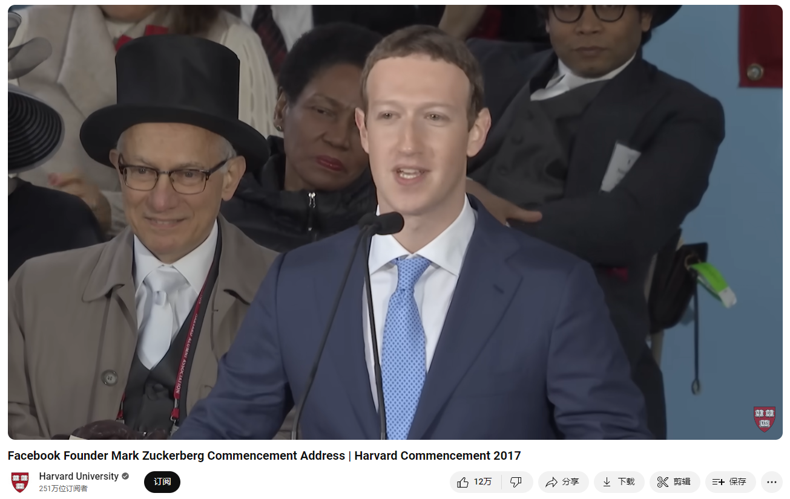

# Facebook Founder Mark Zuckerberg Commencement Address | Harvard Commencement 2017

Link: [https://www.youtube.com/watch?v=BmYv8XGl-YU](https://www.youtube.com/watch?v=BmYv8XGl-YU)

@[toc]

Facebook Founder Mark Zuckerberg gave his address at Harvard's 366th Commencement on May 25, 2017 at Tercentenary Theatre

## Summary

 ### Summary of Mark Zuckerberg's 2017 Harvard Commencement Speech

**Introduction and Personal Anecdotes:**

1. **Opening and Harvard Memories:**
   - Zuckerberg expresses his honor to be speaking at Harvard, reflecting on his own incomplete journey at the university.
   - He reminisces about his time at Harvard, including humorous and pivotal moments, like the launch of Facebook and meeting his wife, Priscilla Chan.

2. **Humorous Story:**
   - Zuckerberg recalls the prank website Facemash and how it led to a meeting with the administrative board, which ultimately connected him with Priscilla.

**Main Message: The Importance of Purpose:**
1. **Definition of Purpose:**
   - Purpose is described as the feeling of being part of something greater and having something meaningful to work towards.

2. **Generational Challenge:**
   - Zuckerberg emphasizes that finding individual purpose isn’t enough; the challenge is to create a world where everyone has a sense of purpose.
   - He shares a story about a janitor at NASA who viewed his work as contributing to putting a man on the moon, illustrating the broader impact of having purpose.

**Three Ways to Create Purpose for Everyone:**
1. **Taking on Big Meaningful Projects Together:**
   - Zuckerberg urges tackling grand challenges such as climate change, curing diseases, and modernizing democracy.
   - He stresses that significant achievements often start without full clarity and that it’s essential to begin working on ideas even if they seem daunting.

2. **Redefining Equality:**
   - He advocates for a society that allows everyone the freedom to pursue their purpose.
   - Zuckerberg highlights the need for a new social contract, including universal basic income, affordable childcare, and healthcare not tied to employment.
   - He points out the importance of giving people the freedom to fail and succeed, emphasizing that wealth inequality should be addressed to provide equal opportunities for everyone.

3. **Building Community:**
   - Zuckerberg underscores the importance of local communities in providing a sense of belonging and support.
   - He shares examples of graduates who have made significant contributions to their communities.
   - He calls for a global community that can tackle worldwide issues like poverty and disease, stressing that change starts at the local level.

**Personal Reflections and Encouragement:**
1. **Personal Story of Impact:**
   - Zuckerberg recounts his experience teaching at the Boys and Girls Club, which taught him valuable lessons about giving back and understanding diverse perspectives.

2. **Message of Hope and Responsibility:**
   - He shares an inspiring story of a high school student who, despite being undocumented, shows a strong sense of purpose and desire to help others.
   - Zuckerberg encourages graduates to find the courage to make their lives a blessing, referencing a prayer he sings to his daughter.

**Conclusion:**
- He congratulates the Class of 2017 and wishes them good luck, emphasizing their role in creating a purposeful world.

### Key Takeaways

1. **Purpose Beyond Self:**
   - The importance of creating a world where everyone can find purpose, not just oneself.
   
2. **Collective Action:**
   - The value of working on big, meaningful projects together to address global challenges.

3. **Equal Opportunity:**
   - Redefining equality to ensure everyone has the freedom and support to pursue their dreams and contribute to society.

4. **Community Building:**
   - Strengthening local and global communities to provide a sense of belonging and purpose.

### Advice

- **Start working on ideas even if they seem unclear at first.**
- **Redefine equality to give everyone a fair chance to succeed.**
- **Build and strengthen communities to support and uplift each other.**
- **Find courage and take responsibility to make a positive impact in the world.**

## Vocabulary

janitor: 美 [ˈdʒænɪtər] 清洁工；管理员；看门人；门卫

detention: 美 [dɪˈtenʃn] 拘留；监禁；

fray:美 [freɪ] 使磨损；使磨破；使紧张；

Relationships were so frayed 关系如此紧张

imposter:美 [ɪmˈpɑstɚ] 冒名顶替者；骗子

genomes: 美 [ˈdʒiˌnoʊmz] 染色体组；基因组；（genome的复数）

stigmatize: 美 [ˈstɪɡməˌtaɪz]   污名化；给…带来耻辱；诬蔑；指责

## Transcript

President Faust, Board of Overseers, faculty,
alumni, friends, proud parents, members of

the ad board, and graduates of the greatest
university in the world,

I'm honored to be with you today because,
let's face it, you accomplished something

I never could.

If I get through this speech, it'll be the
first time I actually finish something at

Harvard.

Class of 2017, congratulations!

I'm an unlikely speaker, not just because
I dropped out, but because we're technically

in the same generation.

We walked this yard less than a decade apart,
studied the same ideas and slept through the

same Ec10 lectures.

We may have taken different paths to get here,
especially if you came all the way from the

Quad, but today I want to share what I've
learned about our generation and the world

we're building together.

But first, the last couple of days have brought
back a lot of good memories.

How many of you remember exactly what you
were doing when you got that email telling

you that you got into Harvard?

I was playing Civilization and I ran downstairs,
got my dad, and for some reason, his reaction

was to video me opening the email.

That could have been a really sad video.

I swear getting into Harvard is still the
thing my parents are most proud of me for.

What about 
your first lecture at Harvard?

Mine was Computer Science 121 with the incredible
Harry Lewis.

I was late so I threw on a t-shirt and didn't
realize until afterwards it was inside out

and backwards with my tag sticking out the
front.

I couldn't figure out why no one would talk
to me -- except one guy, KX Jin, he just went

with it.

We ended up doing our problem sets together,
and now he runs a big part of Facebook.

And that, Class of 2017, is why you should
be nice to people.

But my best memory from Harvard was meeting
Priscilla.

I had just launched this prank website Facemash,
and the ad board wanted to "see me".

Everyone thought I was going to get kicked
out.

My parents came to help me pack.

My friends threw me a going away party.

As luck would have it, Priscilla was at that
party with her friend.

We met in line for the bathroom in the Pfoho
Belltower, and in what must be one of the

all time romantic lines, I said: "I'm going
to get kicked out in three days, so we need

to go on a date quickly."

Actually, any of you graduating can use that
line.

I didn't end up getting kicked out -- I did
that to myself.

Priscilla and I started dating.

And, you know, that movie made it seem like
Facemash was so important to creating Facebook.

It wasn't.

But without Facemash I wouldn't have met Priscilla,
and she's the most important person in my

life, so you could say it was the most important
thing I built in my time here.

We've all started lifelong friendships here,
and some of us even families.

That's why I'm so grateful to this place.

Thanks, Harvard.

Today I want to talk about purpose.

But I'm not here to give you the standard
commencement about finding your purpose.

We're millennials.

We'll try to do that instinctively.

Instead, I'm here to tell you finding your
purpose isn't enough.

The challenge for our generation is creating
a world where everyone has a sense of purpose.

One of my favorite stories is when John F
Kennedy visited the NASA space center, he

saw a janitor carrying a broom and he walked
over and asked what he was doing.

The janitor responded: "Mr. President, I'm
helping put a man on the moon".

Purpose is that sense that we are part of
something bigger than ourselves, that we are

needed, that we have something better ahead
to work for.

Purpose is what creates true happiness.

You're graduating at a time when this is especially
important.

When our parents graduated, purpose reliably
came from your job, your church, your community.

But today, technology and automation are eliminating
many jobs.

Membership in communities is declining.

Many people feel disconnected and depressed,
and are trying to fill a void.

As I've traveled around, I've sat with children
in juvenile detention and opioid addicts,

who told me their lives could have turned
out differently if they just had something

to do, an after school program or somewhere
to go.

I've met factory workers who know their old
jobs aren't coming back and are trying to

find their place.

To keep our society moving forward, we have
a generational challenge -- to not only create

new jobs, but create a renewed sense of purpose.

I remember the night I launched Facebook from
my little dorm in Kirkland House.

I went to Noch's with my friend KX.

I remember telling him I was excited to connect
the Harvard community, but one day someone

would connect the whole world.

The thing is, it never even occurred to me
that someone might be us.

We were just college kids.

We didn't know anything about that.

There were all these big technology companies
with resources.

I just assumed one of them would do it.

But this idea was so clear to us -- that all
people want to connect.

So we just kept moving forward, day by day.

I know a lot of you will have your own stories
just like this.

A change in the world that seems so clear
you're sure someone else will do it.

But they won't.

You will.

But it's not enough to have purpose yourself.

You have to create a sense of purpose for
others.

I found that out the hard way.

You see, my hope was never to build a company,
but to make an impact.

And as all these people started joining us,
I just assumed that's what they cared about

too, so I never explained what I hoped we'd
build.

A couple years in, some big companies wanted
to buy us.

I didn't want to sell.

I wanted to see if we could connect more people.

We were building the first News Feed, and
I thought if we could just launch this, it

could change how we learn about the world.

Nearly everyone else wanted to sell.

Without a sense of higher purpose, this was
the startup dream come true.

It tore our company apart.

After one tense argument, an advisor told
me if I didn't agree to sell, I would regret

the decision for the rest of my life.

Relationships were so frayed that within a
year or so every single person on the management

team was gone.

That was my hardest time leading Facebook.

I believed in what we were doing, but I felt
alone.

And worse, it was my fault.

I wondered if I was just wrong, an imposter,
a 22 year-old kid who had no idea how the

world worked.

Now, years later, I understand that *is* how
things work with no sense of higher purpose.

It's up to us to create it so we can all keep
moving forward together.

Today I want to talk about three ways to create
a world where everyone has a sense of purpose:

by taking on big meaningful projects together,
by redefining equality so everyone has the

freedom to pursue purpose, and by building
community across the world.

First, let's take on big meaningful projects.

Our generation will have to deal with tens
of millions of jobs replaced by automation

like self-driving cars and trucks.

But we have the potential to do so much more
together.

Every generation has its defining works.

More than 300,000 people worked to put a man
on the moon \'96 including that janitor.

Millions of volunteers immunized children
around the world against polio.

Millions of more people built the Hoover dam
and other great projects.

These projects didn't just provide purpose
for the people doing those jobs, they gave

our whole country a sense of pride that we
could do great things.

Now it's our turn to do great things.

I know, you're probably thinking: I don't
know how to build a dam, or get a million

people involved in anything.

But let me tell you a secret: no one does
when they begin.

Ideas don't come out fully formed.

They only become clear as you work on them.

You just have to get started.

If I had to understand everything about connecting
people before I began, I never would have

started Facebook.

Movies and pop culture get this all wrong.

The idea of a single eureka moment is a dangerous
lie.

It makes us feel inadequate since we haven't
had ours.

It prevents people with seeds of good ideas
from getting started.

Oh, you know what else movies get wrong about
innovation?

No one writes math formulas on glass.

That's not a thing.

It's good to be idealistic.

But be prepared to be misunderstood.

Anyone working on a big vision will get called
crazy, even if you end up right.

Anyone working on a complex problem will get
blamed for not fully understanding the challenge,

even though it's impossible to know everything
upfront.

Anyone taking initiative will get criticized
for moving too fast, because there's always

someone who wants to slow you down.

In our society, we often don't do big things
because we're so afraid of making mistakes

that we ignore all the things wrong today
if we do nothing.

The reality is, anything we do will have issues
in the future.

But that can't keep us from starting.

So what are we waiting for?

It's time for our generation-defining public
works.

How about stopping climate change before we
destroy the planet and getting millions of

people involved manufacturing and installing
solar panels?

How about curing all diseases and asking volunteers
to track their health data and share their

genomes?

Today we spend 50x more treating people who
are sick than we spend finding cures so people

don't get sick in the first place.

That makes no sense.

We can fix this.

How about modernizing democracy so everyone
can vote online, and personalizing education

so everyone can learn?

These achievements are within our reach.

Let's do them all in a way that gives everyone
in our society a role.

Let's do big things, not only to create progress,
but to create purpose.

So taking on big meaningful projects is the
first thing we can do to create a world where

everyone has a sense of purpose.

The second is redefining equality to give
everyone the freedom they need to pursue purpose.

Many of our parents had stable jobs throughout
their careers.

Now we're all entrepreneurial, whether we're
starting projects or finding or role.

And that's great.

Our culture of entrepreneurship is how we
create so much progress.

Now, an entrepreneurial culture thrives when
it's easy to try lots of new ideas.

Facebook wasn't the first thing I built.

I also built games, chat systems, study tools
and music players.

I'm not alone.

JK Rowling got rejected 12 times before publishing
Harry Potter.

Even Beyonce had to make hundreds of songs
to get Halo.

The greatest successes come from having the
freedom to fail.

But today, we have a level of wealth inequality
that hurts everyone.

When you don't have the freedom to take your
idea and turn it into a historic enterprise,

we all lose.

Right now our society is way over-indexed
on rewarding success and we don't do nearly

enough to make it easy for everyone to take
lots of shots.

Let's face it.

There is something wrong with our system when
I can leave here and make billions of dollars

in 10 years while millions of students can't
afford to pay off their loans, let alone start

a business.

Look, I know a lot of entrepreneurs, and I
don't know a single person who gave up on

starting a business because they might not
make enough money.

But I know lots of people who haven't pursued
dreams because they didn't have a cushion

to fall back on if they failed.

We all know we don't succeed just by having
a good idea or working hard.

We succeed by being lucky too.

If I had to support my family growing up instead
of having time to code, if I didn't know I'd

be fine if Facebook didn't work out, I wouldn't
be standing here today.

If we're honest, we all know how much luck
we've had.

Every generation expands its definition of
equality.

Previous generations fought for the vote and
civil rights.

They had the New Deal and Great Society.

Now it's our time to define a new social contract
for our generation.

We should have a society that measures progress
not just by economic metrics like GDP, but

by how many of us have a role we find meaningful.

We should explore ideas like universal basic
income to give everyone a cushion to try new

things.

We\'re going to change jobs many times,
so we need affordable childcare to get to

work and healthcare that aren't tied to one
company.

We're all going to make mistakes, so we need
a society that focuses less on locking us

up or stigmatizing us.

And as technology keeps changing, we need
to focus more on continuous education throughout

our lives.
And yes, giving everyone the freedom to pursue

purpose isn't free.

People like me should pay for it.

Many of you will do well and you should too.

That's why Priscilla and I started the Chan
Zuckerberg Initiative and committed our wealth

to promoting equal opportunity.

These are the values of our generation.

It was never a question of if we were going
to do this.

The only question was when.

Millennials are already one of the most charitable
generations in history.

In one year, three of four US millennials
made a donation and seven out of ten raised

money for charity.

But it's not just about money.

You can also give time.

I promise you, if you take an hour or two
a week -- that's all it takes to give someone

a hand, to help them reach their potential.

Maybe you think that's too much time.

I used to.

When Priscilla graduated from Harvard she
became a teacher, and before she'd do education

work with me, she told me I needed to teach
a class.

I complained: "Well, I'm kind of busy.

I'm running this company."

But she insisted, so I taught a middle school
program on entrepreneurship at the local Boys

and Girls Club.

I taught them lessons on product development
and marketing, and they taught me what it's

like feeling targeted for your race and having
a family member in prison.

I shared stories from my time in school, and
they shared their hope of one day going to

college too.

For five years now, I\'ve been having dinner
with those kids every month.

One of them threw me and Priscilla our first
baby shower.

And next year they\'re going to college.

Every one of them.

First in their families.

We can all make time to give someone a hand.

Let's give everyone the freedom to pursue
their purpose -- not only because it's the

right thing to do, but because when more people
can turn their dreams into something great,

we're all better for it.

Purpose doesn't only come from work.

The third way we can create a sense of purpose
for everyone is by building community.

And when our generation says "everyone", we
mean everyone in the world.

Quick show of hands: how many of you are from
another country?

Now, how many of you are friends with one
of these folks?

Now we're talking.

We have grown up connected.
In a survey asking millennials around the

world what defines our identity, the most
popular answer wasn't nationality, religion

or ethnicity, it was "citizen of the world".

That's a big deal.

Every generation expands the circle of people
we consider "one of us".

For us, it now encompasses the entire world.

We understand the great arc of human history
bends towards people coming together in ever

greater numbers -- from tribes to cities to
nations -- to achieve things we couldn't on

our own.

We get that our greatest opportunities are
now global -- we can be the generation that

ends poverty, that ends disease.

We get that our greatest challenges need global
responses too -- no country can fight climate

change alone or prevent pandemics.

Progress now requires coming together not
just as cities or nations, but also as a global

community.

But we live in an unstable time.

There are people left behind by globalization
across the world.

It's hard to care about people in other places
if we don't feel good about our lives here

at home.

There's pressure to turn inwards.

This is the struggle of our time.

The forces of freedom, openness and global
community against the forces of authoritarianism,

isolationism and nationalism.

Forces for the flow of knowledge, trade and
immigration against those who would slow them

down.

This is not a battle of nations, it's a battle
of ideas.

There are people in every country for global
connection and good people against it.

This isn't going to be decided at the UN either.

It's going to happen at the local level, when
enough of us feel a sense of purpose and stability

in our own lives that we can open up and start
caring about everyone.

The best way to do that is to start building
local communities right now.

We all get meaning from our communities.

Whether our communities are houses or sports
teams, churches or music groups, they give

us that sense we are part of something bigger,
that we are not alone; they give us the strength

to expand our horizons.

That's why it's so striking that for decades,
membership in all kinds of groups has declined

as much as one-quarter.

That's a lot of people who now need to find
purpose somewhere else.

But I know we can rebuild our communities
and start new ones because many of you already

are.

I met Agnes Igoye, who's graduating today.

Where are you, Agnes?

She spent her childhood navigating conflict
zones in Uganda, and now she trains thousands

of law enforcement officers to keep communities
safe.

I met Kayla Oakley and Niha Jain, graduating
today, too.

Stand up.

Kayla and Niha started a non-profit that connects
people suffering from illnesses with people

in their communities willing to help.

I met David Razu Aznar, graduating from the
Kennedy School today.

David, stand up.

He's a former city councilor who successfully
led the battle to make Mexico City the first

Latin American city to pass marriage equality
-- even before San Francisco.

This is my story too.

A student in a dorm room, connecting one community
at a time, and keeping at it until one day

we connect the whole world.

Change starts local.

Even global changes start small -- with people
like us.

In our generation, the struggle of whether
we connect more, whether we achieve our biggest

opportunities, comes down to this -- your
ability to build communities and create a

world where every single person has a sense
of purpose.

Class of 2017, you are graduating into a world
that needs purpose.

It's up to you to create it.

Now, you may be thinking: can I really do
this?

Remember when I told you about that class
I taught at the Boys and Girls Club?

One day after class I was talking to them
about college, and one of my top students

raised his hand and said he wasn't sure he
could go because he's undocumented.

He didn't know if they'd let him in.

Last year I took him out to breakfast for
his birthday.

I wanted to get him a present, so I asked
him and he started talking about students

he saw struggling and said "You know, I'd
really just like a book on social justice."

I was blown away.

Here's a young guy who has every reason to
be cynical.

He didn't know if the country he calls home
-- the only one he's known -- would deny him

his dream of going to college.

But he wasn't feeling sorry for himself.

He wasn't even thinking of himself.

He has a greater sense of purpose, and he's
going to bring people along with him.

It says something about our current situation
that I can't even say his name because I don't

want to put him at risk.

But if a high school senior who doesn't know
what the future holds can do his part to move

the world forward, then we owe it to the world
to do our part too.

Before you walk out those gates one last time,
as we sit in front of Memorial Church, I am

reminded of a prayer, Mi Shebeirach, that
I say whenever I face a challenge, that I

sing to my daughter thinking about her future
when I tuck her into bed.

It goes:
"May the source of strength, who blessed the

ones before us, help us *find the courage*
to make our lives a blessing."

I hope you find the courage to make your life
a blessing.

Congratulations, Class of '17!

Good luck out there.

## Afterword

2024年6月23日18点00分于上海。