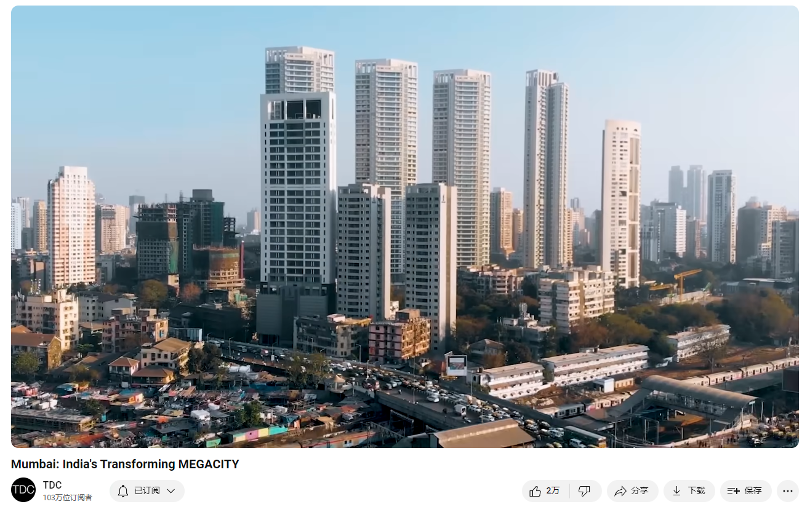

# Mumbai: India's Transforming MEGACITY

Link: [https://www.youtube.com/watch?v=tWD_-Rzrn8o](https://www.youtube.com/watch?v=tWD_-Rzrn8o)

## Summary

First Paragraph:

Mumbai, India’s financial and entertainment capital, is undergoing a major transformation. With its contiguous urban population nearing 25 million and its land surrounded by water, Mumbai is the world’s second-most densely populated major city. To address the city's congestion and support its growth into a global power center, five transportation megaprojects are under construction. These projects aim to ease the movement of people and goods, and position Mumbai for significant future development. Historically, Mumbai evolved from a group of islands merged through land reclamation projects by 1845, and its modern significance was largely shaped by the American Civil War, which boosted its cotton trade due to disruptions in the US supply and the opening of the Suez Canal. The British further enhanced Mumbai’s role by developing railways, facilitating goods movement to its rapidly growing port, which remains crucial for India’s container traffic today.

Second Paragraph:

Mumbai’s current infrastructure struggles to keep pace with its growing population. The city’s suburban railway, the lifeline of Mumbai, is severely overcrowded and dangerous, necessitating a more extensive and efficient transit system. The Mumbai Metro project, one of the most ambitious in history, aims to address this by constructing eight new metro lines to handle around 7-8 million passengers daily. The metro network will alleviate congestion, improve connectivity, and enhance safety. Alongside the metro, the Coastal Road project is set to cut travel time significantly by providing a 29.2-km expressway, and the Sewri-Worli Connector will enhance East-West connectivity. The Trans Harbour Link will be the longest sea bridge in India, reducing travel time between Mumbai and the mainland, and the new Navi Mumbai International Airport will separate international and domestic flights, boosting efficiency and capacity.

Third Paragraph:

Despite these advancements, there are concerns about environmental impact and sustainability. Elevated highways like the Coastal Road could disrupt coastal ecosystems and encourage more car ownership, worsening air pollution and traffic. Projects like the bridge to Gorai, an area currently accessed by ferry and relatively untouched by urban sprawl, raise fears of losing natural beauty and vital ecosystems like mangroves, which protect against flooding. Residents like Hillary, who prefer the quieter, more natural environment, worry about the loss of this tranquility and ecological balance. Mumbai’s development is a constant negotiation between progress and preservation, reflecting the broader challenges faced by rapidly growing megacities around the world.

视频脚本总结

第一段：

印度的金融和娱乐之都孟买正在经历重大转型。孟买的连续城市人口接近2500万，且其土地被水包围，使其成为世界上人口密度第二高的大城市。为了解决城市拥堵问题并支持其成为全球权力中心的发展，孟买同时在建五个大型交通项目。这些项目旨在缓解人员和货物的流动，并为孟买的未来发展奠定基础。历史上，孟买从一组岛屿通过填海项目在1845年合并为一块大陆，其现代重要性主要因美国内战而形成，当时美国的棉花供应中断，苏伊士运河的开通进一步促进了孟买的棉花贸易。英国人通过发展铁路进一步提升了孟买的地位，促进了货物向迅速增长的港口的运输，孟买港今天仍是印度集装箱运输的核心。

第二段：

孟买现有的基础设施难以跟上其不断增长的人口。城市的郊区铁路是孟买的生命线，但严重过载且危险，迫切需要更广泛和高效的交通系统。孟买地铁项目是历史上最雄心勃勃的项目之一，旨在通过建设八条新地铁线路，每天承载约700-800万乘客。地铁网络将缓解拥堵、改善连通性并提高安全性。除了地铁项目，滨海公路项目将提供一条29.2公里的快速路，大幅减少出行时间，而塞沃里-沃利连接线将增强东西向的交通连接。跨海大桥项目将成为印度最长的海上大桥，减少孟买与大陆之间的旅行时间，新的纳维孟买国际机场将分开国际和国内航班，提高效率和容量。

第三段：

尽管这些进展显著，但也存在环境影响和可持续性方面的担忧。像滨海公路这样的高架公路可能会破坏沿海生态系统，鼓励更多的汽车拥有量，导致空气污染和交通恶化。像通往戈莱的桥梁项目，戈莱是目前通过渡轮进入且相对未被城市扩展影响的区域，引发了人们对失去自然美景和重要生态系统（如保护免受洪水侵袭的红树林）的担忧。像希拉里这样的居民更喜欢安静、自然的环境，担心失去这种宁静和生态平衡。孟买的发展是在进步与保护之间的不断协商，反映了全球迅速增长的特大城市所面临的更广泛挑战。

## Vocabulary

ferry：美 [ˈferi] 渡船；摆渡；渡口；渡运

the local language:当地语言

landmass：美 [ˈlændˌmæs]  大陆

Suez：美 [sʊ'ɛz] 苏伊士(埃及东北部港市); 苏伊士运河

canal：美 [kəˈnæl]  运河 **注意发音**

Suez Canal：苏伊士运河

hinterland：美 [ˈhɪn(t)ərˌlænd] 内地；腹地；

One of the things the British brought to us were the railways,  mainly to move goods from the hinterland directly to the port.  英国人带给我们的东西之一是铁路，主要是把货物从内陆直接运到港口。

seaport：海港；港口城市；海滨城市；

Today, Mumbai’s seaport handles most of the container traffic entering and exiting India,  creating many jobs for its residents. 今天，孟买的海港处理着进出印度的大部分集装箱运输，为其居民创造了许多就业机会。

rupee：美 [ruˈpi] 卢比

rickshaw：英 [ˈrɪkʃɔː] 人力车；黄包车；人力三轮车

congestion：美 [kənˈdʒestʃən]  拥塞；阻塞；拥挤

traffic congestion：交通拥堵

It will also help ease traffic congestion.这也将有助于缓解交通拥堵。

southern end：南端

Bollywood：宝莱坞

lush：茂密的；豪华的；华丽舒适的；丰富的；

upscale：高档的；豪华的；昂贵的；

Mumbai’s layout means its most popular areas are in its southern end, like Bollywood, India’s booming film and media industry. Many of its stars live in Bandra, a lush, upscale neighborhood.  孟买的布局意味着它最受欢迎的地区在它的南端，就像印度蓬勃发展的电影和媒体产业宝莱坞。它的许多明星住在班德拉，一个奢华的高档社区。

expressway ：高速公路

waterfront：滨海区；滨湖区；滨河区          

promenade：美 [ˌprɑməˈneɪd] 散步道；步行街；（在海滨、公园等）散步；漫步；**注意发音**

waterfront promenade  海滨长廊

tear down：拆除

viaduct：美 [ˈvaɪəˌdəkt] 高架桥；高架道路

viaduct highways：高架公路

Cautionary tales of such an approach can be found in the US cities of Seattle and Boston,  which recently spent billions to open up access to their precious waterfronts by tearing down viaduct highways to reroute traffic through newly dug tunnels instead. 这种做法的警示故事可以在美国的西雅图和波士顿找到，这两个城市最近花费数十亿美元，拆除高架公路，通过新挖的隧道来改变交通路线，以开放宝贵的滨水区。

flyover：公路立交桥；高架公路；

## Transcript

Big things are happening in India’s 
financial and entertainment capital.  

Its contiguous urban population is nearing 25 
million and its land is surrounded by water,  

making it the world’s second-most densely 
populated major city. But there’s hope that  

a set of five transportation megaprojects - 
that are under construction simultaneously  

throughout the city - will ease 
the movement of people and goods,  

and help position it to become a global 
power center by the middle of the century.

This is Mumbai, the transforming megacity.

Surrounded by the Arabian sea, Mumbai - which 
means “mother” in Marathi, the local language - is  

the heart of the state of Maharashtra, the 
second-most populous country subdivision on Earth  

and the single largest contributor to India’s 
Economy. What was a group of islands were - by  

1845 - merged into one landmass through multiple 
land reclamation projects. But it was a turning  

point in American history that did arguably 
the most to place Mumbai on its modern path.

Had it not been for the Civil War in the United 
States, Mumbai probably wouldn’t have been as important  

a city as it is today. That source of raw 
cotton for the newly industrialized England  

suddenly dried up due to the Civil War. 
Simultaneously they managed to open the Suez canal  

which cut the journey to London into one-third. So 
what was a 90-day journey became a 30-day journey.  

When you come out of the Suez and you come out 
of the Red Sea, the port dead ahead was Mumbai.  

So Mumbai just happened to be at the right place 
at the right time with the whole of Maharashtra’s  

rich cotton growing culture. One of the things 
the British brought to us were the railways,  

mainly to move goods from the hinterland directly 
to the port. And the port really grew like mad.

Today, Mumbai’s seaport handles most of the 
container traffic entering and exiting India,  

creating many jobs for its residents. Ramesh 
Shinde commutes by train to work at the port.

Ramesh Shinde: “I work at a shipbuilding 
company, Mazagon Dock, building submarines.  

We have already built 5 submarines and 
we’re currently building the sixth.”

The prospect of good, stable employment has been 
attracting people from across India for decades.

In India we have a huge problem 
with people migrating to the metros.  

You can’t prevent people from 
coming to the city of Mumbai,  

they have as right to come here as any 
other Indian. You either figure out how  

to make things better, or you vote in people 
who figure out how to make things better.

The challenge is that the city’s 
population has grown far faster  

than their government's ability to build 
infrastructure and it’s been happening  

for so long now that no matter who they 
elect, there is a lot of catching up to do.

Infrastructure was being built to try and keep up with the 
needs of the city. But from the 1970s onwards we  

had a lot of setbacks in spending money. We had 
a complete lack of foresight. You know, when you  

reach 10 million people and your infrastructure is 
good for two, and you bring up your infrastructure  

to 10 million people, by the time you do that it's 
already surpassed 15 million and it’s inadequate.

To close the gap, five massive transportation 
builds are happening at the same time.

The first is the Mumbai metro, 
one of the most ambitious and  

important transit initiatives in history.

“Right now our suburban 
railway is lifeline of Mumbai.  

This suburban railway carries around nine million 
passengers. The new metro network which we are  

creating will be carrying around 7 million or 8 
million passengers. We are almost doubling it.”

Gigantic tunnel boring machines are being 
used to construct eight lines at the same  

time through the living city. They can’t come 
soon enough. The existing suburban railway is  

completely maxed out, carrying three times 
more passengers than originally intended.

Not only is this extremely 
stressful, it’s dangerous.  

Around 2,000 people die every year on these 
tracks, conditions that cause constant delays.

“There is no fast train and it doesn't come on 
time. If the train on the central line doesn't 

come on time, then we miss the 
connecting western line train.”

“It is difficult to get on 
the train for a non-Mumbaikar.  

It can get very crowded. I’m a local and 
I can’t even get on the Virar train.”

The first two above-ground metro lines opened 
earlier this year to positive reviews.

“With the metro, we sit in Air Conditioning 
and travel for 30 rupees. So it is 

very convenient. Otherwise, imagine how much 
money one would spend on a taxi or a rickshaw.”

The most important, arterial line will run 33 km 
under many of Mumbai’s most historic buildings.

“This is going to be the first underground 
metro that the city is going to witness.  

I live right outside what is going to be an 
underground metro station soon. I think it’s  

going to make travelling very convenient. And it’s 
underground so there is very little damage to the  

built heritage or built parts of the city. 
The way the networks are being built right  

now it’s made connectivity so much easier and 
convenient. You get out of your railway station,  

you have a skywalk that’s connecting you to 
a metro line, and from there directly home.

I remember speaking to RA Rajeev. He said 
that while the first metro project took  

about 10 years they were really hoping 
to make the rest of the lines quicker,  

and we’re seeing that, we’re seeing that 
happen in the rest of the city, the suburbs.

The current plan is for 14 lines 
to make up a 360-kilometer network.  

It will also help ease traffic congestion.

The road is very, very stressful. Clutch, 
brake, clutch, brake. There is a lot of traffic.  

Driving a car is very difficult. And what’s 
more difficult than driving is parking.  

That’s also a problem, no parking spaces.

Mumbai’s layout means its most popular areas 
are in its southern end, like Bollywood, India’s  

booming film and media industry. Many of its stars 
live in Bandra, a lush, upscale neighborhood.  

A little further south is the city’s 
historic heart, home to government agencies,  

the main business district and university, 
luxury hotels, and famous landmarks–including  

the Gateway of India, the Chhatrapati Shivaji 
Terminus railway station, and the ensemble  

of Victorian and Art Deco buildings that 
face each other across Oval Maidan Park.

However, this area is so congested that it can  

take well over an hour to 
get to the airport by car.

That’s where project number two comes 
in. The Coastal Road will be a 29.2-km  

expressway that will cut this travel time to 
just 20-25 minutes when it opens next year.

As a civil engineer it is a dream project. 
It has everything a civil engineer can dream  

of including reclamation, sea wall, bridges, 
tunnel. We’ve had some world records on this  

also. We’ve had 456 meters of mining 
in a month, which has never happened.

The coastal road project was a dream in India  

and now it is being built so there is a lot of
progress in India.

The project also creates 10.5km 
of non-stop waterfront promenade  

with various greenspaces and will improve the 
ease of travel to Sanjay Gandhi National Park,  

the world’s largest tropical urban forest.

However, the highway will also be a 
massive concrete barrier that cuts  

off much of the seafront, replacing 
that view with loud vehicle traffic.  

Cautionary tales of such an approach can be 
found in the US cities of Seattle and Boston,  

which recently spent billions to open up 
access to their precious waterfronts by  

tearing down viaduct highways to reroute 
traffic through newly dug tunnels instead.

Other concerns include encouraging more car 
ownership which could make air pollution and  

traffic worse; that it neglects the needs 
of carless residents who make up a majority  

of the city’s population; and it seems to 
ignore perhaps the city’s biggest threat.

When you build roads that are 1 km 
into the sea, you need more roads  

to connect that. You’re increasing your 
built infrastructure. That increases cost,  

that increases the damage that you are doing to 
the environment. You’re reclaiming your seas for  

this, at a time when there is a threat of the 
city submerging. We need to seriously think  

about whether a coastal road is really going to 
benefit the city 50 years down the line. Are we  

going to see more water logging incidents during 
the rain? None of that has really been thought of.

Mumbaikars call elevated highways, 
like the coastal road, flyovers.  

Another is the Sewri-Worli Connector–the 
third major project. It will cut through  

the island so vehicles can cross the 
city uninterrupted from coast to coast.

This taxi driver is constantly navigating its 
construction. Based on conversations with his  

customers, he has a good idea of how this 
new piece of infrastructure will be used.

“When the bridge is built, the locals who have 
to go into the suburbs, will go from below.  

The rest of the people will 
go up over the flyover.”

So we first had a whole 
series of flyovers in Mumbai,  

but they were all North-South. So 
East-West connectivity was terrible.

Kurush lives in the satellite city of Navi 
Mumbai, which will benefit from the fourth  

project. The Trans Harbour Link is a 21.8 
km bridge for vehicles to quickly cross  

the bay-like inlet of the Arabian Sea that 
separates the island city from the Indian  

mainland. When it opens this year, it will 
be the longest sea bridge in the country.

It’s not just a transportation corridor,  

it is - and will be - and engine of economic 
growth. So what this bridge does is, actually,  

it brings the mainland within a distance of 12-15 
minutes, adding a huge land parcel to Mumbai.

With the bridge in place, the 
fifth project makes a lot of sense.  

The Navi Mumbai International Airport will provide 
what many other major global cities already have:  

one airport dedicated to international 
flights and a second for domestic travelers.

With an urban area nearly twice as dense as 
the national capital, it is vital that Mumbai’s  

transportation system works. So even though 
these five big projects have taken decades,  

now that the steel has been laid and the concrete 
poured, an even more ambitious vision is emerging.

The city has transformed it’s been 
moving toward becoming megapolis.

We’re looking at something all the way to the 
Gujarat border in the north, to Mubar in the east,  

and to Mangaon on the Bombay-Goa highway 
in the south. That is what we realized the  

city of Mumbai is going to be, and that’s 
the Mumbai Metropolitan Region ultimately.

But an example of the constantly evolving 
tradeoffs to continual development is Gorai,  

a part of the city that has remained 
fairly immune to its sprawl. Lying  

just across Manori creek, it is only 
accessible from the south by ferry.

In the evening the place is totally deserted.  

You don’t feel like you’re in 
Mumbai. This is a beautiful place.

Hillary has seen firsthand 
how fast things are changing.

People are crazy for money, everybody wants a fast 
life. Everybody sold their property. Before there  

was not a single wall over here. Now since you 
buy the property you construct your own wall.

Hillary says he’s content making about $8 USD a 
day, even though he has to spend hours driving  

15 km to the closest compressed natural gas pump 
and wait in line each time he needs to fill up.  

Authorities want to build a bridge to connect 
Gorai - and its beaches - to the rest of the city.  

They say this will give residents like 
him more services, like gas pumps.

They’ll give you options. If 
you need a gas pump over here,  

we have to construct the bridge. To 
win something we are losing something.

But if they construct the bridge and all the 
beauty of this place is going to vanish. Oh  

mangroves and everything–everything will be 
disappeared over here. No land will be saved.

So even though his income could improve, 
he doesn’t want the bridge. He thinks it  

will ruin the relatively quiet life he and 
his wife enjoy among the water-absorbing  

mangrove ecosystem that helps protect them 
from rising seas and storm flooding. Most  

of the rest of Mumbai’s mangroves 
have been completely destroyed.

Nobody else is destroying the nature, we ourselves 
are destroying the nature. And we are blaming the  

nature. What nature can do? Nature stands still.  

Take care of the nature, everything will be 
fine. If you play with the nature you have  

to pay the fine. If you cooperate with 
nature, nature will cooperate with you.

## Afterword

2024年6月26日17点57分于上海。

