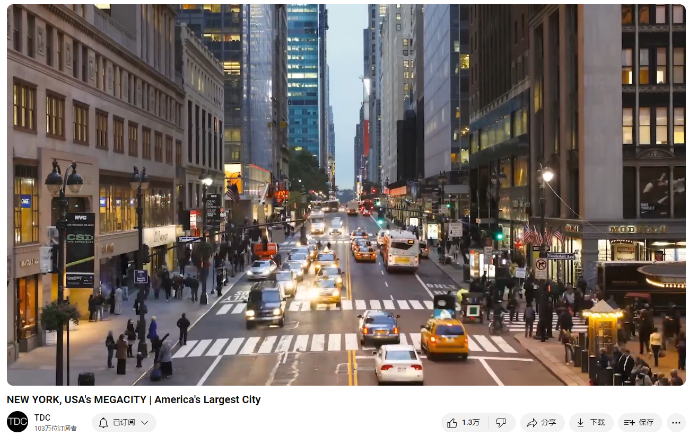

# NEW YORK, USA's MEGACITY | America's Largest City

Link: [https://www.youtube.com/watch?v=dzjQ-akB3BI&list=PLmSQiOQJmbZ7TU39cyx7gizM9i8nOuZXy&index=24](https://www.youtube.com/watch?v=dzjQ-akB3BI&list=PLmSQiOQJmbZ7TU39cyx7gizM9i8nOuZXy&index=24)

The story of New York City, America's megalopolis.

## Summary

### Paragraph 1: The Historical Development and Growth of New York City

The script begins by highlighting New York City's dynamic nature, emphasizing its pulse and vitality. It traces the city's origins back to 1609 when Henry Hudson discovered Manhattan Island. The Dutch established New Amsterdam in 1624, and the English later captured it in 1664, renaming it New York. The city's growth accelerated in the late 18th and early 19th centuries, becoming an important port city and briefly serving as the U.S. capital. The establishment of the New York Stock Exchange and the construction of the Erie Canal further boosted its development. Significant events like the construction of the Croton Aqueduct and Central Park improved sanitation and public spaces, respectively. The city also played crucial roles during the Civil War, the abolition of slavery, and the women's suffrage movement.

### Paragraph 2: New York's Cultural and Social Impact
The narrative shifts to New York City's cultural and social influence. The city welcomed waves of immigrants, contributing to its diverse population. Harlem became the cultural capital of Black America during the Great Migration. New York was a center for various social movements, including the civil rights movement, the gay rights movement, and community activism led by figures like Jane Jacobs. The construction of iconic structures like the Brooklyn Bridge and the Empire State Building marked its architectural achievements. Despite economic challenges and rising crime rates in the 1970s and 1980s, the city rebounded with modernized policing and Wall Street's resurgence.

### Paragraph 3: Modern Challenges and Future Prospects
The script concludes by addressing New York City's current challenges and future prospects. The September 11, 2001, attacks profoundly impacted the city, but it has since rebuilt, exemplified by One World Trade Center. The city's population and infrastructure face pressures, with overcrowded subways and high housing costs. Projects like the Second Avenue Subway and Hudson Yards aim to address these issues. Climate change presents a significant threat, particularly rising sea levels, prompting the need for flood defenses and sustainable urban planning. Despite these challenges, New York City remains a beacon of modernity, creativity, and inclusivity, proving that it can adapt and thrive in the face of adversity.

### 第一段：纽约市的历史发展与增长
视频脚本首先强调了纽约市的活力和脉动，追溯其起源至1609年亨利·哈德逊发现曼哈顿岛。1624年，荷兰人在这里建立了新阿姆斯特丹，而后在1664年被英国占领并改名为纽约市。18世纪末和19世纪初，纽约市发展迅速，成为重要的港口城市，并曾短暂地作为美国首都。纽约证券交易所的建立和伊利运河的建设进一步推动了城市的发展。克罗顿引水渠和中央公园的建设改善了城市的卫生和公共空间。纽约市在南北战争期间、废奴运动和妇女选举权运动中也发挥了重要作用。

### 第二段：纽约的文化和社会影响
叙述转向纽约市的文化和社会影响。城市迎来了大量移民，形成了多元化的人口。哈莱姆区在大迁徙期间成为了黑人美国的文化首都。纽约市是各种社会运动的中心，包括民权运动、同性恋权利运动和由简·雅各布斯领导的社区活动。布鲁克林大桥和帝国大厦等标志性建筑的建造标志着其建筑成就。尽管在20世纪70年代和80年代面临经济挑战和犯罪率上升的问题，城市通过现代化的警务措施和华尔街的复兴实现了反弹。

### 第三段：现代挑战与未来展望
视频脚本最后讨论了纽约市当前的挑战和未来前景。2001年9月11日的袭击对城市造成了深远影响，但通过重建，包括新世贸中心一号大楼，纽约市展现了其恢复力。城市人口和基础设施面临压力，地铁拥挤和住房成本高昂。第二大道地铁和哈德逊广场等项目旨在解决这些问题。气候变化，特别是海平面上升，是一个重大威胁，促使城市需要防洪措施和可持续的城市规划。尽管面临这些挑战，纽约市依然是现代性、创造力和包容性的象征，证明其能够适应并在逆境中茁壮成长。

## 托福考生介绍纽约

New York City, one of the most dynamic and influential cities in the world, boasts a rich history and vibrant present. Founded in 1609 when Henry Hudson discovered Manhattan Island, it initially became a Dutch settlement called New Amsterdam in 1624. The English captured it in 1664, renaming it New York. Throughout the 18th and 19th centuries, New York grew rapidly, becoming a major port and briefly serving as the capital of the United States. The construction of the New York Stock Exchange and the Erie Canal further boosted its development, turning it into a financial and commercial hub.

Culturally, New York City is a melting pot, welcoming immigrants from all over the world. This diversity has shaped the city’s identity, making it a center for various social movements. Harlem, for instance, became the cultural capital for African Americans during the Great Migration. The city played significant roles in the abolitionist movement, women's suffrage, and the civil rights movement. It also saw crucial battles for community preservation led by activists like Jane Jacobs against urban development projects.

Today, New York faces modern challenges such as overcrowded subways and high housing costs, which the city is addressing through projects like the Second Avenue Subway and Hudson Yards. Climate change poses a significant threat, with rising sea levels necessitating innovative flood management solutions. Despite these challenges, New York remains a symbol of resilience, creativity, and inclusivity. Its ability to adapt and thrive amid adversity highlights its enduring significance on the global stage.

## Vocabulary

megalopolis：美 [ˌmɛɡəˈlɑpələs] 特大城市；特大都市

exiles: 美 [ˈeksaɪlz]  流放；放逐；被流放者；流亡者；（exile的复数）

the mother of exiles 

concrete jungle: 水泥丛林

the melting pot：熔炉

expedition：美 [ˌekspəˈdɪʃn] 探险；探险队；远征；远征队；

Geographical gem：地理宝石

gem: 美 [dʒem] （经切割打磨的）宝石；宝物；珍宝；

shore：美 [ʃɔːr] 岸；滨；

Western Shore:西海岸

estuary：美 [ˈestʃueri]河口湾；三角湾；河口

narrow estuary ：狭窄的河口

terrain ：美 [təˈreɪn] 地面；地形；地势；地带 **注意发音**

mercantilist ：美 [mɜ'kæntɪlɪst]  重商主义者

warships 军舰；战船；（warship的复数）

redcoat：美 [ˈrɛdˌkoʊt] 英国士兵；

laid out：安排；规划；陈列；（lay out的过去式和过去分词）

A grid pattern of streets was laid out 街道被设计成网格状

quadruple：美 [kwɑːˈdruːpl] 使成为四倍；成为四倍；

Between 1820 and 1850 New York's population quadrupled 从1820年到1850年，纽约的人口翻了两番

tenement：美 [ˈtɛnəmənt] 住房；住宅；

tenement houses：廉价住房

sanitation：美 [ˌsænɪˈteɪʃn] 环境卫生；卫生设备卫生设施体系

without proper sanitation or clean water 没有适当的卫生设施或干净的水

cholera：美 [ˈkɑːlərə] 霍乱

typhoid：美 [ˈtaɪˌfɔɪd]   伤寒

smallpox：天花

rampant：美 [ˈræmpənt] 泛滥的；猖獗的；肆虐的；

Diseases like Cholera, Typhoid and Smallpox became rampant 霍乱、伤寒和天花等疾病变得猖獗

aqueduct：美 [ˈækwɪdʌkt]   人工水渠；

Croton aqueduct

hygiene：美 [ˈhaɪdʒiːn]  卫生

hygiene began to immediately improve卫生状况立即开始改善

swampland：美 [ˈswɑmpˌlænd] 沼泽地

squatter：美 [ˈskwɑːtər] 非法占用空屋者；大牧羊场场主；非法占地者

shack：美 [ʃæk] 棚屋；简陋的小屋；临时住所；

squatter shacks：棚户区

swampland and squatter shacks沼泽地和棚户区

epicenter：美 [ˈepəˌsentər] 震中；中心；集中点

New York was the epicenter of the abolition movement 纽约是废除运动的中心

suffrage：美 [ˈsəfrɪdʒ] 选举权；投票权；

women's suffrage：女性选举权

bulldoze：美 [ˈbʊlˌdoʊz] 清除；威吓；震慑

metroplitan：美 [ˌmetrəˈpɑːlɪtən] 大都会的；大城市的；有大城市气派的

metropolitan area：市区，大都会区

Today the New York Metropolitan area has over 20 million residents 今天，纽约大都会区有2000多万居民

ridership：客流量

riders：乘客

 its subway is one of the busiest transportation systems on Earth. Its ridership nearly doubled from 1 billion annual riders in 1990s to 1.8 billion today, but the amount of track and Subway cars has stayed the same 它的地铁是地球上最繁忙的交通系统之一。它的乘客人数从20世纪90年代的每年10亿人增加到今天的18亿人，几乎翻了一番，但轨道和地铁车辆的数量却保持不变

exorbitantly: 美 [ig'zɔ:bitəntli] 过度地；过高地

Another issue is exorbitantly expensive housing.房价过度高

## Transcript

Every urban center has its monuments, its history, its skyline, but great cities are more than buildings, great cities

Have a pulse and few mega cities capture the complexity

Chaos and vitality of a living system more vividly than New York, yet for a place

So deeply embedded in American culture

It's fascinating origins often go overlooked

After all no city becomes the Celebrity's playground, this city that never sleeps, the melting pot, the mother of exiles and the American dream overnight

While it is no longer the largest metropolis on Earth. It is still the most influential, but as this fast-paced

Capitalist Mecca Matures its confronting a unique set of challenges

Let's take a bite out of the big Apple, America's Mega City

One of the most remarkable things about this concrete jungle is how quickly it's rotted up

Compared to the other two mega cities

We've profiled so far New York is relatively young, less than 400 years ago the city looked like this

In 1609 the Island of Manhattan was found by an expedition. Its leader Henry Hudson realized immediately that it was a

Geographical gem the ideal location to build a city. A large river ran along its entire

Western Shore and on its Eastern Edge was a narrow estuary connected to a large Bay

Its Southern tip was flanked by two more large bays and dozens of Islands including the much larger

Long Island which shields Manhattan from ocean storms and

And as we saw in our previous explorations of Mexico City and Bangladesh

Containing and distributing clean water to residents is often a keystone challenge for dense urban centers on

this front however New York City reaps the benefits of Nature

direct contact with water ensures reliable access while elevated terrain spares it from excessive flooding

but back to the 17th century, after word reached Europe that Hudson had discovered what he called

"As pleasant to land as one can tread upon" the mercantilist minded Dutch sent 30 families to build a settlement called New Amsterdam in

Exchange for some metal kettles, axes and cloth the Native Americans who hunted throughout the area gave the Dutch the Island

slaves were immediately brought in to begin building the town

the Town's population reached 700 in

1664, but it still wasn't receiving very much support from the crown back in Holland, so English King Charles II

swooped in and with four warships

Captured the town without resistance. He then gave the colony to his brother the Duke of York

And you can guess what they called it. By the end of the 18th century, New York had become an important

Port City, then came the Revolution that changed everything

In 1776, New York joined the other American Colonies and declared independence from the English

After getting kicked out of Boston the British responded by sending an entire fleet of redcoats to seize and occupy

New York which they held for seven years until George, Washington

Led his victorious Rebel Army back into the city

After the war, New York briefly served as the capital of the newly formed United States until the federal government moved to the more centrally

Located district of Columbia. It's fascinating how that came about

The Decision was ultimately up to President Washington

But he left it up to his two right-hand men to figure out. In a backroom deal brokered by James Madison over dinner

Treasury secretary Alexander Hamilton of New York agreed to allow the nation's capital to move south to Northern Virginia the home state of

secretary of state Thomas Jefferson. In Exchange Jefferson agreed to support

Hamilton's financial plan which included the creation of a powerful Central bank

Soon after, the New York Stock Exchange was established laying the groundwork for lower Manhattan to become the financial capital of the world

Today its home to the two largest stock exchanges by total market capitalization

A couple more events in the early 1800s helped accelerate the City's growth. A grid pattern of streets was laid out

Providing an organized plan of expansion to the North and the opening of the Erie canal in 1825

This increased New York's importance as an export center of goods

Agricultural products and raw materials that could now be easily transported from the resource-rich Great lakes region

Around this time the city became the Gateway to America as large numbers of German and Irish immigrants arrived

Between 1820 and 1850 New York's population quadrupled

Many of these newcomers had to settle in tenement houses without proper sanitation or clean water

Diseases like Cholera, Typhoid and Smallpox became rampant. The construction of the Croton aqueduct

One of the world's first great modern water distribution systems helped to solve this problem

and hygiene began to immediately improve

In order to preserve the fast-growing city's connection to the environment a

600 acre area of swampland and squatter shacks was set aside for preservation and eventually transformed into Central Park

Today, it's the most visited Urban park in the country

Heading into the 1860s slavery was deeply dividing the Northern and Southern States

New York was the epicenter of the abolition movement

when the Civil War began in

1861, After Abraham Lincoln was elected president a riot broke out as angry white mobs attacked blacks

Who they blamed for low wages and the war

Hundreds were killed

Despite the unrest the city's economic engine roared as it became the vital source of

financing and supplies for the two million soldiers strong Union war effort

After the northern victory brought peace to the country New York's industrialists were free to focus on building

In 1883 the Brooklyn Bridge was completed linking New York to the third largest city in the country

The 1880s also brought electricity to the city and by 1893 there were

1,500 arc lamps illuminating New York streets. In 1898 the state legislature incorporated

Manhattan and the surrounding four boroughs of Brooklyn, Queens, the Bronx and Staten Island into the city of New York

instantly doubling its population and

quadrupling its land area

After leading the earlier fight to abolish slavery, New York was now the leader of the women's suffrage and workers rights movements

This culture of inclusivity also welcomed African-Americans fleeing the destruction and segregation of the south

They largely settled in an area on the upper west side that became known as Harlem the cultural capital of Black America

Electricity made the city at the center of nightlife in the roaring 20s

By the end of the decade the New York Metropolitan area's population had grown to 8 million

passing London to become the planets largest urban area

In 1931 the City Also had the world's tallest building as the Empire State building rose to dominate the skyline in an almost ridiculous way

World war II brought another wave of immigrants fleeing the chaos and destruction in Europe

When it was over, New York status as the unofficial capital of the world was cemented

with the construction of the gleaming United Nations complex along the east river

throughout its history

New York has also been a core force behind major social movements that have focused the country's vision while

Unifying New Yorkers as a community with a common identity

The city played an important role in the civil rights movement of the 1960s as leaders like Dr.Martin Luther King

Rallied support through the New York-based news media the Gay Rights Movement counts Greenwich Village as its epicenter

This neighborhood was also the site of a crucial battle between the powerful developer Robert Moses and residents

Led by activist and author Jane Jacobs, their grassroots movement ultimately blocked Moses from carrying out a project

That would have bulldozed the village and the area now known as Soho in order to cut through the heart of Manhattan with a giant

expressway

Paul Goldberger: "The lower Manhattan Expressway was

To have connected a Holland Tunnel with the Williamsburg and Manhattan bridges

It would have destroyed most of Soho we would have lost

One of the greatest inventories of 19th Century buildings not just in New York, but in the world"

Jane Jacobs: "The highways of course destroyed the neighborhoods that they went through. Where was this going to end?

The whole place was going to be laced with highways

What would we have left of Manhattan?"

By making it work for the automobile and as it became clear

That urban highways were in fact

profoundly destructive

It really became a battle between opposing forces"

In the 1970s and 80s economic problems and the crack cocaine epidemic

Created a spike in crime, but modernized police strategies and the rebirth of Wall Street helped solve these challenges

Today there are less than 400 murders a year in the city, down from a high of over 2000 in 1990

Of course New York still lives with the traumatic memory of its worst day

September 11th 2001, when more than 2,500 civilians and first responders died in the tragic attack on the World Trade Center

In the 16 years since One World Trade Center has risen from the ashes to become the tallest building in the western hemisphere

Today the New York Metropolitan area has over 20 million residents

Just to be clear, the city of New York has about 8 and a half million people

But for the purposes of this mega city series, I'm using entire Metropolitan

Populations because that's a city's labor market, its economic zone if you will.

Anyway, New York no longer is the largest city or metropolitan area in the world

But it's still massive population presents tremendous challenges. For one, its subway is one of the busiest transportation

systems on Earth. Its ridership nearly doubled from 1 billion annual riders in 1990s to

1.8 billion today, but the amount of track and Subway cars has stayed the same

This crowding has bogged things down

The system-wide average on time rate has dropped from 90%

Over the last decade to just 65 percent, the silver lining is that a 17 billion dollar Second Avenue Subway line

Is coming online. The first phase opened this year

But the remaining three phases could take more than two decades to complete. Another issue is exorbitantly

expensive housing. Costs in some high-end areas have been driven up by foreign Investors like wealthy Russians and Chinese

Who like to park their fortunes in the Ultra-Secure, New York Real Estate market

But the root cause of high prices is simple supply and demand

Whenever new housing development is built with affordable units it gets ten times as many applicants as there are units available to rent

The mega Developments, Essex Crossing Hunters point South and Pacific park that are going up throughout the city are seeing this firsthand

In the near term, the high-end housing shortage will be eased, slightly

By the 28 acre Hudson yards mega development, at an estimated total price tag of over 20 billion dollars

This new neighborhood is the most expensive real estate project in American history

Another future mega project getting people's attention, for different reasons, is Cornell Tech on Roosevelt island in the East river

The school joins the more than 120 colleges and universities in the city and

will feature the world's first High-rise residential building that meets

Passive house energy-efficient principles

Projects like these make it clear, New York City is cultivating the human capital needed to tackle the world's biggest problems

Thanks to climate change New York will have its fair share, as we saw firsthand after Hurricane Sandy

Flooded large parts of the region, there is no bigger threat to New York City than rising Seas

That storm caused nearly twenty billion dollars in damages

with New York's coastline expected to be between one and two feet higher by 2050

Now is the time to start planning for the future, whether that's designing flood and seawall solutions that blend with existing infrastructure

Or embracing a policy known as managed retreat where areas are simply abandoned in favor of higher ground

With so much at stake there's little doubt New York City will meet these challenges

In many ways it represents the best of our modern world

its dynamic, creative and socially tolerant, its embrace of sustainability proves that capitalism and

Environmentalism are not incompatible, and it's people which speak 400 different languages and are

37% foreign-born prove that, even in one of the most densely populated urban centers on the planet, if conditions are good

there's plenty of room for everyone to get along

Thanks for watching. I want to give a shout out to the museum of New York whose video on the city's history really helped me out

I'm curious to know what you think it is about New York that most makes it what it is today

And what you think will be its biggest challenge in the future, if you like this video subscribe and check back soon

We're headed to Cairo Egypt next

For TDC I'm Brice Plank

## Afterword

2024年6月25日21点46分于上海。

