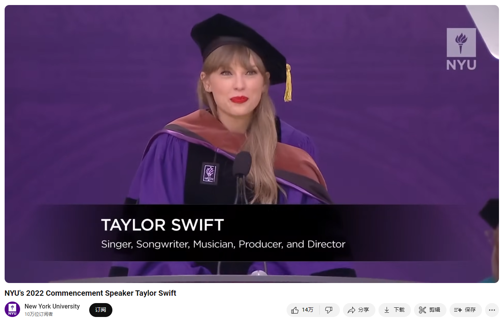

# NYU's 2022 Commencement Speaker Taylor Swift

Link: [https://www.youtube.com/watch?v=OBG50aoUwlI](https://www.youtube.com/watch?v=OBG50aoUwlI)

Singer, songwriter, producer, and director Taylor Swift received a Doctor of Fine Arts, honoris causa, at the Commencement for the Class of 2022 and delivered remarks on behalf of the honorary degree recipients.

## Summary

In her commencement speech at New York University, Taylor Swift shared several key themes and personal reflections:

1. **Gratitude and Recognition**: Taylor begins by thanking the NYU community and acknowledging the significant influence and support of her family and loved ones. She recognizes the collaborative effort involved in the graduates' journeys, emphasizing the importance of acknowledging those who have helped along the way.

2. **Life Experiences and Lessons**: Taylor reflects on her own life experiences, particularly the unconventional path she took in her career. She humorously mentions her lack of a traditional college experience and the challenges she faced in the music industry. Despite these challenges, she highlights how they shaped her success and personal growth.

3. **Embracing Mistakes and Growth**: Taylor discusses the inevitability of making mistakes and how they can lead to valuable life lessons. She emphasizes that mistakes do not equate to failure but rather opportunities for growth and learning. Her personal anecdotes about public scrutiny and overcoming setbacks illustrate this point.

4. **Living Authentically and Passionately**: Taylor encourages the graduates to live with enthusiasm and not to hide their passions or interests. She advocates for being unashamed of one's efforts and desires, stressing that genuine passion and hard work are more valuable than trying to appear effortlessly cool.

5. **Navigating Life's Uncertainties**: Taylor acknowledges the complexities and uncertainties of life, particularly as the graduates move into the next phases of their lives. She advises them to trust their instincts and be prepared for both successes and failures. Her message is one of resilience and adaptability, encouraging the graduates to embrace both the good and the bad.

6. **Advice on Personal Well-being**: Taylor offers practical advice on managing life's emotional and mental burdens. She talks about the importance of discerning what to hold onto and what to let go of, and learning to live alongside inevitable moments of embarrassment or "cringe."

7. **Empowerment and Independence**: Taylor empowers the graduates by reminding them that their choices and paths are their own. While this autonomy can be daunting, it also provides the freedom to shape their futures according to their own values and aspirations.

Overall, Taylor Swift's speech is a blend of humor, personal storytelling, and motivational advice. She inspires the graduates to embrace their individuality, learn from their mistakes, and approach life with enthusiasm and resilience. The key takeaway is to live authentically, pursue passions without shame, and navigate life's ups and downs with a spirit of perseverance and gratitude.

在纽约大学的毕业典礼演讲中，泰勒·斯威夫特分享了几个重要主题和个人反思：

1. **感恩与认可**：泰勒首先感谢了纽约大学的社区，并感谢她的家人和所爱之人的重要影响和支持。她认识到在毕业生的旅途中，合作的努力是至关重要的，并强调了承认那些在这一路上给予帮助的人们的重要性。

2. **生活经历与教训**：泰勒回顾了她自己的生活经历，特别是她在职业生涯中所走的非常规道路。她幽默地提到了自己缺乏传统大学经历以及在音乐行业中面临的挑战。尽管面临这些挑战，但她强调这些经历如何塑造了她的成功和个人成长。

3. **拥抱错误与成长**：泰勒谈到了犯错误的不可避免性以及这些错误如何带来宝贵的人生教训。她强调错误并不等同于失败，而是成长和学习的机会。她通过自己的个人故事，讲述了如何在公众的审视下克服挫折来说明这一点。

4. **真实而热情地生活**：泰勒鼓励毕业生们以热情的态度生活，不要隐藏自己的兴趣和爱好。她提倡对自己的努力和愿望不感到羞愧，强调真正的热情和努力工作比试图显得毫不费力更有价值。

5. **应对生活的不确定性**：泰勒承认生活的复杂性和不确定性，特别是在毕业生进入下一阶段时。她建议他们相信自己的直觉，并为成功和失败做好准备。她的信息是关于韧性和适应性，鼓励毕业生们拥抱生活中的好与坏。

6. **关于个人福祉的建议**：泰勒提供了一些关于管理生活情感和心理负担的实用建议。她谈到如何辨别什么该坚持，什么该放手，以及学会与不可避免的尴尬或“尴尬时刻”共存。

7. **赋权与独立**：泰勒通过提醒毕业生他们的选择和道路是自己的，赋予他们力量。虽然这种自主性可能令人畏惧，但也提供了根据自己的价值观和愿望来塑造未来的自由。

总体来说，泰勒·斯威夫特的演讲结合了幽默、个人故事和鼓舞人心的建议。她激励毕业生们拥抱个性，从错误中学习，并以热情和韧性面对生活。核心要点是要真实地生活，毫无羞愧地追求激情，并以坚韧和感恩的精神应对生活的起伏。

## Vocabulary

escort: 美 [ˈeskɔːrt , ɪˈskɔːrt] 护送；押送；护卫

lectern: 美 [ˈlɛktərn] 讲台

please escort the candidate to the lectern. 请护送候选人到讲台。

blazing: 美 [ˈbleɪzɪŋ]  闪耀的；耀眼的；燃烧的；

blazing singer:闪耀的歌手

philanthropist：美 [fɪˈlænθrəpɪst] 慈善家 **注意发音**

resolve：美 [rɪˈzɑːlv] 决心；决意；决议；

hundreds of millions：亿万；数亿；上亿          

You have brought joy and resolve to your hundreds of millions of fans throughout the world. 你给全世界亿万粉丝带来了快乐和决心。

genres：美 [ˈʒɑːnrəz] 体裁；（genre的复数） **注意发音**

demographics：美 [ˌdeməˈɡræfɪks] 人口统计资料；人口统计数据；人口分布情况

You have crossed genres, demographics, age groups and borders of all kinds to touch lives around the globe. 你已经跨越了流派、人口统计、年龄组和各种各样的边界，接触到全球各地的生活。

remarkable：引人注目的；非凡的；显著的；值得注意的；杰出的；

galvanize：美 [ˈɡælvəˌnaɪz] 刺激；激励；激发；使震惊；促使行动；

You have used the remarkable platform you earned to galvanize support for the Equality Act to prevent discrimination on the basis of sexual orientation and gender identity. 你已经利用你所获得的显著平台来激发对平权法案的支持，以防止基于性取向和性别认同的歧视。

literacy：美 [ˈlɪtərəsi] 读写能力；识字能力；文化程度；知识水平；教育水平；素养；能力

literacy programs for children 儿童扫盲计划

exploitation：美 [ˌeksplɔɪˈteɪʃn] 剥削；开发；利用；

champion：拥护；支持；为...而斗争；

You have fearlessly challenged the exploitation of music artists and successfully championed their right to be compensated for their work. 你无畏地挑战了对音乐艺术家的剥削，并成功地捍卫了他们获得工作报酬的权利。

role model：榜样；典范；模范；

unprecedented：美 [ʌnˈpresɪdentɪd] 史无前例的；前所未有的；没有先例的；空前的；

talent and accomplishment：才华和成就

advocacy：美 [ˈædvəkəsi]  提倡；（对某种思想、行动方针、信念的）拥护；支持；

commitment to:致力于

forcefully: 强有力地；激烈地；有说服力地          

eloquently: 美 [ˈeləkwəntli] 雄辩地；富于表现力地；善辩地

forcefully, eloquently and effectively 有力、雄辩和有效地

you are a role model across the world for your unprecedented talent and accomplishment, your fierce advocacy for protection of those facing discrimination and your commitment to speaking out forcefully, eloquently and effectively on behalf of all artists. 你是全世界的榜样，因为你有着前所未有的才华和成就，你积极倡导保护那些面临歧视的人，你致力于代表所有艺术家有力、雄辩和有效地发表意见。

by virtue of : 凭借；依靠；由于；

vest in:  授予；归属；赋予          

confer upon: 授予；赋予；给予          

honoris causa: 美 [ənɔːriːsˈkaʊzə] 作为一种荣誉

By virtue of the authority vested in me, I am pleased to confer upon you the degree of Doctor of Fine Arts honoris causa. 根据授予我的权力，我很高兴授予你荣誉Fine Arts博士学位。

>在这句话中，“Fine Arts”指的是“美术”或“纯艺术”，涵盖了包括绘画、雕塑、音乐、舞蹈、戏剧和其他艺术形式的创造性实践和研究。
>
>授予泰勒·斯威夫特“Doctor of Fine Arts honoris causa”的学位，是对她在艺术领域，特别是在音乐和表演艺术方面的卓越贡献和成就的认可。这个荣誉学位表彰了她作为一名歌手、词曲创作者、制作人和导演在艺术创作中的卓越表现，以及她对艺术界的影响和贡献。

in heels：穿着高跟鞋

glittery：美 [ˈɡlɪtəri] 闪烁的；闪光的；亮晶晶的；华丽的

leotard：美 [ˈliəˌtɑrd] 紧身连衣裤

Last time I was in a stadium this size I was dancing in heels and wearing a glittery leotard. 上次我在这么大的体育场，我穿着高跟鞋和闪亮的紧身衣跳舞。

elated：美 [iˈleɪtɪd]   兴高采烈的；得意洋洋的

I am elated to be here with you today：我很高兴今天能和你们在一起

patchwork：（不同图案杂色布块的）拼缝物；拼接物；混合物；杂烩；拼接图案；

We are each a patchwork quilt of those who have loved us, those who have believed in our futures, those who showed us empathy and kindness or told us the truth, even when it wasn't easy to hear. 我们每个人都是由那些爱过我们的人组成的拼接图案，那些相信我们未来的人，那些对我们表现出同情和善意或告诉我们真相的人，即使我们不容易听到。

chuckle：美 [ˈtʃʌkl]  咯咯笑；轻声地咯咯笑；轻声地笑；

audience chuckles 观众笑了

who have supported these students in their pursuit of educational enrichment. 他们支持这些学生追求丰富的教育。

catchy：动听易记的          

cathartic：美 [kəˈθɑrdɪk] 宣泄情感的；宣泄情绪的；释放压力的

you desperately needed to hear a song with a catchy hook and an intensely cathartic bridge section. 你迫切需要听到一首吸引人的歌曲和强烈宣泄情绪的桥段。

hook

>这里的 "hook" 是指音乐中的“钩子”。在音乐术语中，"hook" 是一段旋律、歌词或节奏，它能够迅速抓住听众的注意力并让他们记住这首歌。通常，"hook" 是歌曲中最有吸引力和最容易记住的部分，它可能是副歌、主旋律或某个特别突出的段落。泰勒·斯威夫特在这里说，如果你的紧急情况是急需听一首带有吸引力旋律和强烈情感宣泄桥段的歌，她可以帮上忙。

per se: 美 [ˌpər ˈseɪ]  本身，**注意发音**

I never got to have a normal college experience per se. 我从来没有过正常的大学生活。

glamorous：美 [ˈɡlæmərəs] 富有魅力的；美丽动人的；迷人的

incredibly：难以置信地

I went out on the road for radio tour which sounds incredibly glamorous： 我去电台巡回演出，听起来非常迷人

unsolicited：美 [ˌənsəˈlɪsɪdəd] 未经请求的；主动提供的

give anyone unsolicited advice 主动提供的建议

grudges：美 [grʌdʒiz] 怨恨；恶意；（grudge的复数）

No matter how hard you try to avoid being cringe, you will look back on your life and cringe retrospectively.

>这里的 "cringe" 是一个现代俚语，指的是一种因尴尬、窘迫或不适感而感到难为情、脸红或不自在的反应。通常，这种感觉源于回想起自己或他人过去所做的尴尬或不合适的事情。
>
>泰勒·斯威夫特在这里说的是，无论你多么努力地避免做出让自己感到尴尬的事情，将来回想起来时，你仍然会对自己过去的一些行为感到尴尬或不自在。这种尴尬感是无法避免的。

revolting: 美 [rɪˈvoʊltɪŋ] 背叛的；叛乱的；讨厌的

hilarious: 美 [hɪˈleriəs]  非常滑稽的；令人捧腹大笑的；极有趣的；

and find revolting and hilarious. 觉得既恶心又好笑。

squirm:美 [skwɜːrm]   表露出困窘；感到困窘

stigma: 耻辱；污名；圣痕；

eagerness: 渴望；热心

ambivalence: 美 [æmˈbɪvələns] 矛盾心理；犹豫；矛盾情绪

It seems to me that there is a false stigma around eagerness in our culture of unbothered, ambivalence. 在我看来，在我们这种无拘无束、矛盾的文化中，对渴望有一种虚假的偏见。

ensnare:美 [ənˈsnɛr] 使入陷阱；使中圈套；使陷入困境

humiliated: 美 [hjuːˈmɪlieɪtɪd] 羞辱；使丢脸；（humiliate的过去式和过去分词）

excruciatingly: 美 [ɪk'skruʃɪeɪtɪŋlɪ] 极痛苦地；讨厌地；难以忍受地

likability: 受欢迎程度

Being publicly humiliated over and over again at a young age was excruciatingly painful but it forced me to devalue the ridiculous notion of minute by minute, ever fluctuating social relevance and likability

在年轻时一次又一次地被公开羞辱是极其痛苦的，但它迫使我贬低那种荒谬的观念，即每分每秒不断变化的社会相关性和受欢迎程度。

consummate：[ˈkɑːnsəmeɪt]] 完美的；技艺超群的；圆满的；极致的；

I know I sound like a consummate optimist 我知道我听起来像一个完美的乐观主义者

sabotage: 美 [ˈsæbətɑːʒ] 破坏；蓄意破坏（以防止敌方利用或表示抗议）；妨碍；捣乱 **注意发音**

self-sabotage 自我破坏

## Transcript

I would like now to introduce Jason King

Chair and Associate Professor

of the Clive Davis
Institute of Recorded Music,

Tisch School of the Arts,

who will present the candidate
for Doctor of Fine Arts.

Will trustee, Brett Racon,

please escort the
candidate to the lectern.

(audience applauding)
(audience cheering)

Taylor Swift

(audience cheering)
(audience applauding)

blazing singer, songwriter,
producer, director, actress,

pioneering and influential
advocate for artists' rights

and philanthropist.

You have brought joy and resolve

to your hundreds of millions
of fans throughout the world.

(audience cheering)

One of the best selling
music artists in history.

You have crossed genres,
demographics, age groups

and borders of all kinds

to touch lives around the globe.

With nine original studio albums

two re-recorded studio albums,

(audience applauding)
(audience cheering)

five extended plays, three live
albums and 14 compilations.

You have sold well over
100 million album units,

(audience applauding)
(audience cheering)

earning awards and
honors in every category.

You have used the remarkable
platform you earned

to galvanize support for the Equality Act

to prevent discrimination

on the basis of sexual
orientation and gender identity.

(audience applauding)
(audience cheering)

And you have spoken out

and you have supported initiatives

to protect women and girls

from harassment and sexual assaults.

(audience applauding)
(audience cheering)

You have donated significantly

to victims of floods and tornadoes,

for cancer research, literacy
programs for children

and public education.

You have fearlessly
challenged the exploitation

of music artists

and successfully championed their right

to be compensated for their work.

(audience applauding)
(audience cheering)

Taylor Swift,
(audience cheering)

you are a role model across the world

for your unprecedented
talent and accomplishment,

your fierce advocacy

for protection of those
facing discrimination

and your commitment to speaking out

forcefully, eloquently and effectively

on behalf of all artists.

(audience cheering)
(audience applauding)

By virtue of the authority vested in me,

I am pleased to confer upon you

the degree of Doctor of
Fine Arts honoris causa.

(audience cheering)
(audience applauding)

(audience members cheering)

I am now pleased to
introduce Taylor Swift,

who will respond

on behalf of the honorary
degree recipients.

(audience applauding)
(audience cheering)

### Taylor's Speech

Hi, I'm Taylor.

(audience applauding)
(audience cheering)

Last time I was in a stadium this size

I was dancing in heels and
wearing a glittery leotard.

(podium members chuckling)
(audience cheering)

This outfit is much more comfortable.

I would like to say a huge thank you

to NYU's Chairman of the Board
of Trustees, Bill Berkeley

and all the trustees and
members of the board.

NYU's President Andrew Hamilton,
Provost Katherine Fleming

and the faculty and alumni here today,

who have made this day possible.

I feel so proud to share this
day with my fellow honorees

Susan Hockfield and Félix Matos Rodríguez,

who humble me with the
ways they improve our world

with their work.

(audience applauding)
(audience cheering)

As for me, I'm 90% sure,
the main reason I'm here

is because I have a song called "22."

(audience cheering)
(audience applauding)

And let me just say, I am elated
to be here with you today,

as we celebrate and graduate

New York University's Class of 2022.

(audience cheering)
(audience applauding)

Not a single one of us here
today has done it alone.

We are each a patchwork quilt
of those who have loved us,

those who have believed in our futures,

those who showed us empathy and kindness

or told us the truth, even
when it wasn't easy to hear.

Those who told us we could do it

when there was absolutely
no proof of that.

Someone read stories to
you and taught you to dream

and offered up some moral
code of right and wrong

for you to try and live by.

Someone, tried their best
to explain every concept

in this insanely complex world,

to the child that was you,

as you asked a bazillion questions,

like how does the moon work

and why can we eat salad, but not grass?

(audience chuckles)

And maybe they didn't do it perfectly,

no one ever can.

Maybe they aren't with us anymore.

In that case, I hope
you'll remember them today.

If they are in this stadium,

I hope you'll find your own
way to express your gratitude

for all the steps and missteps

that have led us to
this common destination.

(audience cheering)
(audience applauding)

I know that words are
supposed to be my thing

but I will never be able to find the words

to thank my mom and
dad, my brother, Austin,

for the sacrifices they made every day,

so I could go from
singing in coffee houses

to standing up here with you all today

because no words would ever be enough.

(audience cheering)
(audience applauding)

To all the incredible parents,
family members, mentors

teachers, allies, friends,
and loved ones here today,

who have supported these students

in their pursuit of
educational enrichment.

Let me say to you now welcome to New York,

it's been waiting for you.

(audience cheering)
(audience applauding)

I'd like to thank NYU for making me

technically, on paper at least, a doctor.

(audience cheering)
(audience applauding)

Not the type of doctor
you would want around

in case of an emergency,

unless your specific emergency

was that you desperately
needed to hear a song

with a catchy hook

and an intensely cathartic bridge section.

(audience cheering)
(audience applauding)

Or if your emergency was
that you needed a person

who can name over 50 breeds
of cats in one minute.

(audience cheering)

I never got to have a normal
college experience per se.

I went to public high
school until 10th grade

and then finished my education,

doing homeschool work on the
floors of airport terminals.

Then I went out on the road for radio tour

which sounds incredibly glamorous,

but in reality it consisted
of a rental car, motels,

and my mom and I,

pretending to have loud
mother-daughter fights

with each other during boarding,

so no one would want the empty
seat between us on Southwest.

(audience chuckles)

As a kid, I always thought
I would go away to college,

imagining the posters I
would hang on the wall

of my freshman dorm.

I even set the ending of my music video

from my song "Love Story" at
my fantasy imaginary college

where I meet a male model,
reading a book on the grass.

And with one single glance

we realized we had been
in love in our past lives

which is exactly what
you guys all experienced

at some point in the
last four years, right?

But I really can't complain

about not having a normal
college experience to you

because you went to NYU
during a global pandemic

being essentially locked into your dorms

and having to do classes over Zoom.

Everyone in college during normal times

stresses about test scores.

But on top of that

you also had to pass like
a thousand COVID tests.

(audience chuckles)

I imagine the idea of a
normal college experience

was all you wanted too.

But in this case, you and I both learned

that you don't always get
all the things in the bag

that you selected from the menu

in the delivery surface that is life.

You get what you get.

And as I would like to
say to you wholeheartedly

you should be very proud of
what you've done with it.

Today, you leave New York University

and then go out into the
world, searching what's next,

and so will I.

(audience cheering)
(audience applauding)

So as a rule, I try not to
give anyone unsolicited advice

unless they ask for it.

I'll go into this more later.

I guess I have been officially
solicited in this situation

to impart whatever wisdom I might have

to tell you things that have
helped me so far in my life.

Please bear in mind

that I in no way feel qualified
to tell you what to do.

You've worked and struggled and sacrificed

and studied and dreamed
your way here today.

And so, you know what you're doing

you'll do things differently

than I did them and for different reasons.

So I won't tell you to what to do

'cause no one likes that.

I will, however, give you
some life hacks, I wish I knew

when I was starting out
my dreams of a career

and navigating life,
love, pressure, choices,

shame, hope, and friendship.

The first of which is, life can be heavy

especially if you try
to carry it all at once.

Part of growing up and moving
into new chapters of your life

is about catch and release.

What I mean by that is,

knowing what things to keep
and what things to release.

You can't carry all things, all grudges

all updates on your ex,

all enviable promotions
your school bully got

at the hedge fund his uncle started.

(audience chuckles)

Decide what is yours to
hold and let the rest go.

Oftentimes, the good things in
your life are lighter anyway,

so there's more room for them.

One toxic relationship

can outweigh so many
wonderful, simple joys.

You get to pick what your
life has time and room for.

Be discerning.

Secondly, learn to live alongside cringe.

(audience cheering)
(audience laughing)

No matter how hard you
try to avoid being cringe,

you will look back on your life
and cringe retrospectively.

(audience cheering)
(audience applauding)

Cringe is unavoidable over a lifetime.

Even the term cringe might
someday be deemed cringe.

I promise you're probably doing

or wearing something right now

that you will look back on later

and find revolting and hilarious.

(audience chuckles)

You can't avoid it, so don't try to.

For example I had a phase
where for the entirety of 2012,

I dressed like a 1950's housewife

But you know what? I was having fun.

Trends and phases are fun.

Looking back and laughing is fun.

And while we're talking about
things that make us squirm

but really shouldn't.

I'd like to say I'm a big advocate

for not hiding your enthusiasm for things.

(audience cheering)
(audience applauding)

It seems to me that there is a
false stigma around eagerness

in our culture of unbothered, ambivalence.

This outlook perpetuates the idea

that it's not cool to want it.

That people who don't try

are fundamentally more
chic than people who do.

And I wouldn't know because
I've been a lot of things

but I've never been an expert on chic

but I'm the one who's up here,

so you have to listen
to me when I say this,

never be ashamed of trying.

Effortlessness is a myth.

The people who wanted it the least

were the ones I wanted to date

and be friends with in high school.

The people who want it the most

are the people I now hire
to work for my company.

(audience cheering)
(audience applauding)

I started writing songs when I was 12.

And since then it's been
the compass guiding my life,

and in turn, my life guided my writing

everything I do is just
an extension of my writing

whether it's directing
videos or a short film

creating the visuals for a tour

or standing on a stage performing.

Everything is connected
by my love of the craft

the thrill of working through ideas

and narrowing them down and
polishing it all up in the end,

editing, waking up in
the middle of the night,

throwing out the old idea

because you just thought
of a new or better one

or a plot device that ties
the whole thing together.

There's a reason they call it a hook.

Sometimes a string of
words just ensnares me

and I can't focus on anything

until it's been recorded or written down.

As a songwriter I've never
been able to sit still

or stay in one creative
place for too long.

I've made and released 11 albums

and in the process, I've switched genre

from country to pop,
to alternative to folk.

And this might sound

like a very songwriter-centric
line of discussion,

but in a way I really do
think we are all writers

and most of us write in a different voice

for different situations.

You write differently in
your Instagram stories

than you do your senior thesis.

You send a different type
of email to your boss

than you do your best friend from home.

We are all literary chameleons
and I think it's fascinating.

It's just a continuation of the idea

that we are so many things all the time.

And I know it can be really overwhelming

figuring out who to be and when,

who you are now and how to act

in order to get where you wanna go.

I have some good news.
It's totally up to you.

I have some terrifying news.

It's totally up to you.

I said to you earlier that
I don't ever offer advice

unless someone asked me for it

and now I'll tell you why.

As a person who started
my very public career

at the age of 15, it came with a price

and that price was years
of unsolicited advice.

Being the youngest person in
every room for over a decade

meant that I was constantly
being issued warnings

from older members of the music industry,

media, interviewers, executives

and this advice often presented itself

as thinly veiled warnings.

See, I was a teenager at a time

when our society was absolutely obsessed

with the idea of having perfect
young female role models.

It felt like every interview I did

included slight barbs by the interviewer

about me one day, running off the rails

and that meant a different thing

to every person who said it to me.

So I became a young adult
while being fed the message

that if I didn't make any mistakes,

all the children of America

would grow up to be perfect angels.

However, if I did slip up,

the entire earth would fall off its axis

and it would be entirely my fault

and I would go to pop star
jail forever and ever.

It was all centered around the idea

that mistakes equal failure

and ultimately the loss of any chance

at a happy or rewarding life.

This has not been my experience.

My experience has been that my mistakes

led to the best things in my life

and being embarrassed when you mess up

it's part of the human experience.

Getting back up, dusting yourself off

and seeing who still wants to
hang out with you afterward

and laugh about it, that's a gift.

The times I was told
no or wasn't included,

wasn't chosen, didn't
win, didn't make the cut,

looking back, it really
feels like those moments

were as important if not more crucial

than the moments I was told, yes.

Not being invited

to the parties and
sleepovers in my hometown

made me feel hopelessly lonely,

but because I felt alone,
I would sit in my room

and write the songs

that would get me a ticket somewhere else.

Having label executives
in Nashville tell me

that only 35 year old housewives
listen to country music

and there was no place for a
13 year old on their roster

made me cry in the car on the way home

but then I'd post my songs on
my MySpace and yes, MySpace.

(audience chuckles)

And I would message with
other teenagers like me

who loved country music

but just didn't have anyone
singing from their perspective.

Having journalists write in depth

oftentimes critical pieces
about who they perceive me to be

made me feel like I was living
in some weird simulation

but it also made me look inward

to learn about who I actually am.

Having the world treat my love life

like a spectator sport

in which I lose every single game

was not a great way to date
in my teens and twenties,

but it taught me to protect
my private life fiercely.

Being publicly humiliated over
and over again at a young age

was excruciatingly painful

but it forced me to devalue
the ridiculous notion

of minute by minute,

ever fluctuating social
relevance and likability.

(audience cheering)
(audience applauding)

Getting canceled on the internet
and nearly losing my career

gave me an excellent knowledge
of all the types of wine.

(audience laughing)

I know I sound like a consummate optimist

but I'm really not.

I lose perspective all the time.

Sometimes everything just
feels completely pointless.

I know the pressure of living your life

through the lens of perfectionism

and I know that I'm talking
to a group of perfectionists

because you are here
today, graduating from NYU.

(audience cheering)
(audience applauding)

So this might be hard for you to hear.

In your life, you will
inevitably misspeak,

trust the wrong person,
under react, overreact

hurt the people who didn't deserve it,

overthink, not think
at all, self-sabotage,

create a reality where only
your experience exists,

ruin perfectly good moments
for yourself and others,

deny any wrongdoing, not take
the steps to make it right,

feel very guilty, let the guilt
eat at you, hit rock bottom.

Finally, address the pain you caused,

try to do better next time, rinse, repeat.

(audience chuckles)

(audience cheering)
(audience applauding)

And I'm not gonna lie,

these mistakes will
cause you to lose things.

I'm trying to tell you that losing things

doesn't just mean losing.

A lot of the time when we lose things,

we gain things too.

Now you leave the structure
and framework of school

and chart your own path.

Every choice you make
leads to the next choice,

which leads to the next

and I know it's hard to
know which path to take.

There will be times in life

where you need to stand up for yourself

times when the right thing

is actually to back down and apologize,

times when the right thing is to fight,

times when the right
thing is to turn and run,

times to hold on with all you have

and times to let go with grace.

Sometimes the right thing to do

is to throw out the old schools of thought

in the name of progress and reform.

Sometimes the right thing
to do is to sit and listen

to the wisdom of those
who have come before us.

How will you know what the right choice is

in these crucial moments?

You won't.

How do I give advice to this many people

about their life choices?

I won't.

The scary news is you're on your own now

but the cool news is,
you're on your own now.

(audience cheering)
(audience applauding)

I leave you with this.

We are led by our gut
instincts, our intuition,

our desires and fears,
our scars and our dreams.

And you will screw it
up sometimes, so will I.

And when I do,

you will most likely read
about it on the internet.

Anyway, hard things will happen to us.

We will recover, we will learn from it.

We will grow more resilient because of it.

And as long as we are fortunate
enough to be breathing

we will breathe in, breathe through,

breathe deep, breathe out.

And I am a doctor now,

so I know how breathing works.

(audience laughing)

(audience applauding)

I hope you know how proud I
am to share this day with you.

We're doing this together.

So let's just keep dancing,
like we're the Class of '22.

(audience cheering)
(audience applauding)

## Afterword

2024年6月24日13点17分于上海。

