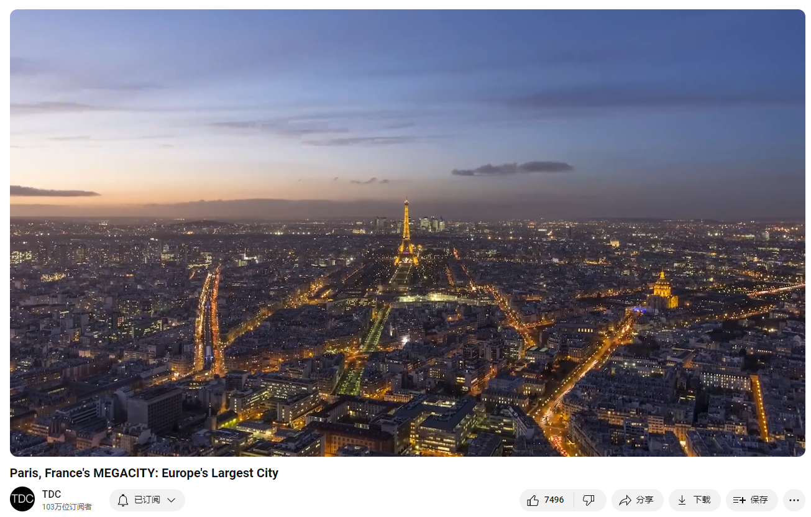

# Paris, France's MEGACITY: Europe's Largest City

Link: [https://www.youtube.com/watch?v=bdObzSwVAw4&list=PLmSQiOQJmbZ7TU39cyx7gizM9i8nOuZXy&index=22](https://www.youtube.com/watch?v=bdObzSwVAw4&list=PLmSQiOQJmbZ7TU39cyx7gizM9i8nOuZXy&index=22)

Paris, France is the grand megacity of Europe at the forefront of human progress.

## Summary

Summary of Paris: The Grand MegaCity

Paris, often called the City of Light, has long been a beacon for progress and innovation in various fields such as cuisine, fashion, infrastructure, and governance. Its history dates back to 2300 years ago when the Celtic Gauls, known as the Parisii, settled on Île de la Cité. Over time, Paris transformed significantly under various rulers, especially during the Middle Ages, becoming the largest city in Europe and a center for Gothic architecture and Enlightenment thought. The city's pivotal role in the French Revolution, highlighted by the storming of the Bastille in 1789, led to the establishment of the French Republic and influenced much of Western Europe through Napoleon's rule.

In the mid-19th century, Paris underwent a dramatic transformation under Emperor Napoleon III and urban planner Baron Haussmann. Their vision modernized the city with wide boulevards, a new aqueduct, an extensive sewer system, gas lighting, rail stations, and numerous parks. Haussmann's meticulous urban planning created the iconic and uniform architectural style that characterizes Paris today. Despite the displacement of many residents during this period, the changes made Paris healthier, less congested, and aesthetically grander. The city's resilience was evident during WWII when it was spared destruction, and landmarks like the Eiffel Tower and the Louvre became symbols of cultural and historical significance.

In contemporary times, Paris continues to be at the forefront of addressing global challenges. It hosted the significant climate change conference two weeks after a deadly terrorist attack, showcasing its commitment to global issues. Paris is also focusing on improving its infrastructure to support its 12 million inhabitants and preparing for the 2024 Summer Olympics by expanding the La Defense financial district and the Paris metro system. These efforts ensure that Paris remains a thriving megacity capable of leading future generations in tackling the challenges of the second half of the century.

 巴黎：宏伟的超级城市概述

巴黎，常被称为“光之城”，长期以来在美食、时尚、基础设施和治理等各个领域一直是进步和创新的灯塔。它的历史可以追溯到2300年前，当时凯尔特高卢人，称为巴黎人，定居在塞纳河中的西岱岛。随着时间的推移，在各个统治者的治理下，巴黎发生了显著的变化，尤其是在中世纪，成为欧洲最大的城市和哥特式建筑与启蒙思想的中心。1789年巴士底狱起义引发的法国大革命，导致了法兰西共和国的建立，通过拿破仑的统治对西欧产生了深远影响。

19世纪中期，巴黎在拿破仑三世皇帝和城市规划者奥斯曼男爵的领导下进行了彻底的变革。他们的愿景通过宽阔的林荫大道、新的输水道、广泛的下水道系统、煤气灯照明、铁路站和众多公园使城市现代化。奥斯曼精心规划的城市结构创造了巴黎今天标志性且统一的建筑风格。尽管许多居民在这一期间被迫迁移，但这些变化使巴黎变得更加健康、减少拥堵且更加宏伟。在二战期间，巴黎表现出的韧性显而易见，它幸免于破坏，像埃菲尔铁塔和卢浮宫这样的地标成为文化和历史的重要象征。

在当代，巴黎继续在应对全球挑战方面处于前沿。在一次致命的恐怖袭击后仅两周，巴黎就主办了一场重要的气候变化会议，展示了其对全球问题的承诺。巴黎还专注于改善其基础设施，以支持其1200万居民，并通过扩展拉德芳斯金融区和巴黎地铁系统，为2024年夏季奥运会做准备。这些努力确保巴黎将继续成为一个繁荣的超级城市，能够引领未来几代人应对21世纪下半叶的挑战。

## Vocabulary

beacon：美 [ˈbiːkən] 灯塔；灯标；信标

couture:英 [kuːˈtjʊə] 美 [kuˈtʊ(ə)r] 时装设计和缝制；时装 **注意发音**

refuge: 美 [ˈrefjuːdʒ] 避难所；收容所；**注意发音**

refuge for the rebel 反叛者的避难所

vanguard：美 [ˈvænɡɑːrd] 先驱者；前卫；先头部队；先锋地位

Seine：英 [seɪn] （Seine）塞纳河；

Frankish：美 [ˈfræŋkɪʃ] 法兰克人的；法兰克语的

tribes：美 [traɪbz] 部落（tribe的复数）

Louis：英 [ˈluːi] 人名：路易斯；路易；**注意发音**

monarchs：英 [ˈmɒnəks] 君主；帝王；（monarch的复数）

Clovis, the first king to unite all the Frankish tribes is the origin of the name Louis, taken by 18 subsequent French monarchs. 克洛维斯，第一个联合所有法兰克部落的国王，是路易这个名字的由来，后来的18个法国君主都取了这个名字。

ground zero：基础；起点；

gothic architecture：哥特式建筑

Gothic：美 [ˈɡɑːθɪk]哥特式的（尤指中世纪欧洲的建筑风格）；哥特派的；哥特风格的；

the Middle Ages：中世纪

Home to one of the first Universities and the birthplace of Gothic architecture, Paris was ground zero for the enlightenment.巴黎是第一批大学的所在地，也是哥特式建筑的发源地，是启蒙运动的中心。

pamphlets:美 ['pæmflɪts] 小册子；（pamphlet的复数）

Bastille:美 [bæˈstil] 巴士底狱

fortress:美 [ˈfɔːrtrəs] 要塞；堡垒；

well over：远远超过

tight street：拥挤的街道

filthy：美 [ˈfɪlθi] 肮脏的；污秽的；

alleyways：英 ['ælɪweɪs] 小巷；窄街；走廊；（alleyway的复数）

By the middle of the 1800’s, Paris had well over a million people, but was made up of tight streets and overpopulated, filthy alleyways.到19世纪中期，巴黎已经有超过一百万的人口，但是由拥挤的街道和拥挤肮脏的小巷组成。

slums：美 [slʌmz] 贫民窟；（slum的复数）

Life for many was a miserable, day-to-day struggle in disease-ridden slums. 对许多人来说，生活是在疾病肆虐的贫民窟里日复一日的痛苦挣扎。

audacity：美 [ɔːˈdæsəti]  大胆；无畏；鲁莽

full of audacity：胆大妄为

boulevard：英 [ˈbuːləvɑːd] 林荫大道

artery：美 [ˈɑːrtəri] 动脉；主要交通道路；干线（指主要公路、河流、铁路线等）

He imagined the modern city as a living organism with the boulevards its arteries. 他把现代城市想象成一个有生命的有机体，林荫大道是它的动脉。

aqueduct ：美 [ˈækwɪdʌkt] 人工水渠

reservoir ：美 [ˈrezərvwɑːr] 水库；蓄水池； **注意发音**

dismantled：拆卸；（dismantle的过去式和过去分词）

## Transcript

One MegaCity always seems to be at the forefront of progressive movements.

Whether it’s innovation in its cuisine, couture, infrastructure, or governance, this

refuge for the rebel, artist, philosopher, and scientist, has always held a place in

the hearts of romantics and vanguards alike.

Because here, in The City of Light, engineers and artists often share a line of sight.

This is Paris, the Grand MegaCity.

Twenty-three hundred years ago, a group of Celtic Gauls called the Parisii settled on

the Île de la Cité, a small island in the middle of the Seine.

After falling into the hands of the Roman Empire, the town grew, until the Empire collapsed

a short time later.

Clovis, the first king to unite all the Frankish tribes is the origin of the name Louis, taken

by 18 subsequent French monarchs.

For the next thousand years, or the period known as the Middle Ages, Paris saw rulers,

religions, wars, and plagues come and go as it became the largest city in Europe.

Home to one of the first Universities and the birthplace of Gothic architecture, Paris

was ground zero for the enlightenment.

Philosophies embracing individual liberty, religious tolerance, and the scientific method,

were perfectly captured by the phrase Sapere aude, “dare to know.”

In the end, the monarchy and the Church were simply overmatched by the sheer power of a

set of ideas whose time had come--ideas that were spread far and wide by books and pamphlets.

The stage was set for Revolution.

On the afternoon of July 14, 1789, the Bastille, a medieval fortress and prison symbolizing

royal authority in the center of Paris, was overtaken by force.

It was the opening move in a ten year struggle that featured the bloody overthrow of the

monarchy, the establishment of the French Republic, and violent political turmoil.

The dictatorship of Napoleon followed, delivering many principles of the revolution to much

of Western Europe.

By the middle of the 1800’s, Paris had well over a million people, but was made up of

tight streets and overpopulated, filthy alleyways.

Life for many was a miserable, day-to-day struggle in disease-ridden slums.

So Napoleon’s nephew, who had become emperor himself, set out to make the city healthier,

less congested, and grander.

He turned to a clever man described as big, strong, energetic, and full of audacity and

skill: the visionary urban planner Baron Haussmann.

He imagined the modern city as a living organism with the boulevards its arteries.

Over the next 17 years, the duo oversaw the most epic public works spree since Ancient

Rome.

Tens of thousands of workers were hired to carry out their plans, which included a new

aqueduct and massive reservoir to bring clean water from the Vanne River, and hundreds of

kilometers of pipes to distribute it throughout the city; completely rebuilding the sewer

system and installing hundreds of kilometers of pipes inside of it to distribute gas for

thousands of new streetlights; two brand new rail stations connecting Paris to the rest

of France; and more than twenty parks to ensure that none was more than a ten minute’s walk

away.

Four of these ‘lawns of Paris’ were major parks, inspired by Hyde Park in London which

Napoleon remembered fondly from his time in exile.

But the innovation that most transformed the city was Haussmann's dedication to wide boulevards,

twelve of which converge on the roundabout circling the Arc De Triomphe.

Throughout the thirty year undertaking, hundreds of thousands of people were displaced in phases

as the entire city became a construction zone.

This sacrifice - which wasn’t always appreciated by the residents of Paris - was well worth

the end result.

The discipline to keep the buildings lining these avenues the same height, all faced with

similar colored stone, created a striking visual effect.

Over the next 100 years, Paris was thankfully spared the widespread destruction suffered

by many other capitals in the wars and conflicts that unfolded across Europe.

When the unthinkable happened in 1940, and Nazi flags were raised throughout Paris during

the German occupation, Hitler declared the city too beautiful to bomb.

Famous photos show him posing like a tourist at the base of the Eiffel tower, which was

the tallest building in the world at the time of its construction in 1889.

Originally planned to be dismantled after 20 years, converting it into a radio tower

saved it and today it is the most visited landmark on the planet.

Another signature site is the Louvre.

Built and expanded over the course of eight centuries, what was once the largest building

in the world used to be a palace.

That changed when the royals were thrown out during the French Revolution.

Today, it is the most visited museum in the world.

As the decades after the French and allied victory in WWII stretched into the 21st century,

Paris remained at the forefront in the battle of ideas, grappling with challenges like how

best to educate its students, integrate immigrants and refugees, offer services to its people,

and find a balance between security and liberty in the face of terrorism.

But Paris has always come t hrough the other side of struggles more unified and stronger.

Just two weeks after suffering the deadliest attack on French soil since the Second World

War, Paris hosted 196 countries in an effort to make progress on climate change.

The French government is also focused on making sure the 12 million people who now inhabit

Paris are well supported by world-class infrastructure.

As it prepares to host the 2024 Summer Olympics, Paris is aiming to complete two megaprojects:

building 12 more towers in the La Defense financial district on the westernmost end

of the 10 kilometre Historical Axis; and expanding the Paris metro, adding four new lines and

68 stations to a system that is already the most extensive on the continent.

These improvements will keep the city thriving for decades, and ensure that the next generation

of Parisians are positioned to lead on the challenges of the second half of the century.

If you enjoyed this, check out my other megacity minidocs, and my rundown of the revolutions

that changed the world.

Next up, we’ll explore Sao Paolo, Brazil.

Until then, I’m Bryce Plank.

## Afterword

2024年6月27日16点51分于上海。