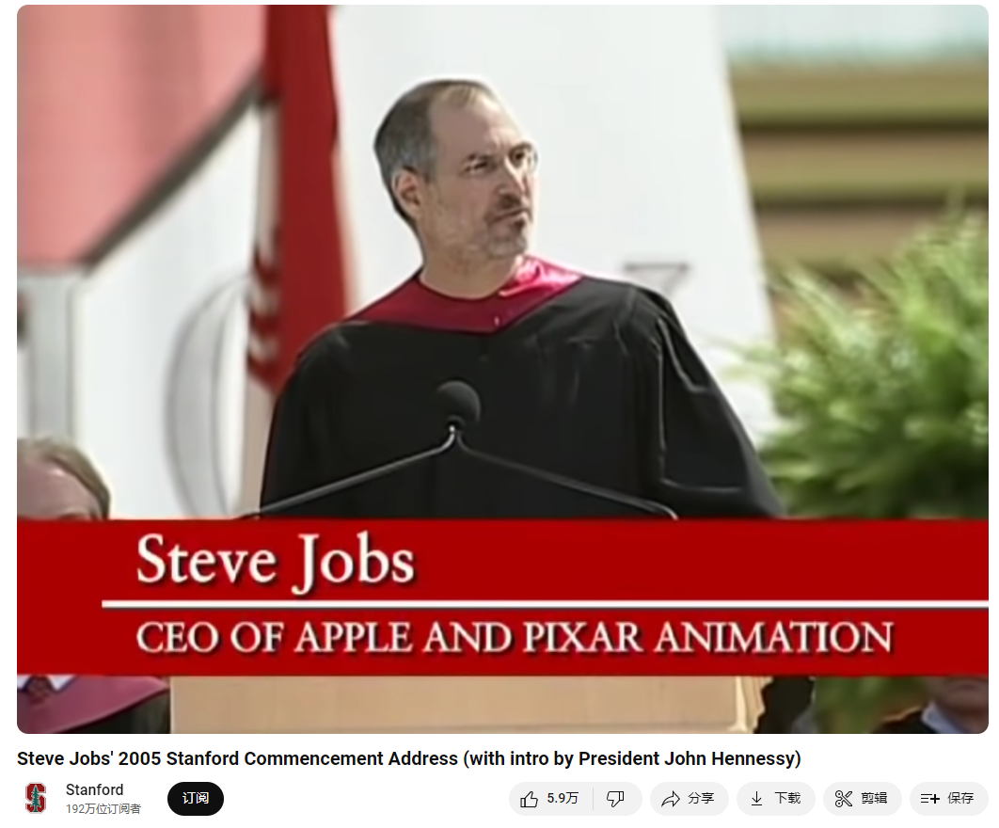

# Steve Jobs' 2005 Stanford Commencement Address

Link: [https://www.youtube.com/watch?v=UF8uR6Z6KLc](https://www.youtube.com/watch?v=UF8uR6Z6KLc) and [https://www.youtube.com/watch?v=Hd_ptbiPoXM](https://www.youtube.com/watch?v=Hd_ptbiPoXM)

@[toc]

Drawing from some of the most pivotal points in his life, Steve Jobs, chief executive officer and co-founder of Apple Computer and of Pixar Animation Studios, urged graduates to pursue their dreams and see the opportunities in life's setbacks -- including death itself -- at the university's 114th Commencement on June 12, 2005.

## Summary

In this speech, Steve Jobs shares three stories from his life, each offering a distinct lesson:

1. **Connecting the Dots**
   Jobs talks about how dropping out of Reed College led him to take a calligraphy course, which seemed irrelevant at the time but later influenced the design of the Macintosh computer. The lesson here is that seemingly unrelated experiences can become valuable in the future. Trust your intuition and believe that the dots will connect down the road.

2. **Love and Loss**
   Jobs recounts how he was fired from Apple, the company he co-founded. This setback turned out to be a blessing in disguise, allowing him to start NeXT and Pixar and eventually return to Apple. The lesson is that passion and perseverance in what you love to do can lead to new opportunities and success, even after failure.

3. **About Death**
   Jobs shares his experience of being diagnosed with cancer and how it reinforced the importance of living each day as if it were his last. He emphasizes that awareness of mortality can help clarify life's important choices and inspire one to follow their heart. The lesson is to live authentically, pursue what you truly love, and not let external expectations dictate your life.

Through these three stories, Jobs conveys the following insights:
- Trust your intuition and follow your inner voice.
- Keep searching for and doing what you love; don't settle.
- Recognize the brevity of life, which helps prioritize what's truly important and inspires courage to pursue your dreams.

在这份演讲中，Steve Jobs 讲了三个故事，每个故事都带来了不同的启发：

1. **连接点滴**（Connecting the Dots）
   Jobs 讲述了他如何在 Reed College 退学后，偶然接触到书法课程。这门课程虽然当时看似没有实际用途，但后来成为了 Macintosh 电脑拥有漂亮字体设计的灵感来源。启发是：有时候当下看似无关的经历，可能在未来发挥重要作用。相信自己内心的直觉，并相信点滴会在未来某个时刻连接起来。

2. **爱与失落**（Love and Loss）
   Jobs 讲述了他如何被自己创立的公司 Apple 解雇，但这反而成为他人生中最好的事情之一。他利用这段时间创办了 NeXT 和 Pixar，并最终重返 Apple。启发是：即使面对失败和挫折，只要对自己所做的事情充满热爱，坚持不懈，就能找到新的机会并取得成功。

3. **关于死亡**（About Death）
   Jobs 讲述了他被诊断出患有癌症的经历，以及面对死亡时的感悟。他强调了生命有限，因此要追随自己的心，做自己真正热爱的事情。启发是：意识到生命的有限性，可以帮助我们更清晰地看待生活中的重要选择，避免陷入世俗的束缚。

通过这三个故事，Jobs 传达了以下启示：
- 相信自己的直觉和内心的声音。
- 不断寻找和追求自己热爱的事物，不要轻易妥协。
- 认识到生命的短暂，因此要珍惜时间，勇敢追随自己的梦想和热情。

## Vocabulary

commencement: 毕业典礼

college graduation：毕业典礼

unwed：美 [ˌənˈwɛd] 没有正式结婚的；未婚的

unwed graduate student： 未婚研究生

relented ：美 [rɪˈlentid] 变温和；变宽厚；缓和；（relent的过去式）

coke：美 [koʊk]  可口可乐（Cocacola的简称）

I returned coke bottles for the 5 cent deposits to buy food with 我退回可乐瓶，用5美分的押金买食物

stumbled：美 [ˈstʌmbld]  绊倒；犯错误；（stumble的过去式和过去分词）

priceless：无价的；无法估量的价值；极为珍贵的          

And much of what I stumbled into by following my curiosity and intuition turned out to be priceless later on. 我跟随自己的好奇心和直觉所遇到的许多事情后来被证明是无价的。

calligraphy：美 [kəˈlɪɡrəfi] 书法；书法艺术；书法作品；

Throughout the campus every poster, every label on every drawer, was beautifully hand calligraphed. 整个校园里的每张海报，每个抽屉上的每个标签，都是漂亮的手写字体。

typography： 美 [taɪˈpɑɡrəfi] 铅印；排印；印刷版面式样

drop in on：参加（某门课）

drop in on that course

typefaces: 美 [ˈtaipfeisiz] 字体；（typeface的复数）

If I had never dropped in on that single course in college, the Mac would have never had multiple typefaces or proportionally spaced fonts. 如果我在大学里没有选修那门课，Mac电脑就不会有多种字体或按比例排列的字体。

gut: 美 [ɡʌt]  胆量；勇气；毅力；意志；

karma: 美 [ˈkɑːrmə] 因果报应；命运；因缘；

You have to trust in something, your gut, destiny, life, karma:你必须相信一些东西，你的勇气，命运，生活，因果报应

diverge: 分开；岔开；偏离；背离；

falling out: 闹翻；掉出来；摔出         

have a falling out: 闹翻了 

But then our visions of the future began to diverge and eventually we had a falling out. 但后来我们对未来的看法开始出现分歧，最终我们闹翻了。

devastating：美 [ˈdevəsteɪtɪŋ] 毁灭性的；极具破坏性的；引起极度震惊（或悲痛、忧伤）的；

baton：英 [ˈbætɒn] ，美 [bəˈtɑːn] （乐队）指挥棒；（接力赛的）接力棒；

dropped the baton：丢掉了指挥棒

dawn on: 开始明白；渐渐意识到；逐渐清晰；

But something slowly began to dawn on me I still loved what I did. 但是我慢慢明白了，我仍然热爱我所做的事情。

pancreas: 美 [ˈpæŋkriəs]  胰腺

biopsy：美 [ˈbaɪˌɑpsi] 活体组织检查（从身体取下细胞或组织进行检验）

endoscope：美 [ˈɛndəˌskoʊp] 内窥镜；内腔镜

intestines：美 [ɪnˈtestənz] 肠；（intestine的复数）

Later that evening I had a biopsy, where they stuck an endoscope down my throat, through my stomach and into my intestines, put a needle into my pancreas and got a few cells from the tumor. 那天晚上晚些时候，我做了一个活组织检查，他们把一个内窥镜从我的喉咙伸进去，穿过我的胃，进入我的肠子，把一根针插进我的胰腺，从肿瘤上取了一些细胞。

sedated：美 [sɪˈdeɪtid]  安静的；沉着的；镇静的

be trapped：被困住

dogma：教义；信条          

drown out：盖过；淹没（声音）；压倒；

Your time is limited, so don't waste it living someone else's life. Don't be trapped by dogma which is living with the results of other people's thinking. Don't let the noise of others' opinions drown out your own inner voice. And most important, have the courage to follow your heart and intuition. 你的时间是有限的，所以不要浪费时间过别人的生活。不要被教条所困，教条就是生活在别人思考的结果中。不要让别人观点的噪音淹没了自己内心的声音。最重要的是，要有勇气跟随你的心和直觉。

## Transcript

Thank You. I am honored to be with you today at your commencement

from one of the finest universities in the world.

Truth be told I never graduated from college

and this is the closest I've ever gotten to a college graduation.

Today I want to tell you three stories from my life. That's it.

No big deal. Just three stories.

### Connecting the dots

The first story is about connecting the dots.

I dropped out of Reed College after the first 6 months,

but then stayed around as a drop-in

for another 18 months or so before I really quit.

So why did I drop out?

It started before I was born.

My biological mother was a young, unwed graduate student,

and she decided to put me up for adoption.

She felt very strongly that I should be adopted by college graduates,

so everything was all set for me to

be adopted at birth by a lawyer and his wife.

Except that when I popped out they decided

at the last minute that they really wanted a girl.

So my parents, who were on a waiting list,

got a call in the middle of the night asking: "We have an unexpected

baby boy; do you want him?"

They said: "Of course." My biological mother later found out that

my mother had never graduated from college

and that my father had never graduated from high school.

She refused to sign the final adoption papers.

She only relented a few months later when

my parents promised that I would go to college. This was the start in my life.

And 17 years later I did go to college. But I naively chose a college

that was almost as expensive as Stanford,

and all of my working-class parents'

savings were being spent on my college tuition.

After six months, I couldn't see the value in it.

I had no idea what I wanted to do with my life

and no idea how college was going to help me figure it out.

And here I was spending all of the money my parents had saved

their entire life.

So I decided to drop out and trust that it would all work out OK.

It was pretty scary at the time,

but looking back it was one of the best decisions I ever made.

The minute I dropped out I could stop

taking the required classes that didn't interest me,

and begin dropping in on the ones that looked interesting.

It wasn't all romantic. I didn't have a dorm room,

so I slept on the floor in friends' rooms,

I returned coke bottles for the 5 cent deposits to buy food with,

and I would walk the 7 miles across town every Sunday

night to get one good meal a week at the Hare Krishna

temple. I loved it.

And much of what I stumbled into by following

my curiosity and intuition turned out to be priceless later on.

Let me give you one example: Reed College at that

time offered perhaps the best calligraphy instruction in the country.

Throughout the campus every poster, every label on every drawer,

was beautifully hand calligraphed.

Because I had dropped out and didn't have to take the normal classes,

I decided to take a calligraphy class to learn how to do this.

I learned about serif and san serif typefaces,

about varying the amount of space

between different letter combinations,

about what makes great typography great.

It was beautiful, historical,

artistically subtle in a way that science can't capture,

and I found it fascinating.

None of this had even a hope of any practical application in my life.

But ten years later,

when we were designing the first Macintosh computer,

it all came back to me. And we designed it all into the Mac.

It was the first computer with beautiful typography.

If I had never dropped in on that single course in college,

the Mac would have never had multiple

typefaces or proportionally spaced fonts.

And since Windows just copied the Mac,

it's likely that no personal computer would have them.

If I had never dropped out,

I would have never dropped in on this calligraphy class,

and personal computers might not have the wonderful typography

that they do. Of course it was impossible to connect

the dots looking forward when I was in college.

But it was very, very clear looking backwards ten years later.

Again, you can't connect the dots looking forward;

you can only connect them looking backwards.

So you have to trust that the dots will somehow connect

in your future.

You have to trust in something, your gut, destiny, life, karma,

whatever.

Believing that the dots will connect down the road will give you the confidence to follow your heart

Even when it leads you off the well worn path, and that will make all the difference.

### Love and loss

My second story is about love and loss.

I was lucky I found what I loved to do early in life.

Woz and I started Apple in my parents garage when I was 20.

We worked hard, and in 10 years Apple had grown from just the two of

us in a garage into a $2 billion company with over 4000 employees.

We had just released our finest creation the Macintosh

a year earlier, and I had just turned 30.

And then I got fired.

How can you get fired from a company you started?

Well, as Apple grew we hired someone who I thought

was very talented to run the company with me,

and for the first year or so things went well.

But then our visions of the future began

to diverge and eventually we had a falling out.

When we did, our Board of Directors sided with him.

So at 30 I was out. And very publicly out.

What had been the focus of my entire adult life was gone,

and it was devastating.

I really didn't know what to do for a few months.

I felt that I had let the previous generation of entrepreneurs

down - that I had dropped the baton as it was being passed to me.

I met with David Packard and Bob Noyce

and tried to apologize for screwing up so badly.

I was a very public failure,

and I even thought about running away from the valley.

But something slowly began to dawn on me I still loved what I did.

The turn of events at Apple had not changed that one bit.

I had been rejected, but I was still in love.

And so I decided to start over.

I didn't see it then, but it turned out that getting fired from

Apple was the best thing that could have ever happened to me.

The heaviness of being successful was

replaced by the lightness of being a beginner again,

less sure about everything.

It freed me to enter one of the most creative periods of my life.

During the next five years, I started a company named NeXT,

another company named Pixar,

and fell in love with an amazing woman who would become my wife.

Pixar went on to create the worlds first computer animated feature

film, Toy Story,

and is now the most successful animation studio in the world.

In a remarkable turn of events, Apple bought NeXT,

I returned to Apple, and the technology we developed at

NeXT is at the heart of Apple's current renaissance.

And Laurene and I have a wonderful family together.

I'm pretty sure none of this would

have happened if I hadn't been fired from Apple.

It was awful tasting medicine, but I guess the patient needed it.

Sometimes life hits you in the head with a brick. Don't lose faith.

I'm convinced that the only thing that kept me going was that I loved

what I did. You've got to find what you love.

And that is as true for your work as it is for your lovers.

Your work is going to fill a large part of your life,

and the only way to be truly satisfied

is to do what you believe is great work.

And the only way to do great work is to love what you do.

If you haven't found it yet, keep looking. Don't settle.

As with all matters of the heart, you'll know when you find it.

And, like any great relationship,

it just gets better and better as the years roll on.

So keep looking. Don't settle.

### Death

My third story is about death.

When I was 17, I read a quote that went something like:

"If you live each day as if it was your last,

someday you'll most certainly be right."

It made an impression on me, and since then, for the past 33 years,

I have looked in the mirror every morning

and asked myself: "If today were the last day of my life,

would I want to do what I am about to do today?"

And whenever the answer has been "No" for too many days in a row,

I know I need to change something.

Remembering that I'll be dead soon is the most important

tool I've ever encountered to help me make the big choices in life.

Because almost everything all external expectations, all pride,

all fear of embarrassment or failure -

these things just fall away in the face of death,

leaving only what is truly important.

Remembering that you are going to die is the best

way I know to avoid the trap of thinking you have something to lose.

You are already naked. There is no reason not to follow your heart.

About a year ago I was diagnosed with cancer.

I had a scan at 7:30 in the morning,

and it clearly showed a tumor on my pancreas.

I didn't even know what a pancreas was.

The doctors told me this was almost

certainly a type of cancer that is incurable,

and that I should expect to live no longer than three to six months.

My doctor advised me to go home and get my affairs in order,

which is doctor's code for prepare to die.

It means to try to tell your kids everything you thought

you'd have the next 10 years to tell them in just a few months.

It means to make sure everything is buttoned

up so that it will be as easy as possible for your family.

It means to say your goodbyes.

I lived with that diagnosis all day.

Later that evening I had a biopsy,

where they stuck an endoscope down my throat,

through my stomach and into my intestines,

put a needle into my pancreas and got a few cells from the tumor.

I was sedated, but my wife, who was there,

told me that when they viewed the cells under a microscope

the doctors started crying because it turned out to be

a very rare form of pancreatic cancer that is curable with surgery.

I had the surgery and thankfully I'm fine now.

This was the closest I've been to facing death,

and I hope its the closest I get for a few more decades.

Having lived through it,

I can now say this to you with a bit more certainty than when

death was a useful but purely intellectual concept:

No one wants to die.

Even people who want to go to heaven don't want to die to get there.

And yet death is the destination we all share.

No one has ever escaped it. And that is as it should be,

because Death is very likely the single best invention of Life.

It is Life's change agent.

It clears out the old to make way for the new.

Right now the new is you, but someday not too long from now,

you will gradually become the old and be cleared away.

Sorry to be so dramatic, but it is quite true.

Your time is limited, so don't waste it living someone else's life.

Don't be trapped by dogma which is living

with the results of other people's thinking.

Don't let the noise of others' opinions drown out your own inner

voice. And most important,

have the courage to follow your heart and intuition.

They somehow already know what you truly want to become.

Everything else is secondary.

When I was young,

there was an amazing publication called The Whole Earth Catalog,

which was one of the bibles of my generation.

It was created by a fellow named Stewart Brand not far from here

in Menlo Park, and he brought it to life with his poetic touch.

This was in the late 1960's,

before personal computers and desktop publishing,

so it was all made with typewriters, scissors, and polaroid cameras.

It was sort of like Google in paperback form,

35 years before Google came along: it was idealistic,

overflowing with neat tools, and great notions.

Stewart and his team put out several

issues of The Whole Earth Catalog,

and then when it had run its course, they put out a final issue.

It was the mid-1970s, and I was your age.

On the back cover of their final issue

was a photograph of an early morning country road,

the kind you might find yourself

hitchhiking on if you were so adventurous.

Beneath it were the words: "Stay Hungry. Stay Foolish."

It was their farewell message as they signed off. Stay Hungry.

Stay Foolish. And I have always wished that for myself.

And now, as you graduate to begin anew, I wish that for you.

Stay Hungry. Stay Foolish.

Thank you all very much.

## Afterword

2024年6月23日19点38分于上海。